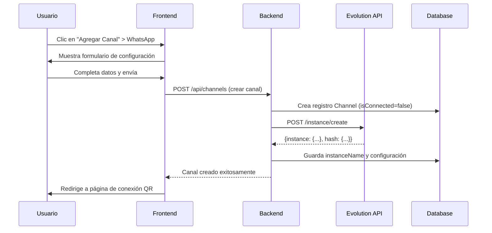
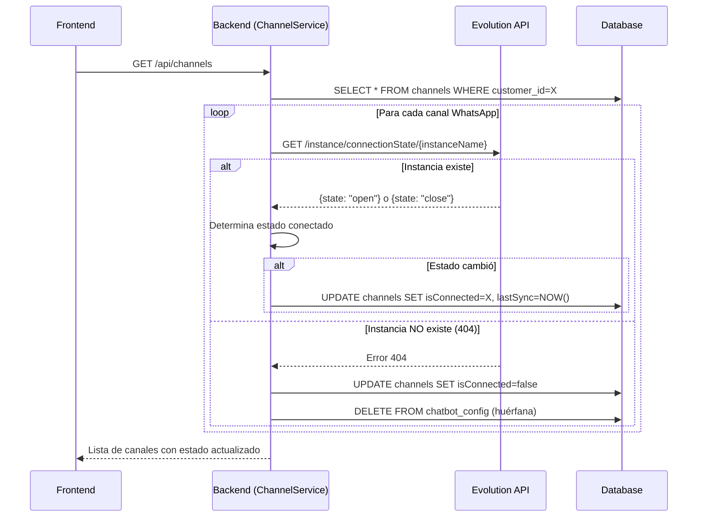

# 📡 Sistema de Canales de Comunicación - WhatsApp Business

## 📋 Descripción General

El sistema de canales de comunicación de CloudFly permite integrar múltiples plataformas de mensajería (WhatsApp, Facebook, Instagram, TikTok) en un solo lugar, con verificación automática del estado de conexión en tiempo real.

## 🎯 Características Principales

### 1. **Gestión Multi-Canal**
- Soporte para WhatsApp Business, Facebook Messenger, Instagram Direct y TikTok
- Un canal por tipo de plataforma por tenant (multi-tenant)
- Configuración y gestión centralizada

### 2. **Sincronización Automática de Estado**
- Verificación en tiempo real contra Evolution API
- Actualización automática del estado de conexión
- Detección de instancias huérfanas o desconectadas

### 3. **Interfaz Simplificada**
- Estado único: **Conectado** ✅ o **Desconectado** ❌
- Sin estados redundantes (eliminado el botón activar/desactivar)
- Validación contra la fuente de verdad (Evolution API)

---

## 🏗️ Arquitectura del Sistema

```
┌─────────────────┐         ┌──────────────────┐         ┌─────────────────────┐
│   Frontend      │         │    Backend       │         │   Evolution API     │
│   (Next.js)     │◄────────┤   (Spring Boot)  │◄────────┤   (WhatsApp)        │
│                 │         │                  │         │                     │
│ - Lista canales │         │ - ChannelService │         │ - Gestión instancia │
│ - Configuración │         │ - EvolutionAPI   │         │ - Estado conexión   │
│ - Estados       │         │ - Sincronización │         │ - Envío mensajes    │
└─────────────────┘         └──────────────────┘         └─────────────────────┘
         │                           │                              │
         │                           │                              │
         └───────────────────────────┴──────────────────────────────┘
                         Flujo de Sincronización
```

---

## 📊 Flujo de Funcionamiento

### **Fase 1: Creación de Canal WhatsApp**



**Detalles Técnicos:**
- El `instanceName` se genera automáticamente: `cloudfly_{tenantId}`
- El token de instancia lo genera Evolution API (no se envía)
- Se almacena en la tabla `channels` con estado `isConnected=false`

---

### **Fase 2: Conexión WhatsApp (Escaneo QR)**

```mermaid
sequenceDiagram
    participant U as Usuario
    participant F as Frontend
    participant B as Backend
    participant E as Evolution API
    participant W as WhatsApp

    F->>B: GET /api/chatbot/qr
    B->>E: GET /instance/connect/{instanceName}
    E-->>B: {qrcode: "data:image/png;base64,..."}
    B-->>F: Devuelve QR code
    F->>U: Muestra código QR
    U->>W: Escanea QR con WhatsApp
    W->>E: Conexión establecida
    E->>B: Webhook: connection.update (state: open)
    B->>DB: UPDATE channels SET isConnected=true
    F->>U: Muestra "Conectado exitosamente"
```

**Estados Posibles:**
- `close` - Desconectado
- `connecting` - Conectando
- `open` - Conectado ✅

---

### **Fase 3: Sincronización Automática de Estado**

Cada vez que el usuario consulta la lista de canales, el backend verifica el estado real:



---

## 🔧 Componentes del Sistema

### **Backend - Java/Spring Boot**

#### 1. **ChannelService.java**
```java
@Service
public class ChannelService {
    
    // Obtener todos los canales (con sincronización automática)
    @Transactional
    public List<ChannelDTO> getAllChannels() {
        // 1. Obtiene canales del tenant
        List<Channel> channels = channelRepository.findByCustomerId(tenantId);
        
        // 2. Sincroniza estado de WhatsApp
        for (Channel channel : channels) {
            if (channel.getType() == WHATSAPP && channel.getInstanceName() != null) {
                syncWhatsAppChannelStatus(channel);
            }
        }
        
        // 3. Devuelve DTOs actualizados
        return channels.stream().map(this::mapToDTO).collect(Collectors.toList());
    }
    
    // Sincroniza estado con Evolution API
    private void syncWhatsAppChannelStatus(Channel channel) {
        Map<String, Object> status = evolutionApiService.checkInstanceStatus(instanceName);
        
        if (status != null) {
            // Extrae estado (soporta múltiples formatos)
            String state = getStateFromResponse(status);
            boolean connected = "open".equals(state) || "connected".equals(state);
            
            // Actualiza si cambió
            if (channel.getIsConnected() != connected) {
                channel.setIsConnected(connected);
                channelRepository.save(channel);
            }
        } else {
            // Instancia no existe
            handleMissingInstance(channel);
        }
    }
}
```

#### 2. **EvolutionApiService.java**
```java
@Service
public class EvolutionApiService {
    
    // Verifica estado de conexión
    public Map<String, Object> checkInstanceStatus(String instanceName) {
        String url = apiUrl + "/instance/connectionState/" + instanceName;
        
        HttpHeaders headers = new HttpHeaders();
        headers.set("apikey", apiKey);
        
        try {
            ResponseEntity<Map> response = restTemplate.exchange(
                url, HttpMethod.GET, new HttpEntity<>(headers), Map.class
            );
            return response.getBody();
        } catch (Exception e) {
            log.error("Failed to check instance: {}", e.getMessage());
            return null; // Instancia no existe
        }
    }
}
```

---

### **Frontend - Next.js/React**

#### **page.tsx** (Lista de Canales)
```tsx
const ChannelsPage = () => {
    const [channels, setChannels] = useState<Channel[]>([]);
    
    const loadChannels = async () => {
        // Llama al backend que sincroniza automáticamente
        const response = await axiosInstance.get<ChannelDTO[]>('/api/channels');
        setChannels(response.data);
    };
    
    return (
        <Grid container spacing={3}>
            {channels.map(channel => (
                <Card>
                    {/* Badge de estado */}
                    <Chip 
                        icon={channel.isConnected ? <CheckCircle /> : <Cancel />}
                        label={channel.isConnected ? 'Conectado' : 'Desconectado'}
                        color={channel.isConnected ? 'success' : 'error'}
                    />
                    
                    {/* Acciones */}
                    <Button onClick={() => configure(channel)}>Configurar</Button>
                    <Button onClick={() => delete(channel)}>Eliminar</Button>
                </Card>
            ))}
        </Grid>
    );
};
```

---

## 🗄️ Base de Datos

### **Tabla: channels**

```sql
CREATE TABLE channels (
    id BIGINT PRIMARY KEY AUTO_INCREMENT,
    customer_id BIGINT NOT NULL,           -- Tenant (multi-tenant)
    type ENUM('WHATSAPP', 'FACEBOOK', 'INSTAGRAM', 'TIKTOK'),
    name VARCHAR(100) NOT NULL,
    
    -- Estado
    is_active BOOLEAN DEFAULT false,       -- Ya no se usa en UI
    is_connected BOOLEAN DEFAULT false,    -- ✅ Verificado contra Evolution API
    
    -- Datos específicos de WhatsApp
    phone_number VARCHAR(50),
    instance_name VARCHAR(100),            -- cloudfly_{tenantId}
    webhook_url VARCHAR(500),
    api_key TEXT,                          -- Token de instancia (generado por Evolution API)
    
    -- Datos de Facebook/Instagram/TikTok
    page_id VARCHAR(100),
    username VARCHAR(100),
    access_token VARCHAR(500),
    
    -- Configuración adicional
    configuration TEXT,                    -- JSON con config extendida
    
    -- Auditoría
    last_sync DATETIME,                    -- Última sincronización exitosa
    last_error VARCHAR(500),               -- Último error detectado
    created_at DATETIME DEFAULT CURRENT_TIMESTAMP,
    updated_at DATETIME ON UPDATE CURRENT_TIMESTAMP,
    
    FOREIGN KEY (customer_id) REFERENCES customers(id)
);
```

---

## 🔐 Configuración de Evolution API

### **application.properties**

```properties
# Evolution API Configuration
evolution.api.url=https://evolution.example.com
evolution.api.key=YOUR_GLOBAL_API_KEY

# Webhook Configuration (para recibir eventos)
app.webhook.base-url=https://cloudfly.example.com
```

### **Variables de Entorno**
```bash
EVOLUTION_API_URL=https://evolution.example.com
EVOLUTION_API_KEY=abc123...
WEBHOOK_BASE_URL=https://cloudfly.example.com
```

---

## 🔄 Estados y Transiciones

### **Estados del Canal**

| Estado | Descripción | Color | Icono |
|--------|-------------|-------|-------|
| **Conectado** | Instancia existe y `state=open` en Evolution API | Verde ✅ | CheckCircle |
| **Desconectado** | Instancia no existe o `state=close` | Rojo ❌ | Cancel |

### **Transiciones**

```
┌─────────────────┐
│   NUEVO CANAL   │
│ (isConnected=F) │
└────────┬────────┘
         │
         │ Usuario escanea QR
         ▼
┌─────────────────┐
│   CONECTADO     │
│ (isConnected=T) │────┐
└────────┬────────┘    │
         │             │
         │ Logout o    │ Reconexión
         │ Error       │
         ▼             │
┌─────────────────┐    │
│ DESCONECTADO    │    │
│ (isConnected=F) │◄───┘
└─────────────────┘
```

---

## 🛠️ Endpoints del Backend

### **Gestión de Canales**

| Método | Endpoint | Descripción |
|--------|----------|-------------|
| `GET` | `/api/channels` | Lista canales (sincroniza automáticamente) |
| `POST` | `/api/channels` | Crear nuevo canal |
| `GET` | `/api/channels/{id}` | Obtener canal por ID |
| `PUT` | `/api/channels/{id}` | Actualizar canal |
| `DELETE` | `/api/channels/{id}` | Eliminar canal |
| ~~`PATCH`~~ | ~~`/api/channels/{id}/toggle`~~ | ❌ **Eliminado** (ya no se usa) |

### **Evolution API (WhatsApp)**

| Método | Endpoint | Descripción |
|--------|----------|-------------|
| `POST` | `/api/chatbot/activate` | Crear instancia en Evolution API |
| `GET` | `/api/chatbot/qr` | Obtener código QR |
| `GET` | `/api/chatbot/status` | Estado de la instancia |
| `DELETE` | `/api/chatbot/instance` | Eliminar instancia |

---

## 🧪 Casos de Prueba

### **Test 1: Sincronización de Estado**

**Precondición:**
- Canal WhatsApp creado y conectado
- Instancia activa en Evolution API

**Pasos:**
1. Abrir navegador, ir a `/comunicaciones/canales`
2. Observar que el canal muestra "Conectado" ✅

**Resultado esperado:**
- Badge verde con "Conectado"
- `lastSync` actualizado en base de datos

---

### **Test 2: Detección de Instancia Desconectada**

**Precondición:**
- Canal existe en DB
- Instancia NO existe en Evolution API (eliminada manualmente)

**Pasos:**
1. Eliminar instancia directamente en Evolution API
2. Refrescar `/comunicaciones/canales`

**Resultado esperado:**
- Badge rojo con "Desconectado" ❌
- `isConnected=false` en base de datos
- Log: "Instance not found in Evolution API"

---

### **Test 3: Múltiples Formatos de Respuesta**

Evolution API puede devolver diferentes estructuras:

**Formato 1:**
```json
{
  "state": "open"
}
```

**Formato 2:**
```json
{
  "instance": {
    "state": "open"
  }
}
```

**Resultado esperado:**
- El sistema detecta correctamente ambos formatos
- Estado "Conectado" en ambos casos

---

## 📝 Logging y Diagnóstico

### **Logs del Backend**

```log
🔄 [SYNC] Syncing status for channel 1 (instance: cloudfly_1)
🔍 [EVOLUTION-API] Checking instance status. URL: https://evolution.../connectionState/cloudfly_1
✅ [EVOLUTION-API] Status check successful!
📦 [EVOLUTION-API] Full response body: {state=open, instance={...}}
🔑 [EVOLUTION-API] Response keys: [state, instance]
   state = open (type: String)
   instance = {...} (type: LinkedHashMap)
🔍 [SYNC] State value for cloudfly_1: open
🎯 [SYNC] Determined connection status for cloudfly_1: true
📊 [SYNC] Updating channel 1 connection status: false -> true
```

### **Logs de Error**

```log
❌ [EVOLUTION-API] Failed to check instance status: 404 Not Found
❌ [EVOLUTION-API] Exception type: HttpClientErrorException
⚠️ [SYNC] No status returned for instance cloudfly_1
🗑️ [SYNC] Instance cloudfly_1 does not exist, cleaning up configuration
🗑️ [SYNC] Deleting orphaned chatbot config for instance: cloudfly_1
📊 [SYNC] Marking channel 1 as disconnected
```

---

## 🚀 Mejoras Implementadas

### **✅ Simplificación de UI**
- **Antes:** Botones "Activar/Desactivar" + estado de conexión
- **Ahora:** Solo estado de conexión verificado

### **✅ Sincronización Automática**
- Cada consulta verifica contra Evolution API
- Detecta instancias huérfanas o eliminadas
- Actualiza estado en tiempo real

### **✅ Logging Extensivo**
- Diagnóstico completo de respuestas de Evolution API
- Tracking de cada cambio de estado
- Facilita debugging

### **✅ Manejo de Múltiples Formatos**
- Soporta diferentes estructuras de respuesta
- Compatibilidad con versiones de Evolution API
- Robustez ante cambios

---

## 🔮 Próximas Funcionalidades

1. **Webhooks de Evolution API**
   - Recibir eventos en tiempo real
   - Actualizar estado sin polling

2. **Historial de Conexión**
   - Registro de desconexiones/reconexiones
   - Alertas de problemas de estabilidad

3. **Métricas de Canal**
   - Mensajes enviados/recibidos
   - Uptime del canal
   - Tasa de respuesta

4. **Multi-dispositivo**
   - Soporte para múltiples números WhatsApp
   - Distribución de carga

---

## 📚 Referencias

- [Evolution API Documentation](https://doc.evolution-api.com/)
- [WhatsApp Business API](https://developers.facebook.com/docs/whatsapp)
- [CloudFly Architecture Docs](../README.md)

---

**Versión:** 1.0  
**Última actualización:** 2025-12-27  
**Autor:** CloudFly Development Team
