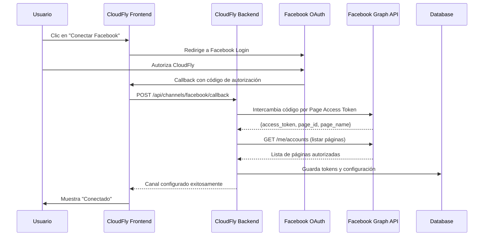
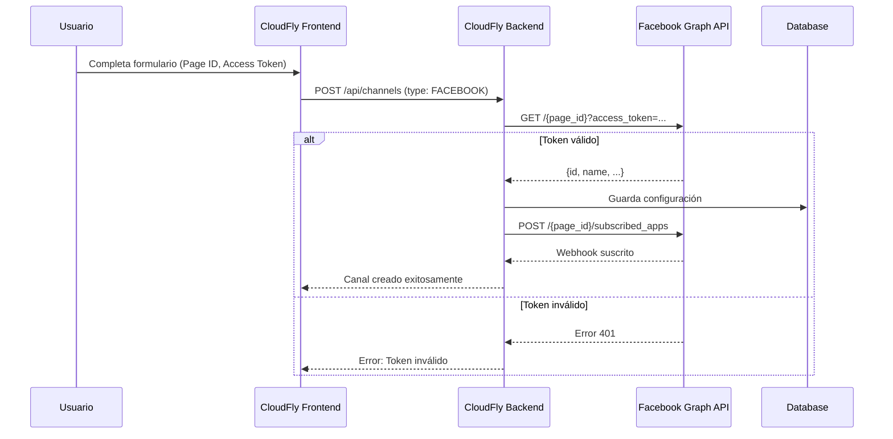

# 📘 Análisis: Integración Facebook Messenger

## 🎯 Objetivo
Implementar integración con Facebook Messenger para permitir que las empresas automaticen respuestas en sus páginas de Facebook mediante la plataforma CloudFly.

---

## 📋 Tabla de Contenidos
1. [Requisitos Previos](#requisitos-previos)
2. [Arquitectura de la Solución](#arquitectura-de-la-solución)
3. [Flujo de Configuración](#flujo-de-configuración)
4. [API de Facebook Messenger](#api-de-facebook-messenger)
5. [Implementación Backend](#implementación-backend)
6. [Implementación Frontend](#implementación-frontend)
7. [Base de Datos](#base-de-datos)
8. [Webhooks](#webhooks)
9. [Seguridad y Validación](#seguridad-y-validación)
10. [Plan de Implementación](#plan-de-implementación)

---

## 🔧 Requisitos Previos

### **1. Cuenta de Facebook Developer**
- [ ] Crear cuenta en [Facebook for Developers](https://developers.facebook.com/)
- [ ] Crear una App de Facebook
- [ ] Verificar el dominio de la aplicación

### **2. Página de Facebook**
- [ ] El cliente debe tener una página de Facebook Business
- [ ] Tener permisos de administrador en la página

### **3. Credenciales Requeridas**
Para la integración necesitamos obtener:

| Credencial | Descripción | Dónde se obtiene |
|------------|-------------|------------------|
| **App ID** | ID de la aplicación de Facebook | Facebook Developer Console |
| **App Secret** | Secreto de la aplicación | Facebook Developer Console |
| **Page Access Token** | Token de acceso a la página | Graph API Explorer |
| **Page ID** | ID de la página de Facebook | Configuración de la página |
| **Verify Token** | Token para verificar webhooks | Generado por CloudFly |

---

## 🏗️ Arquitectura de la Solución

```
┌──────────────────────────────────────────────────────────────────┐
│                         FACEBOOK PLATFORM                         │
│  ┌─────────────┐         ┌──────────────┐      ┌──────────────┐ │
│  │   Página    │◄────────┤  Messenger   │◄─────┤   Usuario    │ │
│  │  Facebook   │         │   Platform   │      │   Final      │ │
│  └──────┬──────┘         └──────┬───────┘      └──────────────┘ │
│         │                       │                                │
└─────────┼───────────────────────┼────────────────────────────────┘
          │                       │
          │ Webhooks              │ Send API
          │ (mensajes entrantes)  │ (mensajes salientes)
          ▼                       ▼
┌──────────────────────────────────────────────────────────────────┐
│                         CLOUDFLY BACKEND                          │
│  ┌─────────────────────────────────────────────────────────────┐ │
│  │             FacebookMessengerService                         │ │
│  │  ┌────────────────┐  ┌─────────────────┐  ┌──────────────┐ │ │
│  │  │   Webhook      │  │   Send Message  │  │   Get User   │ │ │
│  │  │   Handler      │  │   to Customer   │  │   Profile    │ │ │
│  │  └────────────────┘  └─────────────────┘  └──────────────┘ │ │
│  └─────────────────────────────────────────────────────────────┘ │
│  ┌─────────────────────────────────────────────────────────────┐ │
│  │                    ChannelService                            │ │
│  │  - Validar conexión con Facebook                            │ │
│  │  - Verificar permisos de la página                          │ │
│  │  - Gestionar tokens de acceso                               │ │
│  └─────────────────────────────────────────────────────────────┘ │
│  ┌─────────────────────────────────────────────────────────────┐ │
│  │                    ChatbotService                            │ │
│  │  - Procesar mensajes entrantes                              │ │
│  │  - Generar respuestas con IA                                │ │
│  │  - Enrutar a agente humano si es necesario                  │ │
│  └─────────────────────────────────────────────────────────────┘ │
└──────────────────────────────────────────────────────────────────┘
          │
          ▼
┌──────────────────────────────────────────────────────────────────┐
│                         CLOUDFLY FRONTEND                         │
│  ┌─────────────────────────────────────────────────────────────┐ │
│  │         Configuración de Canal Facebook                      │ │
│  │  1. Conectar cuenta de Facebook (OAuth)                     │ │
│  │  2. Seleccionar página                                       │ │
│  │  3. Autorizar permisos                                       │ │
│  │  4. Verificar conexión                                       │ │
│  └─────────────────────────────────────────────────────────────┘ │
└──────────────────────────────────────────────────────────────────┘
```

---

## 🔄 Flujo de Configuración

### **Opción 1: OAuth Flow (Recomendado)**



### **Opción 2: Manual (Token Largo Plazo)**



---

## 📡 API de Facebook Messenger

### **1. Graph API Endpoints**

#### **Verificar Página**
```http
GET https://graph.facebook.com/v18.0/{page-id}
  ?fields=id,name,access_token,category
  &access_token={user-access-token}
```

**Respuesta:**
```json
{
  "id": "123456789",
  "name": "Mi Negocio",
  "category": "Retail",
  "access_token": "EAAxxxxx..." // Page Access Token
}
```

---

#### **Obtener Páginas del Usuario**
```http
GET https://graph.facebook.com/v18.0/me/accounts
  ?access_token={user-access-token}
```

**Respuesta:**
```json
{
  "data": [
    {
      "id": "123456789",
      "name": "Mi Negocio",
      "access_token": "EAAxxxxx...",
      "category": "Retail",
      "tasks": ["MESSAGING", "MODERATE", "ADVERTISE"]
    }
  ]
}
```

---

#### **Suscribir Webhooks**
```http
POST https://graph.facebook.com/v18.0/{page-id}/subscribed_apps
  ?subscribed_fields=messages,messaging_postbacks,messaging_optins
  &access_token={page-access-token}
```

**Respuesta:**
```json
{
  "success": true
}
```

---

#### **Enviar Mensaje de Texto**
```http
POST https://graph.facebook.com/v18.0/me/messages
  ?access_token={page-access-token}

Content-Type: application/json

{
  "recipient": {
    "id": "USER_PSID"
  },
  "message": {
    "text": "¡Hola! ¿En qué puedo ayudarte?"
  }
}
```

---

#### **Enviar Mensaje con Botones**
```http
POST https://graph.facebook.com/v18.0/me/messages
  ?access_token={page-access-token}

{
  "recipient": {
    "id": "USER_PSID"
  },
  "message": {
    "attachment": {
      "type": "template",
      "payload": {
        "template_type": "button",
        "text": "¿Qué deseas hacer?",
        "buttons": [
          {
            "type": "postback",
            "title": "Ver productos",
            "payload": "VIEW_PRODUCTS"
          },
          {
            "type": "postback",
            "title": "Hablar con asesor",
            "payload": "TALK_TO_AGENT"
          }
        ]
      }
    }
  }
}
```

---

#### **Obtener Perfil del Usuario**
```http
GET https://graph.facebook.com/v18.0/{user-psid}
  ?fields=first_name,last_name,profile_pic
  &access_token={page-access-token}
```

**Respuesta:**
```json
{
  "first_name": "Juan",
  "last_name": "Pérez",
  "profile_pic": "https://..."
}
```

---

### **2. Webhooks de Facebook**

Facebook enviará eventos a nuestro endpoint configurado.

#### **Webhook de Mensaje Entrante**
```json
{
  "object": "page",
  "entry": [
    {
      "id": "PAGE_ID",
      "time": 1234567890,
      "messaging": [
        {
          "sender": {
            "id": "USER_PSID"
          },
          "recipient": {
            "id": "PAGE_ID"
          },
          "timestamp": 1234567890,
          "message": {
            "mid": "MESSAGE_ID",
            "text": "Hola, quiero información sobre productos"
          }
        }
      ]
    }
  ]
}
```

#### **Webhook de Postback (Botón presionado)**
```json
{
  "object": "page",
  "entry": [
    {
      "messaging": [
        {
          "sender": {
            "id": "USER_PSID"
          },
          "recipient": {
            "id": "PAGE_ID"
          },
          "timestamp": 1234567890,
          "postback": {
            "title": "Ver productos",
            "payload": "VIEW_PRODUCTS"
          }
        }
      ]
    }
  ]
}
```

---

## 💻 Implementación Backend

### **1. FacebookMessengerService.java**

```java
@Service
@Slf4j
@RequiredArgsConstructor
public class FacebookMessengerService {
    
    @Value("${facebook.api.url:https://graph.facebook.com/v18.0}")
    private String facebookApiUrl;
    
    private final RestTemplate restTemplate = new RestTemplate();
    
    /**
     * Verificar que el token de la página es válido
     */
    public Map<String, Object> verifyPageToken(String pageId, String pageAccessToken) {
        String url = String.format("%s/%s?fields=id,name,category&access_token=%s",
                facebookApiUrl, pageId, pageAccessToken);
        
        log.info("🔍 [FACEBOOK] Verifying page token for page: {}", pageId);
        
        try {
            ResponseEntity<Map> response = restTemplate.getForEntity(url, Map.class);
            log.info("✅ [FACEBOOK] Page verified: {}", response.getBody());
            return response.getBody();
        } catch (Exception e) {
            log.error("❌ [FACEBOOK] Failed to verify page: {}", e.getMessage());
            throw new RuntimeException("Invalid page token or page ID", e);
        }
    }
    
    /**
     * Obtener páginas del usuario
     */
    public List<Map<String, Object>> getUserPages(String userAccessToken) {
        String url = String.format("%s/me/accounts?access_token=%s",
                facebookApiUrl, userAccessToken);
        
        log.info("📄 [FACEBOOK] Fetching user pages");
        
        try {
            ResponseEntity<Map> response = restTemplate.getForEntity(url, Map.class);
            Map<String, Object> body = response.getBody();
            
            if (body != null && body.containsKey("data")) {
                return (List<Map<String, Object>>) body.get("data");
            }
            
            return Collections.emptyList();
        } catch (Exception e) {
            log.error("❌ [FACEBOOK] Failed to fetch pages: {}", e.getMessage());
            throw new RuntimeException("Failed to fetch pages", e);
        }
    }
    
    /**
     * Suscribir webhooks de la página
     */
    public boolean subscribeWebhooks(String pageId, String pageAccessToken) {
        String url = String.format("%s/%s/subscribed_apps?subscribed_fields=messages,messaging_postbacks,messaging_optins&access_token=%s",
                facebookApiUrl, pageId, pageAccessToken);
        
        log.info("🔔 [FACEBOOK] Subscribing webhooks for page: {}", pageId);
        
        try {
            HttpHeaders headers = new HttpHeaders();
            headers.setContentType(MediaType.APPLICATION_JSON);
            
            HttpEntity<String> request = new HttpEntity<>("{}", headers);
            ResponseEntity<Map> response = restTemplate.postForEntity(url, request, Map.class);
            
            Map<String, Object> body = response.getBody();
            boolean success = body != null && Boolean.TRUE.equals(body.get("success"));
            
            log.info("✅ [FACEBOOK] Webhooks subscribed: {}", success);
            return success;
        } catch (Exception e) {
            log.error("❌ [FACEBOOK] Failed to subscribe webhooks: {}", e.getMessage());
            return false;
        }
    }
    
    /**
     * Enviar mensaje de texto
     */
    public Map<String, Object> sendTextMessage(String pageAccessToken, String recipientId, String text) {
        String url = String.format("%s/me/messages?access_token=%s",
                facebookApiUrl, pageAccessToken);
        
        log.info("📤 [FACEBOOK] Sending message to: {}", recipientId);
        
        Map<String, Object> payload = new HashMap<>();
        payload.put("recipient", Map.of("id", recipientId));
        payload.put("message", Map.of("text", text));
        
        try {
            HttpHeaders headers = new HttpHeaders();
            headers.setContentType(MediaType.APPLICATION_JSON);
            
            HttpEntity<Map<String, Object>> request = new HttpEntity<>(payload, headers);
            ResponseEntity<Map> response = restTemplate.postForEntity(url, request, Map.class);
            
            log.info("✅ [FACEBOOK] Message sent successfully");
            return response.getBody();
        } catch (Exception e) {
            log.error("❌ [FACEBOOK] Failed to send message: {}", e.getMessage());
            throw new RuntimeException("Failed to send message", e);
        }
    }
    
    /**
     * Obtener perfil del usuario
     */
    public Map<String, Object> getUserProfile(String pageAccessToken, String userId) {
        String url = String.format("%s/%s?fields=first_name,last_name,profile_pic&access_token=%s",
                facebookApiUrl, userId, pageAccessToken);
        
        try {
            ResponseEntity<Map> response = restTemplate.getForEntity(url, Map.class);
            return response.getBody();
        } catch (Exception e) {
            log.error("❌ [FACEBOOK] Failed to get user profile: {}", e.getMessage());
            return Collections.emptyMap();
        }
    }
}
```

---

### **2. FacebookWebhookController.java**

```java
@RestController
@RequestMapping("/api/webhooks/facebook")
@Slf4j
@RequiredArgsConstructor
public class FacebookWebhookController {
    
    @Value("${facebook.webhook.verify-token}")
    private String webhookVerifyToken;
    
    private final FacebookMessengerService facebookService;
    private final ChatbotService chatbotService;
    private final ChannelRepository channelRepository;
    
    /**
     * Verificación del webhook (Facebook lo llama al configurar)
     */
    @GetMapping
    public ResponseEntity<?> verifyWebhook(
            @RequestParam("hub.mode") String mode,
            @RequestParam("hub.verify_token") String token,
            @RequestParam("hub.challenge") String challenge
    ) {
        log.info("🔍 [FACEBOOK-WEBHOOK] Verification request received");
        log.info("   Mode: {}, Token: {}", mode, token);
        
        if ("subscribe".equals(mode) && webhookVerifyToken.equals(token)) {
            log.info("✅ [FACEBOOK-WEBHOOK] Verification successful");
            return ResponseEntity.ok(challenge);
        }
        
        log.error("❌ [FACEBOOK-WEBHOOK] Verification failed");
        return ResponseEntity.status(HttpStatus.FORBIDDEN).body("Verification failed");
    }
    
    /**
     * Recibir eventos de Messenger
     */
    @PostMapping
    public ResponseEntity<?> receiveWebhook(@RequestBody Map<String, Object> payload) {
        log.info("📨 [FACEBOOK-WEBHOOK] Event received");
        log.debug("   Payload: {}", payload);
        
        try {
            String object = (String) payload.get("object");
            
            if (!"page".equals(object)) {
                log.warn("⚠️ [FACEBOOK-WEBHOOK] Unknown object type: {}", object);
                return ResponseEntity.ok().build();
            }
            
            List<Map<String, Object>> entries = (List<Map<String, Object>>) payload.get("entry");
            
            for (Map<String, Object> entry : entries) {
                String pageId = entry.get("id").toString();
                List<Map<String, Object>> messaging = (List<Map<String, Object>>) entry.get("messaging");
                
                for (Map<String, Object> event : messaging) {
                    processMessagingEvent(pageId, event);
                }
            }
            
            return ResponseEntity.ok().build();
        } catch (Exception e) {
            log.error("❌ [FACEBOOK-WEBHOOK] Error processing webhook: {}", e.getMessage(), e);
            return ResponseEntity.ok().build(); // Siempre devolver 200 a Facebook
        }
    }
    
    /**
     * Procesar evento de mensajería
     */
    private void processMessagingEvent(String pageId, Map<String, Object> event) {
        String senderId = ((Map<String, Object>) event.get("sender")).get("id").toString();
        
        // Mensaje de texto
        if (event.containsKey("message")) {
            Map<String, Object> message = (Map<String, Object>) event.get("message");
            String text = (String) message.get("text");
            
            if (text != null) {
                log.info("💬 [FACEBOOK-WEBHOOK] Message from {}: {}", senderId, text);
                handleIncomingMessage(pageId, senderId, text);
            }
        }
        
        // Postback (botón presionado)
        else if (event.containsKey("postback")) {
            Map<String, Object> postback = (Map<String, Object>) event.get("postback");
            String payload = (String) postback.get("payload");
            String title = (String) postback.get("title");
            
            log.info("🔘 [FACEBOOK-WEBHOOK] Postback from {}: {} ({})", senderId, title, payload);
            handlePostback(pageId, senderId, payload);
        }
    }
    
    /**
     * Manejar mensaje entrante
     */
    private void handleIncomingMessage(String pageId, String senderId, String text) {
        // Buscar canal por pageId
        Optional<Channel> channelOpt = channelRepository.findByPageId(pageId);
        
        if (channelOpt.isEmpty()) {
            log.warn("⚠️ [FACEBOOK-WEBHOOK] Channel not found for page: {}", pageId);
            return;
        }
        
        Channel channel = channelOpt.get();
        
        // Procesar con chatbot
        String response = chatbotService.processMessage(
            channel.getCustomer().getId(),
            senderId,
            text,
            "facebook"
        );
        
        // Enviar respuesta
        facebookService.sendTextMessage(channel.getAccessToken(), senderId, response);
    }
    
    /**
     * Manejar postback (botón)
     */
    private void handlePostback(String pageId, String senderId, String payload) {
        // Lógica según el payload
        // Ejemplo: "VIEW_PRODUCTS", "TALK_TO_AGENT", etc.
    }
}
```

---

### **3. Actualizar ChannelService.java**

```java
// Agregar método para validar conexión de Facebook
public ChannelDTO createFacebookChannel(ChannelCreateRequest request) {
    Long tenantId = userMethods.getTenantId();
    
    // Verificar que no exista ya un canal de Facebook
    if (channelRepository.existsByCustomerIdAndType(tenantId, Channel.ChannelType.FACEBOOK)) {
        throw new RuntimeException("Ya existe un canal de Facebook para este tenant");
    }
    
    // Verificar token y página
    Map<String, Object> pageInfo = facebookMessengerService.verifyPageToken(
        request.pageId(), 
        request.accessToken()
    );
    
    // Suscribir webhooks
    boolean subscribed = facebookMessengerService.subscribeWebhooks(
        request.pageId(),
        request.accessToken()
    );
    
    if (!subscribed) {
        throw new RuntimeException("Failed to subscribe webhooks");
    }
    
    Customer customer = customerRepository.findById(tenantId)
            .orElseThrow(() -> new RuntimeException("Customer not found"));
    
    Channel channel = Channel.builder()
            .customer(customer)
            .type(Channel.ChannelType.FACEBOOK)
            .name((String) pageInfo.get("name"))
            .pageId(request.pageId())
            .accessToken(request.accessToken())
            .isActive(true)
            .isConnected(true) // Ya verificado
            .lastSync(LocalDateTime.now())
            .build();
    
    Channel saved = channelRepository.save(channel);
    log.info("Facebook channel created: {}", saved.getId());
    
    return mapToDTO(saved);
}
```

---

## 🎨 Implementación Frontend

### **Formulario de Configuración**

```tsx
// app/(dashboard)/comunicaciones/canales/configurar/facebook/page.tsx

'use client'

import { useState } from 'react'
import { useRouter } from 'next/navigation'
import {
    Box, Card, CardContent, TextField, Button,
    Typography, Alert, Stepper, Step, StepLabel
} from '@mui/material'
import { axiosInstance } from '@/utils/axiosInstance'

const steps = ['Datos de la Página', 'Verificación', 'Finalizar']

export default function FacebookConfigPage() {
    const router = useRouter()
    const [activeStep, setActiveStep] = useState(0)
    const [loading, setLoading] = useState(false)
    const [error, setError] = useState('')
    
    const [formData, setFormData] = useState({
        pageId: '',
        accessToken: '',
        pageName: ''
    })
    
    const handleVerify = async () => {
        setLoading(true)
        setError('')
        
        try {
            // Verificar página en el backend
            const response = await axiosInstance.post('/api/channels/facebook/verify', {
                pageId: formData.pageId,
                accessToken: formData.accessToken
            })
            
            setFormData(prev => ({
                ...prev,
                pageName: response.data.name
            }))
            
            setActiveStep(1)
        } catch (err: any) {
            setError(err.response?.data?.message || 'Error al verificar la página')
        } finally {
            setLoading(false)
        }
    }
    
    const handleCreate = async () => {
        setLoading(true)
        
        try {
            await axiosInstance.post('/api/channels', {
                type: 'FACEBOOK',
                pageId: formData.pageId,
                accessToken: formData.accessToken,
                name: formData.pageName
            })
            
            setActiveStep(2)
            
            setTimeout(() => {
                router.push('/comunicaciones/canales')
            }, 2000)
        } catch (err: any) {
            setError(err.response?.data?.message || 'Error al crear canal')
        } finally {
            setLoading(false)
        }
    }
    
    return (
        <Box sx={{ p: 3 }}>
            <Typography variant="h4" fontWeight="bold" mb={3}>
                💙 Configurar Facebook Messenger
            </Typography>
            
            <Stepper activeStep={activeStep} sx={{ mb: 4 }}>
                {steps.map(label => (
                    <Step key={label}>
                        <StepLabel>{label}</StepLabel>
                    </Step>
                ))}
            </Stepper>
            
            {error && (
                <Alert severity="error" sx={{ mb: 3 }}>
                    {error}
                </Alert>
            )}
            
            <Card>
                <CardContent>
                    {activeStep === 0 && (
                        <Box>
                            <Typography variant="h6" mb={2}>
                                Paso 1: Ingresa los datos de tu página
                            </Typography>
                            
                            <Alert severity="info" sx={{ mb: 3 }}>
                                Necesitas el ID de tu página y un Page Access Token.
                                <a href="https://developers.facebook.com/docs/messenger-platform" target="_blank">
                                    Ver guía
                                </a>
                            </Alert>
                            
                            <TextField
                                fullWidth
                                label="Page ID"
                                value={formData.pageId}
                                onChange={(e) => setFormData({...formData, pageId: e.target.value})}
                                margin="normal"
                                placeholder="123456789"
                            />
                            
                            <TextField
                                fullWidth
                                label="Page Access Token"
                                value={formData.accessToken}
                                onChange={(e) => setFormData({...formData, accessToken: e.target.value})}
                                margin="normal"
                                type="password"
                                placeholder="EAAxxxxxxxxxxxxx..."
                            />
                            
                            <Button
                                variant="contained"
                                onClick={handleVerify}
                                disabled={!formData.pageId || !formData.accessToken || loading}
                                fullWidth
                                sx={{ mt: 3 }}
                            >
                                {loading ? 'Verificando...' : 'Verificar Página'}
                            </Button>
                        </Box>
                    )}
                    
                    {activeStep === 1 && (
                        <Box>
                            <Typography variant="h6" mb={2}>
                                Paso 2: Confirma la conexión
                            </Typography>
                            
                            <Alert severity="success" sx={{ mb: 3 }}>
                                ✅ Página verificada correctamente
                            </Alert>
                            
                            <Box sx={{ p: 2, bgcolor: 'action.hover', borderRadius: 1, mb: 3 }}>
                                <Typography variant="caption" color="text.secondary">
                                    Nombre de la página:
                                </Typography>
                                <Typography variant="h6">
                                    {formData.pageName}
                                </Typography>
                                <Typography variant="caption" color="text.secondary">
                                    Page ID: {formData.pageId}
                                </Typography>
                            </Box>
                            
                            <Button
                                variant="contained"
                                onClick={handleCreate}
                                disabled={loading}
                                fullWidth
                            >
                                {loading ? 'Configurando...' : 'Finalizar Configuración'}
                            </Button>
                        </Box>
                    )}
                    
                    {activeStep === 2 && (
                        <Box textAlign="center" py={3}>
                            <Typography variant="h5" color="success.main" mb={2}>
                                🎉 ¡Canal configurado exitosamente!
                            </Typography>
                            <Typography variant="body1">
                                Redirigiendo...
                            </Typography>
                        </Box>
                    )}
                </CardContent>
            </Card>
        </Box>
    )
}
```

---

## 🗄️ Base de Datos

La tabla `channels` ya soporta Facebook. Solo necesitamos asegurarnos de usar correctamente los campos:

```sql
-- Ejemplo de registro para Facebook Messenger
INSERT INTO channels (
    customer_id,
    type,
    name,
    page_id,
    access_token,
    is_active,
    is_connected,
    last_sync
) VALUES (
    1,
    'FACEBOOK',
    'Mi Negocio - Facebook',
    '123456789',
    'EAAxxxxxxxxxxxxx...',
    true,
    true,
    NOW()
);
``

---

## 🔒 Seguridad y Validación

### **1. Validar Firma de Webhook (X-Hub-Signature)**

Facebook firma los webhooks para verificar autenticidad:

```java
public boolean validateSignature(String payload, String signature, String appSecret) {
    try {
        Mac mac = Mac.getInstance("HmacSHA256");
        SecretKeySpec keySpec = new SecretKeySpec(appSecret.getBytes(), "HmacSHA256");
        mac.init(keySpec);
        
        byte[] hash = mac.doFinal(payload.getBytes());
        String expectedSignature = "sha256=" + Hex.encodeHexString(hash);
        
        return expectedSignature.equals(signature);
    } catch (Exception e) {
        return false;
    }
}
```

### **2. Verificar Permisos de la Página**

```java
// Verificar que el token tiene permisos de "pages_messaging"
public boolean hasMessagingPermission(String pageAccessToken) {
    String url = facebookApiUrl + "/me/permissions?access_token=" + pageAccessToken;
    // Verificar que incluye "pages_messaging"
}
```

---

## 📝 Plan de Implementación

### **Fase 1: Backend Core (2-3 días)**
- [ ] Crear `FacebookMessengerService.java`
- [ ] Implementar `FacebookWebhookController.java`
- [ ] Agregar método `createFacebookChannel` en `ChannelService`
- [ ] Configurar `application.properties`

### **Fase 2: Frontend (1-2 días)**
- [ ] Crear página de configuración `/configurar/facebook`
- [ ] Implementar formulario de Page ID y Access Token
- [ ] Agregar validación y mensajes de error

### **Fase 3: Webhooks (1 día)**
- [ ] Configurar endpoint público para webhooks
- [ ] Implementar verificación de firma
- [ ] Testing con Facebook Developer Console

### **Fase 4: Testing (1-2 días)**
- [ ] Probar creación de canal
- [ ] Probar envío/recepción de mensajes
- [ ] Validar integración con chatbot

### **Total estimado: 5-8 días**

---

## ✅ Checklist de Preparación

- [ ] Registrar app en Facebook Developer
- [ ] Obtener App ID y App Secret
- [ ] Configurar dominio verificado
- [ ] Solicitar permisos de "pages_messaging"
- [ ] Configurar URL de webhook pública
- [ ] Generar verify token
- [ ] Documentar proceso para clientes

---

## 🔗 Referencias

- [Messenger Platform Docs](https://developers.facebook.com/docs/messenger-platform)
- [Graph API Reference](https://developers.facebook.com/docs/graph-api)
- [Webhook Reference](https://developers.facebook.com/docs/messenger-platform/webhooks)

---

**Próximo paso:** ¿Comenzamos con la implementación del backend o prefieres revisar algún aspecto específico?
