# 🚀 Facebook Messenger OAuth - Integración SaaS

## 🎯 Arquitectura: CloudFly como Plataforma

CloudFly tiene **1 App de Facebook** compartida por todos los customers.
Los customers conectan **sus propias páginas** mediante OAuth.

```
┌──────────────────────────────────────────────────────────────────┐
│                  CLOUDFLY FACEBOOK APP                            │
│  App ID: YOUR_APP_ID                                             │
│  App Secret: YOUR_APP_SECRET                                     │
│  Webhook URL: https://cloudfly.com/api/webhooks/facebook         │
└────────────────────┬─────────────────────────────────────────────┘
                     │
                     │ Múltiples customers conectan sus páginas
                     ▼
┌──────────────────────────────────────────────────────────────────┐
│                     CUSTOMERS (Tenants)                          │
│                                                                  │
│  Customer 1: Conecta página "Tienda X" (page_id: 111)          │
│  Customer 2: Conecta página "Restaurante Y" (page_id: 222)     │
│  Customer 3: Conecta página "Gym Z" (page_id: 333)             │
│                                                                  │
│  Cada uno obtiene un Page Access Token que CloudFly guarda      │
└──────────────────────────────────────────────────────────────────┘
```

---

## 🔄 Flujo OAuth Completo

```mermaid
sequenceDiagram
    participant C as Customer
    participant CF as CloudFly Frontend
    participant CB as CloudFly Backend
    participant FB as Facebook OAuth
    participant FG as Facebook Graph API
    participant DB as Database

    C->>CF: Clic en "Conectar Facebook Messenger"
    CF->>FB: Redirige a Facebook Login<br/>con scopes: pages_messaging, pages_manage_metadata
    
    FB->>C: Muestra diálogo de autorización<br/>"¿Autorizar CloudFly a gestionar tu página?"
    C->>FB: Click "Autorizar"
    
    FB->>CF: Redirige a callback con code=ABC123
    CF->>CB: GET /api/channels/facebook/callback?code=ABC123
    
    CB->>FG: POST /oauth/access_token<br/>(intercambiar code por token)
    FG-->>CB: {access_token: "USER_TOKEN", ...}
    
    CB->>FG: GET /me/accounts (obtener páginas del usuario)
    FG-->>CB: {data: [{id: "111", name: "Tienda X", access_token: "PAGE_TOKEN"}]}
    
    CB->>DB: INSERT INTO channels<br/>(page_id: "111", access_token: "PAGE_TOKEN")
    
    CB->>FG: POST /111/subscribed_apps<br/>(suscribir webhook a la página)
    FG-->>CB: {success: true}
    
    CB-->>CF: {success: true, channelId: 5}
    CF->>C: "✅ Facebook Messenger conectado!"
```



---

## 📁 Estructura de Archivos a Crear

```
backend/
├── src/main/java/com/app/starter1/
│   ├── controllers/
│   │   ├── FacebookWebhookController.java      (webhook receiver)
│   │   └── FacebookOAuthController.java        (OAuth flow) ✨ NEW
│   ├── services/
│   │   └── FacebookMessengerService.java       (API calls) ✨ NEW
│   └── dto/
│       └── FacebookOAuthResponse.java          ✨ NEW

frontend/
└── src/app/(dashboard)/comunicaciones/canales/
    └── configurar/facebook/
        └── page.tsx                             (OAuth UI) ✨ NEW
```

---

## 💻 Backend: OAuth Controller

```java
package com.app.starter1.controllers;

import com.app.starter1.dto.ChannelDTO;
import com.app.starter1.persistence.entity.Channel;
import com.app.starter1.persistence.entity.Customer;
import com.app.starter1.persistence.repository.ChannelRepository;
import com.app.starter1.persistence.repository.CustomerRepository;
import com.app.starter1.services.FacebookMessengerService;
import com.app.starter1.utils.UserMethods;
import lombok.RequiredArgsConstructor;
import lombok.extern.slf4j.Slf4j;
import org.springframework.beans.factory.annotation.Value;
import org.springframework.http.ResponseEntity;
import org.springframework.web.bind.annotation.*;

import java.time.LocalDateTime;
import java.util.List;
import java.util.Map;

@RestController
@RequestMapping("/api/channels/facebook")
@Slf4j
@RequiredArgsConstructor
public class FacebookOAuthController {
    
    @Value("${facebook.app.id}")
    private String appId;
    
    @Value("${facebook.app.secret}")
    private String appSecret;
    
    @Value("${facebook.redirect-uri}")
    private String redirectUri;
    
    private final FacebookMessengerService facebookService;
    private final ChannelRepository channelRepository;
    private final CustomerRepository customerRepository;
    private final UserMethods userMethods;
    
    /**
     * ============================================================
     * PASO 1: Generar URL de autorización de Facebook
     * 
     * El frontend llama este endpoint para obtener la URL
     * a la que debe redirigir al usuario.
     * ============================================================
     */
    @GetMapping("/auth-url")
    public ResponseEntity<?> getAuthorizationUrl() {
        Long tenantId = userMethods.getTenantId();
        
        log.info("📱 [FACEBOOK-OAUTH] Generating auth URL for tenant: {}", tenantId);
        
        // Generar state token para seguridad (prevenir CSRF)
        String state = generateStateToken(tenantId);
        
        String authUrl = String.format(
            "https://www.facebook.com/v18.0/dialog/oauth?" +
            "client_id=%s&" +
            "redirect_uri=%s&" +
            "state=%s&" +
            "scope=pages_messaging,pages_manage_metadata,pages_read_engagement",
            appId,
            redirectUri,
            state
        );
        
        return ResponseEntity.ok(Map.of(
            "authUrl", authUrl,
            "state", state
        ));
    }
    
    /**
     * ============================================================
     * PASO 2: Callback después de autorización
     * 
     * Facebook redirige aquí después de que el usuario autoriza.
     * Recibimos un código que debemos cambiar por un access token.
     * ============================================================
     */
    @GetMapping("/callback")
    public ResponseEntity<?> handleOAuthCallback(
            @RequestParam("code") String code,
            @RequestParam("state") String state
    ) {
        log.info("🔄 [FACEBOOK-OAUTH] Callback received with code");
        
        try {
            // Validar state token
            Long tenantId = validateStateToken(state);
            if (tenantId == null) {
                return ResponseEntity.badRequest().body(
                    Map.of("error", "Invalid state token")
                );
            }
            
            log.info("✅ [FACEBOOK-OAUTH] State validated for tenant: {}", tenantId);
            
            // ==========================================
            // PASO 2A: Intercambiar code por user token
            // ==========================================
            String userAccessToken = facebookService.exchangeCodeForToken(
                code, redirectUri, appId, appSecret
            );
            
            log.info("✅ [FACEBOOK-OAUTH] User access token obtained");
            
            // ==========================================
            // PASO 2B: Obtener páginas que maneja el usuario
            // ==========================================
            List<Map<String, Object>> pages = facebookService.getUserPages(userAccessToken);
            
            if (pages.isEmpty()) {
                return ResponseEntity.badRequest().body(
                    Map.of("error", "No pages found for this user")
                );
            }
            
            log.info("📄 [FACEBOOK-OAUTH] Found {} pages", pages.size());
            
            // ==========================================
            // PASO 2C: Por ahora, tomamos la primera página
            // (podríamos mostrar selector si hay múltiples)
            // ==========================================
            Map<String, Object> selectedPage = pages.get(0);
            
            String pageId = selectedPage.get("id").toString();
            String pageName = selectedPage.get("name").toString();
            String pageAccessToken = selectedPage.get("access_token").toString();
            
            log.info("📄 [FACEBOOK-OAUTH] Selected page: {} (id: {})", pageName, pageId);
            
            // ==========================================
            // PASO 2D: Convertir a long-lived token
            // ==========================================
            String longLivedToken = facebookService.getLongLivedPageToken(
                pageAccessToken, appId, appSecret
            );
            
            log.info("🔑 [FACEBOOK-OAUTH] Long-lived token obtained");
            
            // ==========================================
            // PASO 2E: Suscribir webhooks a la página
            // ==========================================
            boolean subscribed = facebookService.subscribeWebhooks(pageId, longLivedToken);
            
            if (!subscribed) {
                return ResponseEntity.badRequest().body(
                    Map.of("error", "Failed to subscribe webhooks")
                );
            }
            
            log.info("🔔 [FACEBOOK-OAUTH] Webhooks subscribed successfully");
            
            // ==========================================
            // PASO 2F: Guardar canal en base de datos
            // ==========================================
            Customer customer = customerRepository.findById(tenantId)
                    .orElseThrow(() -> new RuntimeException("Customer not found"));
            
            // Verificar si ya existe un canal de Facebook
            if (channelRepository.existsByCustomerIdAndType(tenantId, Channel.ChannelType.FACEBOOK)) {
                // Actualizar el existente
                Channel existingChannel = channelRepository
                        .findByCustomerIdAndType(tenantId, Channel.ChannelType.FACEBOOK)
                        .orElseThrow();
                
                existingChannel.setName(pageName);
                existingChannel.setPageId(pageId);
                existingChannel.setAccessToken(longLivedToken);
                existingChannel.setIsConnected(true);
                existingChannel.setLastSync(LocalDateTime.now());
                existingChannel.setLastError(null);
                
                channelRepository.save(existingChannel);
                
                log.info("✅ [FACEBOOK-OAUTH] Channel updated: {}", existingChannel.getId());
            } else {
                // Crear nuevo
                Channel channel = Channel.builder()
                        .customer(customer)
                        .type(Channel.ChannelType.FACEBOOK)
                        .name(pageName)
                        .pageId(pageId)
                        .accessToken(longLivedToken)
                        .isActive(true)
                        .isConnected(true)
                        .lastSync(LocalDateTime.now())
                        .build();
                
                channelRepository.save(channel);
                
                log.info("✅ [FACEBOOK-OAUTH] Channel created: {}", channel.getId());
            }
            
            // ==========================================
            // PASO 2G: Redirigir al frontend con éxito
            // ==========================================
            String frontendUrl = "http://localhost:3000/comunicaciones/canales?fb_success=true";
            
            return ResponseEntity.status(302)
                    .header("Location", frontendUrl)
                    .build();
            
        } catch (Exception e) {
            log.error("❌ [FACEBOOK-OAUTH] Error in callback: {}", e.getMessage(), e);
            
            String frontendUrl = "http://localhost:3000/comunicaciones/canales?fb_error=" + 
                    e.getMessage();
            
            return ResponseEntity.status(302)
                    .header("Location", frontendUrl)
                    .build();
        }
    }
    
    /**
     * Generar state token para prevenir CSRF
     */
    private String generateStateToken(Long tenantId) {
        // En producción, guardar en Redis con TTL de 5 minutos
        String token = UUID.randomUUID().toString();
        // stateTokenCache.put(token, tenantId, 5, TimeUnit.MINUTES);
        return token + "_" + tenantId; // Simplificado para demo
    }
    
    /**
     * Validar state token
     */
    private Long validateStateToken(String state) {
        try {
            // En producción, verificar contra Redis
            String[] parts = state.split("_");
            return Long.parseLong(parts[1]);
        } catch (Exception e) {
            return null;
        }
    }
}
```

---

## 🔧 FacebookMessengerService - Métodos OAuth

```java
package com.app.starter1.services;

import lombok.RequiredArgsConstructor;
import lombok.extern.slf4j.Slf4j;
import org.springframework.beans.factory.annotation.Value;
import org.springframework.http.*;
import org.springframework.stereotype.Service;
import org.springframework.web.client.RestTemplate;

import java.util.Collections;
import java.util.List;
import java.util.Map;

@Service
@Slf4j
@RequiredArgsConstructor
public class FacebookMessengerService {
    
    @Value("${facebook.api.url:https://graph.facebook.com/v18.0}")
    private String facebookApiUrl;
    
    private final RestTemplate restTemplate = new RestTemplate();
    
    /**
     * ============================================================
     * OAUTH: Intercambiar código por access token
     * ============================================================
     */
    public String exchangeCodeForToken(String code, String redirectUri, 
                                       String appId, String appSecret) {
        String url = String.format(
            "%s/oauth/access_token?client_id=%s&redirect_uri=%s&client_secret=%s&code=%s",
            facebookApiUrl, appId, redirectUri, appSecret, code
        );
        
        log.info("🔄 [FACEBOOK-OAUTH] Exchanging code for token");
        
        try {
            ResponseEntity<Map> response = restTemplate.getForEntity(url, Map.class);
            Map<String, Object> body = response.getBody();
            
            if (body != null && body.containsKey("access_token")) {
                return body.get("access_token").toString();
            }
            
            throw new RuntimeException("No access_token in response");
        } catch (Exception e) {
            log.error("❌ [FACEBOOK-OAUTH] Failed to exchange code: {}", e.getMessage());
            throw new RuntimeException("Failed to get access token", e);
        }
    }
    
    /**
     * ============================================================
     * OAUTH: Obtener páginas del usuario
     * ============================================================
     */
    public List<Map<String, Object>> getUserPages(String userAccessToken) {
        String url = String.format("%s/me/accounts?access_token=%s",
                facebookApiUrl, userAccessToken);
        
        log.info("📄 [FACEBOOK-OAUTH] Fetching user pages");
        
        try {
            ResponseEntity<Map> response = restTemplate.getForEntity(url, Map.class);
            Map<String, Object> body = response.getBody();
            
            if (body != null && body.containsKey("data")) {
                return (List<Map<String, Object>>) body.get("data");
            }
            
            return Collections.emptyList();
        } catch (Exception e) {
            log.error("❌ [FACEBOOK-OAUTH] Failed to fetch pages: {}", e.getMessage());
            throw new RuntimeException("Failed to fetch pages", e);
        }
    }
    
    /**
     * ============================================================
     * OAUTH: Convertir a long-lived token (no expira)
     * ============================================================
     */
    public String getLongLivedPageToken(String shortToken, String appId, 
                                       String appSecret) {
        String url = String.format(
            "%s/oauth/access_token?grant_type=fb_exchange_token&" +
            "client_id=%s&client_secret=%s&fb_exchange_token=%s",
            facebookApiUrl, appId, appSecret, shortToken
        );
        
        log.info("🔑 [FACEBOOK-OAUTH] Converting to long-lived token");
        
        try {
            ResponseEntity<Map> response = restTemplate.getForEntity(url, Map.class);
            Map<String, Object> body = response.getBody();
            
            if (body != null && body.containsKey("access_token")) {
                return body.get("access_token").toString();
            }
            
            // Si falla, retornar el token original (ya podría ser long-lived)
            log.warn("⚠️ [FACEBOOK-OAUTH] Could not convert token, using original");
            return shortToken;
        } catch (Exception e) {
            log.warn("⚠️ [FACEBOOK-OAUTH] Error converting token: {}", e.getMessage());
            return shortToken;
        }
    }
    
    /**
     * ============================================================
     * WEBHOOK: Suscribir webhooks a la página
     * ============================================================
     */
    public boolean subscribeWebhooks(String pageId, String pageAccessToken) {
        String url = String.format(
            "%s/%s/subscribed_apps?subscribed_fields=messages,messaging_postbacks,messaging_optins&access_token=%s",
            facebookApiUrl, pageId, pageAccessToken
        );
        
        log.info("🔔 [FACEBOOK] Subscribing webhooks for page: {}", pageId);
        
        try {
            HttpHeaders headers = new HttpHeaders();
            headers.setContentType(MediaType.APPLICATION_JSON);
            
            HttpEntity<String> request = new HttpEntity<>("{}", headers);
            ResponseEntity<Map> response = restTemplate.postForEntity(url, request, Map.class);
            
            Map<String, Object> body = response.getBody();
            boolean success = body != null && Boolean.TRUE.equals(body.get("success"));
            
            log.info("✅ [FACEBOOK] Webhooks subscribed: {}", success);
            return success;
        } catch (Exception e) {
            log.error("❌ [FACEBOOK] Failed to subscribe webhooks: {}", e.getMessage());
            return false;
        }
    }
    
    /**
     * ============================================================
     * MESSAGING: Enviar mensaje de texto
     * ============================================================
     */
    public Map<String, Object> sendTextMessage(String pageAccessToken, 
                                              String recipientId, String text) {
        // ... (código anterior)
    }
}
```

---

## 🎨 Frontend: Componente de Conexión OAuth

```tsx
'use client'

import { useState, useEffect } from 'react'
import { useRouter, useSearchParams } from 'next/navigation'
import {
    Box, Card, CardContent, Button, Typography, 
    Alert, CircularProgress, Stepper, Step, StepLabel
} from '@mui/material'
import { Facebook as FacebookIcon } from '@mui/icons-material'
import { axiosInstance } from '@/utils/axiosInstance'

const steps = ['Autorizar Facebook', 'Conectando...', 'Finalizado']

export default function FacebookConfigPage() {
    const router = useRouter()
    const searchParams = useSearchParams()
    const [activeStep, setActiveStep] = useState(0)
    const [loading, setLoading] = useState(false)
    const [error, setError] = useState('')
    
    // Verificar si volvimos del callback
    useEffect(() => {
        const success = searchParams.get('fb_success')
        const error = searchParams.get('fb_error')
        
        if (success) {
            setActiveStep(2)
            setTimeout(() => {
                router.push('/comunicaciones/canales')
            }, 2000)
        }
        
        if (error) {
            setError(decodeURIComponent(error))
        }
    }, [searchParams])
    
    const handleConnectFacebook = async () => {
        setLoading(true)
        setError('')
        
        try {
            // Obtener URL de autorización
            const response = await axiosInstance.get('/api/channels/facebook/auth-url')
            const { authUrl } = response.data
            
            setActiveStep(1)
            
            // Redirigir a Facebook
            window.location.href = authUrl
            
        } catch (err: any) {
            setError(err.response?.data?.message || 'Error al conectar con Facebook')
            setLoading(false)
        }
    }
    
    return (
        <Box sx={{ p: 3, maxWidth: 800, mx: 'auto' }}>
            <Typography variant="h4" fontWeight="bold" mb={1}>
                💙 Conectar Facebook Messenger
            </Typography>
            <Typography variant="body1" color="text.secondary" mb={4}>
                Conecta tu página de Facebook para automatizar respuestas con IA
            </Typography>
            
            <Stepper activeStep={activeStep} sx={{ mb: 4 }}>
                {steps.map(label => (
                    <Step key={label}>
                        <StepLabel>{label}</StepLabel>
                    </Step>
                ))}
            </Stepper>
            
            {error && (
                <Alert severity="error" sx={{ mb: 3 }} onClose={() => setError('')}>
                    {error}
                </Alert>
            )}
            
            <Card>
                <CardContent>
                    {activeStep === 0 && (
                        <Box>
                            <Box sx={{ textAlign: 'center', py: 3 }}>
                                <FacebookIcon sx={{ fontSize: 80, color: '#1877F2', mb: 2 }} />
                                
                                <Typography variant="h5" fontWeight="600" gutterBottom>
                                    Conecta tu página de Facebook
                                </Typography>
                                
                                <Typography variant="body1" color="text.secondary" mb={4}>
                                    CloudFly necesita permiso para gestionar los mensajes de tu página
                                </Typography>
                                
                                <Alert severity="info" sx={{ mb: 3, textAlign: 'left' }}>
                                    <Typography variant="subtitle2" fontWeight="600" gutterBottom>
                                        📋 Requisitos:
                                    </Typography>
                                    <Typography variant="body2" component="div">
                                        ✅ Tienes una página de Facebook Business<br/>
                                        ✅ Eres administrador de la página<br/>
                                        ✅ La página tiene Messenger habilitado
                                    </Typography>
                                </Alert>
                                
                                <Box sx={{ p: 2, bgcolor: 'action.hover', borderRadius: 1, mb: 3 }}>
                                    <Typography variant="subtitle2" fontWeight="600" gutterBottom>
                                        ¿Qué va a pasar?
                                    </Typography>
                                    <Typography variant="body2" color="text.secondary">
                                        1️⃣ Te redirigiremos a Facebook<br/>
                                        2️⃣ Autorizarás a CloudFly a gestionar tu página<br/>
                                        3️⃣ Seleccionarás qué página conectar<br/>
                                        4️⃣ ¡Listo! Empezarás a recibir mensajes
                                    </Typography>
                                </Box>
                                
                                <Button
                                    variant="contained"
                                    size="large"
                                    startIcon={<FacebookIcon />}
                                    onClick={handleConnectFacebook}
                                    disabled={loading}
                                    fullWidth
                                    sx={{
                                        bgcolor: '#1877F2',
                                        '&:hover': { bgcolor: '#166FE5' }
                                    }}
                                >
                                    {loading ? 'Conectando...' : 'Conectar con Facebook'}
                                </Button>
                            </Box>
                        </Box>
                    )}
                    
                    {activeStep === 1 && (
                        <Box sx={{ textAlign: 'center', py: 5 }}>
                            <CircularProgress size={60} sx={{ mb: 3 }} />
                            <Typography variant="h6" gutterBottom>
                                Esperando autorización...
                            </Typography>
                            <Typography variant="body2" color="text.secondary">
                                Completa el proceso en la ventana de Facebook
                            </Typography>
                        </Box>
                    )}
                    
                    {activeStep === 2 && (
                        <Box sx={{ textAlign: 'center', py: 5 }}>
                            <Typography variant="h4" color="success.main" mb={2}>
                                🎉 ¡Conectado exitosamente!
                            </Typography>
                            <Typography variant="body1" color="text.secondary">
                                Tu página de Facebook ya está lista para recibir mensajes
                            </Typography>
                        </Box>
                    )}
                </CardContent>
            </Card>
        </Box>
    )
}
```

---

## ⚙️ Configuración: application.properties

```properties
# ============================================================
# FACEBOOK MESSENGER CONFIGURATION
# ============================================================

# App credentials (obtener de Facebook Developer Console)
facebook.app.id=YOUR_APP_ID
facebook.app.secret=YOUR_APP_SECRET

# OAuth redirect URI (debe estar registrado en Facebook App)
facebook.redirect-uri=http://localhost:8080/api/channels/facebook/callback

# API Configuration
facebook.api.url=https://graph.facebook.com/v18.0

# Webhook verification token (generar uno aleatorio)
facebook.webhook.verify-token=cloudfly-webhook-secret-2025
```

---

## 📱 Configuración en Facebook Developer Console

### **1. Crear App de Facebook**

1. Ir a https://developers.facebook.com/apps
2. Clic en "Crear aplicación"
3. Tipo: "Empresa"
4. Nombre: "CloudFly"

### **2. Agregar Messenger Product**

1. En el dashboard de tu app → "Agregar producto"
2. Seleccionar "Messenger"
3. Configurar

### **3. Configurar OAuth**

```
Configuración → Básica

URIs de redirección de OAuth válidos:
http://localhost:8080/api/channels/facebook/callback
https://cloudfly.com/api/channels/facebook/callback
```

### **4. Configurar Webhooks**

```
Messenger → Configuración → Webhooks

Callback URL: https://cloudfly.com/api/webhooks/facebook
Verify Token: cloudfly-webhook-secret-2025

Eventos a suscribir:
☑️ messages
☑️ messaging_postbacks
☑️ messaging_optins
```

### **5. Solicitar Permisos**

```
Permisos necesarios:
- pages_messaging
- pages_manage_metadata
- pages_read_engagement
```

---

## ✅ Resumen

### **¿Cómo funciona?**

1. **CloudFly tiene 1 app de Facebook** (creada por ti)
2. **Cada customer conecta su página** mediante OAuth
3. **Todos los mensajes llegan al mismo webhook** de CloudFly
4. **CloudFly enruta por page_id** a cada customer

### **Ventajas**

✅ Customer solo hace clic en "Conectar"  
✅ No necesita crear apps ni configurar webhooks  
✅ Experiencia profesional y simple  
✅ CloudFly controla todo centralizado  
✅ Escalable a miles de customers  

¿Listo para implementar? 🚀
