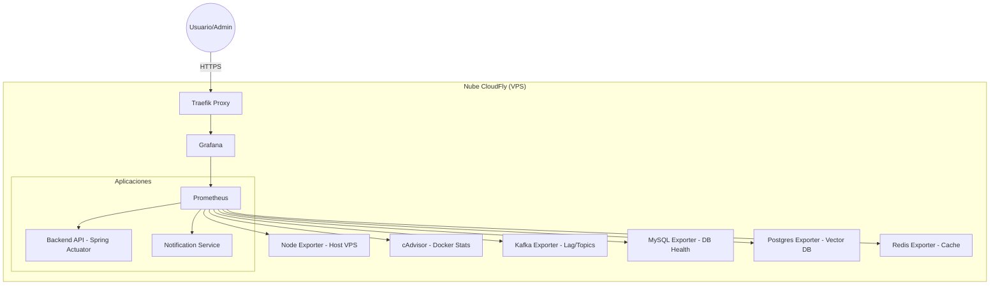

# 📊 Implementación de Monitoreo: CloudFly Observer

Esta documentación detalla la arquitectura, configuración y uso del nuevo sistema de monitoreo implementado para el ecosistema CloudFly.

## 🏗️ Arquitectura de Monitoreo

El sistema utiliza un enfoque de "agentes y recolector" (Exporters & Prometheus) para centralizar métricas de todas las capas de la aplicación.



## 🛠️ Componentes Implementados

### 1. Prometheus (El Motor)
*   **Función:** Recolecta métricas cada 15 segundos de todos los servicios.
*   **Configuración:** Localizada en `monitoring/prometheus/prometheus.yml`.
*   **Almacenamiento:** Volumen persistente `prometheus_data`.

### 2. Grafana (Visualización)
*   **Acceso:** `https://monitor.cloudfly.com.co`
*   **Credenciales:** 
    *   **User:** `admin`
    *   **Pass:** `cloudfly_admin_2024`
*   **Provisioning:** El datasource de Prometheus ya está pre-configurado automáticamente.

### 3. Exporters (Agentes)
| Agente | Función | Puerto |
| :--- | :--- | :--- |
| **Node Exporter** | CPU, RAM, Disco, Red del Servidor | 9100 |
| **cAdvisor** | Estadísticas de cada contenedor Docker | 8080 |
| **Kafka Exporter** | Estado de hilos, tópicos y Consumer Lag | 9308 |
| **MySQL/Postgres** | Salud de las bases de datos | 9104 / 9187 |
| **Spring Actuator** | Métricas internas de la JVM y el Backend | 8080/actuator |

---

## 📈 Guía de Dashboards Recomendados

Para visualizar los datos, se recomienda importar los siguientes dashboards en Grafana (**Dashboards > New > Import**):

1.  **Docker Containers (ID: 14282):** Vista detallada de cada contenedor (memoria, CPU individual).
2.  **Node Exporter Full (ID: 1860):** Estado general del servidor VPS (Ubuntu).
3.  **Spring Boot Statistics (ID: 4701):** Vital para ver el estado de la JVM del backend.
4.  **Kafka Overview (ID: 7589):** Monitoreo crítico para el flujo de mensajes del AI Agent.

---

## 🚀 Mantenimiento y Comandos Útiles

### Ver estado del monitoreo
```bash
docker compose -f docker-compose-monitoring.yml ps
```

### Ver logs de recolección (Prometheus)
```bash
docker compose -f docker-compose-monitoring.yml logs -f prometheus
```

### Reiniciar el stack de monitoreo
```bash
docker compose -f docker-compose-monitoring.yml restart
```

---

## 📝 Notas de Implementación Técnica
*   **Redes:** Se integró en `cloudfly_app-net` y `cloudfly_kafka-net` para acceso directo a los servicios internos.
*   **Seguridad:** Grafana está detrás de Traefik con TLS activado automáticamente vía Let's Encrypt.
*   **Backend:** Se agregaron las dependencias `micrometer-registry-prometheus` en el `pom.xml` para que el backend hable el lenguaje de Prometheus.
