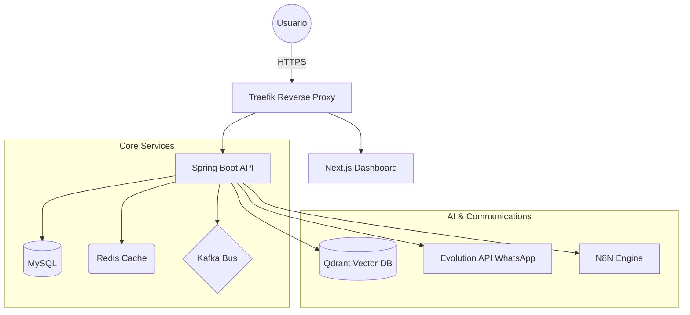

# CloudFly ERP 🚀
### El Sistema Operativo Inteligente para tu Negocio

<div align="center">

[](https://cloudfly.com.co)
[](https://cloudfly.com.co)
[](https://cloudfly.com.co)
[](https://cloudfly.com.co)

**Gestión Integral • Inteligencia Artificial • Comunicación Omnicanal**

[Ver Demo](https://dashboard.cloudfly.com.co) • [Características](#-características-principales) • [Tecnologías](#-stack-tecnológico) • [Documentación](#-documentación)

</div>

---

## 📖 Descripción

**CloudFly** no es solo un ERP convencional. Es una plataforma de gestión empresarial de última generación que fusiona los procesos tradicionales (Contabilidad, POS, Inventarios) con **Inteligencia Artificial Proactiva** y **Omnicanalidad**. Diseñado específicamente para el mercado latinoamericano, cumple con todas las normativas colombianas (NIIF, Nómina Electrónica, Facturación) mientras automatiza tus ventas 24/7.

### ✨ Pilares de Innovación

- 🤖 **IA Everywhere**: Chatbots con RAG que conocen tu negocio mejor que nadie.
- 💬 **WhatsApp Evolution**: Integración profunda con WhatsApp Business API.
- 🏢 **Multi-Tenant Real**: Arquitectura aislada y segura para múltiples empresas.
- 💸 **Nómina Colombiana**: Liquidación automática de prestaciones sociales, cesantías y prima.
- 📊 **BI en Tiempo Real**: Dashboards interactivos con análisis predictivo.

---

## 🚀 Características Principales

### 🧠 Inteligencia Artificial & Marketing
- **Agentes Especializados**: Bots de Ventas, Soporte y Agendamiento.
- **Búsqueda Semántica**: Integración con Qdrant para respuestas precisas basadas en tus documentos (RAG).
- **Workflows Inteligentes**: Automatización con N8N para flujos complejos de CRM.
- **Omnicanalidad**: WhatsApp, Instagram, Facebook y Email unificados.

### 💼 Módulo de Gestión Humana (Nómina 🇨🇴)
- **Liquidación Automática**: Cálculo preciso de salud, pensión, ARL y parafiscales.
- **Prestaciones Sociales**: Provisiones automáticas de Cesantías, Intereses y Prima.
- **Colillas de Pago**: Generación masiva de PDFs y envío automático a empleados.
- **Centros de Costo**: Distribución detallada de costos laborales por proyecto o área.

### 🛒 Ventas & POS Profesional
- **Facturación Electrónica**: Integración lista para normativas DIAN.
- **Control de Stock**: Alertas de inventario mínimo y trazabilidad de SKU.
- **Múltiples Precios**: Tarifas diferenciadas por cliente o volumen.
- **POS Rápido**: Interfaz optimizada para pantallas táctiles y lectores de código de barras.

### 📚 Contabilidad NIIF
- **PUC Colombia**: Plan Único de Cuentas jerárquico cargado por defecto.
- **Comprobantes Automáticos**: Cada venta o compra genera su asiento contable.
- **Reportes Financieros**: Balance General, Estado de Resultados y Libro Mayor en un click.

---

## 🛠️ Stack Tecnológico

### Core System
- **Backend**: Java 17, Spring Boot 3.4.0 (Arquitectura Reactiva)
- **Frontend**: Next.js 14, React 18, TypeScript, Material-UI (MUI)
- **Base de Datos**: MySQL 8.0 (Datos), PostgreSQL 15 (Servicios), Qdrant (Vectores)
- **Mensajería**: Apache Kafka & Socket.IO
- **Cache**: Redis

### Servicios de Terceros
- **IA**: OpenAI API / Claude API (LLMs)
- **Comunicación**: Evolution API (WhatsApp)
- **Automatización**: N8N
- **Soporte**: Chatwoot

---

## 🏗️ Arquitectura de Red



---

## 📦 Instalación (Docker)

```bash
# 1. Clonar el proyecto
git clone https://github.com/cloudfly-erp/core.git

# 2. Configurar entorno
cp .env.example .env

# 3. Desplegar con Docker Compose
docker-compose --profile full up -d
```

---

## 📝 Documentación & Contacto

- **Manual de Usuario**: [docs.cloudfly.com.co](https://docs.cloudfly.com.co)
- **API Reference**: [api.cloudfly.com.co/swagger-ui.html](https://api.cloudfly.com.co/swagger-ui.html)
- **Soporte**: [soporte@cloudfly.com.co](mailto:soporte@cloudfly.com.co)

---

<div align="center">
Desarrollado con ❤️ por el equipo de CloudFly
</div>
