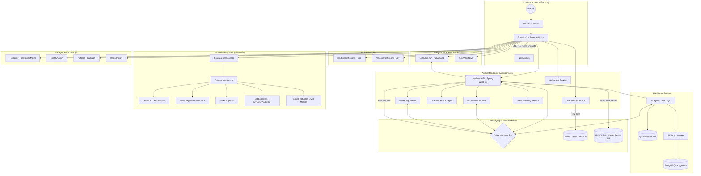

# 🚀 CloudFly AI: Plataforma de CRM y Automatización

CloudFly es una solución integral "All-in-One" diseñada para la gestión comercial impulsada por Inteligencia Artificial, centralizando la comunicación multicanal, la gestión de pedidos y la automatización de procesos en una infraestructura escalable de microservicios.

## 🏗️ Arquitectura del Sistema

### Núcleo de Aplicación (Core)
*   **Backend API (`Java/Spring Boot`):** Motor reactivo (R2DBC) para lógica de negocio y persistencia.
*   **Frontend Dashboard (`Next.js/React`):** Interfaz de usuario moderna y responsiva.
*   **Scheduler Service (`Spring Boot`):** Gestión de calendarios y citas en tiempo real.
*   **Evolution API:** Integración con WhatsApp.

### Inteligencia Artificial
*   **AI Agent (`Python/OpenAI`):** Agente autónomo para cierre de ventas y atención al cliente.
*   **Qdrant & PGVector:** Bases de datos vectoriales para memoria semántica.

## 🛠️ Infraestructura y Despliegue

La plataforma está diseñada para ser desplegada mediante Docker Compose en entornos VPS.

### Comandos de Despliegue Rápido
```bash
# Sincronizar repositorio
git pull origin main

# Reconstruir servicios principales
docker compose -f docker-compose-full-vps.yml up -d --build backend-api ai-agent
```

## 📋 Ficha Técnica (Resumen de Servicios)

| Servicio | Tecnología | Dominio / Endpoint |
| :--- | :--- | :--- |
| **Dashboard** | Next.js | `dashboard.cloudfly.com.co` |
| **Backend API** | Java 17 | `api.cloudfly.com.co` |
| **WhatsApp API** | Evolution API | `eapi.cloudfly.com.co` |
| **Calendario** | Spring Boot | `calendar.cloudfly.com.co` |
| **Automatización**| n8n | `autobot.cloudfly.com.co` |
| **Chat Sockets** | Node.js | `chat.cloudfly.com.co` |

### Capas de Datos
*   **Transaccional:** MySQL 8.0
*   **Eventos:** Apache Kafka
*   **Caché:** Redis
*   **Vectores:** Qdrant & PostgreSQL (pgvector)

## 📊 Diagrama de Arquitectura Integral



---
© 2026 CloudFly AI - Soluciones de Automatización Inteligente.
