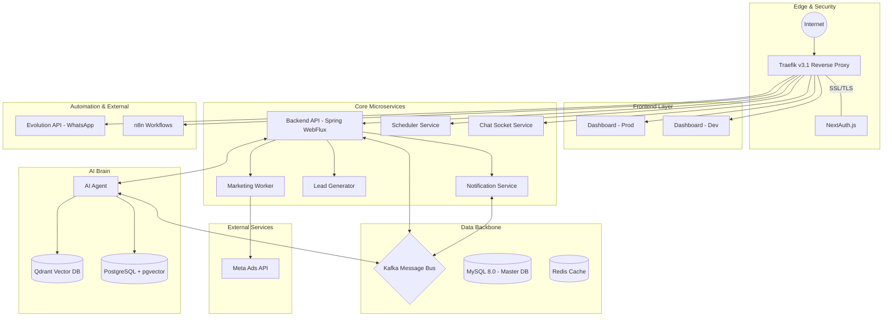

# <p align="center">🚀 CloudFly AI: The Ultimate Business Automation OS</p>

<p align="center">
  
  
  
  
</p>

---

## 🌟 Vision
**CloudFly** is an all-in-one "Business OS" designed to empower companies with AI-driven automation. By centralizing multi-channel communication, sales pipelines, and intelligent customer engagement, CloudFly transforms traditional operations into a high-performance digital ecosystem.

## 🏗️ System Architecture
CloudFly is built on a cutting-edge **Reactive Microservices** architecture, ensuring high scalability and low-latency processing.

### 🧩 Core Ecosystem
*   **Reactive API Engine (`Spring WebFlux`)**: A non-blocking, event-driven core handling complex business logic and multi-tenancy.
*   **High-Impact Dashboard (`Next.js 14`)**: A professional, real-time interface for business management and analytics.
*   **Smart Scheduler (`Spring Boot`)**: Real-time calendar synchronization and autonomous appointment booking.
*   **Communication Hub (`Evolution API`)**: Enterprise-grade WhatsApp integration for seamless customer interactions.

### 🧠 AI & Cognitive Layer
*   **Autonomous AI Agent**: Handles lead qualification, sales closing, and customer support with human-like reasoning.
*   **Semantic Memory**: Powered by **Qdrant** and **pgvector** to provide context-aware responses and long-term knowledge retention.
*   **Vector Workers**: Specialized services for indexing and processing unstructured data.

---

## 📋 Technical Services Map

| Service | Technology Stack | Endpoint |
| :--- | :--- | :--- |
| **🚀 Dashboard** | Next.js / TypeScript | `dashboard.cloudfly.com.co` |
| **⚙️ Backend API** | Java 17 / WebFlux | `api.cloudfly.com.co` |
| **💬 WhatsApp API** | Evolution API | `eapi.cloudfly.com.co` |
| **📅 Calendar** | Spring Boot / R2DBC | `calendar.cloudfly.com.co` |
| **🤖 Automation** | n8n / Workflows | `autobot.cloudfly.com.co` |
| **🔌 Chat Sockets** | Node.js / Socket.io | `chat.cloudfly.com.co` |

### 💾 Data Infrastructure
*   **Primary DB:** MySQL 8.0 (Multi-Tenant Architecture)
*   **Event Bus:** Apache Kafka (Asynchronous microservice communication)
*   **Fast Cache:** Redis (Session management & caching)
*   **Knowledge Base:** Qdrant & PostgreSQL (pgvector)

---

## 🛠️ Modules & Features

### 📈 Sales & CRM (`ventas`)
- **Dynamic Pipelines**: Visual Kanban boards for lead tracking.
- **Order Management**: End-to-end commercial document lifecycle.
- **Quotes & Invoicing**: Automated document generation and tracking.

### 📣 Marketing Automation
- **Multi-Channel Campaigns**: WhatsApp and Facebook integration.
- **Smart Audience Segregation**: AI-assisted list management.
- **Real-time Metrics**: Track conversion rates and engagement in real-time.

+### 📣 Meta Ads Integration
+- **Automated Ad Creation**: Create Facebook/Instagram ads programmatically
+- **AI-Powered Copy**: Generate ad content using OpenRouter/NVIDIA Nemotron
+- **Image Upload**: Automatic product image upload to Meta
+- **Campaign Management**: Full campaign lifecycle (Campaign → Ad Set → Ad)
+- **Colombia Targeting**: Pre-configured targeting for Colombian market

### 🤖 AI Conversational Engine
- **Customizable Chatbots**: Deploy intelligent bots tailored to your industry.
- **Lead Gen Workers**: Automated scraping and lead identification (Apify).
- **Sentiment Analysis**: Real-time customer mood tracking.

---

## 📊 High-Level Architecture Diagram



---

## 🚀 Quick Start for Developers

### Prerequisites
- Docker & Docker Compose
- Java 17+ (for local development)
- Node.js 18+

### Deployment
```bash
# Sync latest changes
git pull origin main

# Start the full production stack
docker compose -f docker-compose-full-vps.yml up -d --build
```

### Meta Ads Commands
```bash
# Generate AI ad copy only
cd marketing_agent
python main.py --generate-ad

# Create Meta image ad
python main.py --create-meta-ads

# Full campaign with Meta ads
python main.py --generate-ad --create-meta-ads

# Specify daily budget (in COP)
python main.py --create-meta-ads --meta-ads-budget 100000
```

### Meta Marketing API Configuration
| Variable | Description | Example |
|----------|-------------|---------|
| `META_ACCESS_TOKEN` | System User Access Token | `EAABsbCS1iHgBO...` |
| `META_AD_ACCOUNT_ID` | Ad Account ID (format: `act_XXX`) | `act_123456789` |
| `META_PAGE_ID` | Facebook Page ID | `123456789012345` |

---

<p align="center">
  <b>© 2026 CloudFly AI - Intelligent Business Operating System</b><br>
  <i>Empowering the next generation of automated enterprises.</i>
</p>
