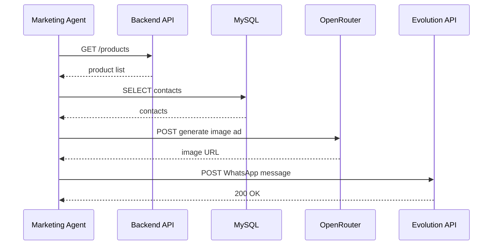

# Marketing Agent Microservice Architecture

## Overview
The **Marketing Agent** microservice is responsible for generating ad content, orchestrating campaigns, and sending messages via the Evolution (WhatsApp) API. It interacts with several internal services and external APIs.

## Key Components
| Component | Description |
|-----------|-------------|
| `main.py` | Entry point that parses CLI arguments and starts the orchestrator. |
| `ai_ad_service.py` | Calls OpenRouter to generate image ads and copy. |
| `product_service.py` | Retrieves product data from the backend API. |
| `campaign_service.py` | Builds WhatsApp‑compatible campaign messages. |
| `evolution_service.py` | Sends messages to the Evolution API (WhatsApp). |
| `facebook_client.py` | Handles Facebook Ads API credentials (used by UI). |
| `config.py` | Loads environment variables and validates required config. |

## Architecture Diagram
```mermaid
graph TD
    subgraph "External APIs"
        OA[OpenRouter API]
        EV[Evolution (WhatsApp) API]
        FB[Facebook Ads API]
    end
    subgraph "Internal Services"
        BE[Backend API (Java)]
        DB[(MySQL DB)]
        KR[Kafka]
        RD[Redis]
    end
    subgraph "Marketing Agent"
        MA[marketing_agent]
        MA -->|reads config| CFG[config.py]
        MA -->|fetches products| BE
        MA -->|stores contacts| DB
        MA -->|queues events| KR
        MA -->|caches data| RD
        MA -->|generates ad| OA
        MA -->|sends message| EV
        MA -->|optional FB sync| FB
    end
    style OA fill:#f9f,stroke:#333,stroke-width:2px
    style EV fill:#bbf,stroke:#333,stroke-width:2px
    style FB fill:#bfb,stroke:#333,stroke-width:2px
```

## Data Flow (Sequence)


## Environment Variables
| Variable | Example | Description |
|----------|---------|-------------|
| `PUBLIC_DOMAIN` | `marketing.example.com` | Domain used by Traefik routing |
| `DB_HOST` | `mysql` | MySQL host (Docker network name) |
| `DB_USER` | `root` | MySQL user |
| `DB_PASSWORD` | `widowmaker` | MySQL password |
| `KAFKA_HOST` | `kafka` | Kafka broker address |
| `EVOLUTION_API_KEY` | `abc123` | Auth token for Evolution API |
| `OPENROUTER_API_KEY` | `or-xyz` | Key for OpenRouter image generation |
| `FACEBOOK_APP_ID` | `1234567890` | Facebook App ID (optional) |
| `FACEBOOK_APP_SECRET` | `s3cr3t` | Facebook App Secret |

## Deployment (Docker Compose)
```yaml
marketing-agent:
  build:
    context: ./marketing_agent
    dockerfile: Dockerfile
  container_name: marketing-agent
  restart: on-failure
  env_file:
    - .env.vps
  environment:
    - PUBLIC_DOMAIN=${MARKETING_AGENT_DOMAIN}
    - DB_HOST=mysql
    - DB_USER=root
    - DB_PASSWORD=widowmaker
    - KAFKA_HOST=kafka
    - EVOLUTION_API_KEY=${EVOLUTION_API_KEY}
    - OPENROUTER_API_KEY=${OPENROUTER_API_KEY}
  networks:
    - app-net
    - kafka-net
  depends_on:
    - mysql
    - kafka
    - evolution-api
```

## Testing Strategy
- **Unit Tests**: Located in `tests/` (e.g., `test_ai_ad_service.py`, `test_campaign_service.py`).
- **Integration Tests**: `test_integration_complete.py` validates end‑to‑end flow with real services.
- **Dockerfile Acceptance Tests**: `test_dockerfile_acceptance.py` ensures the container builds and runs health checks.

## Change Log
- Added full architecture documentation (this file).
- Included Mermaid diagrams for visual reference.
- Updated environment variable table to match `.env.example`.

---
*Document generated by the AI Technical Writer for sprint completion.*