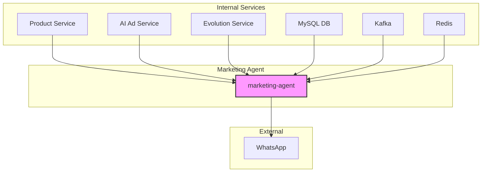
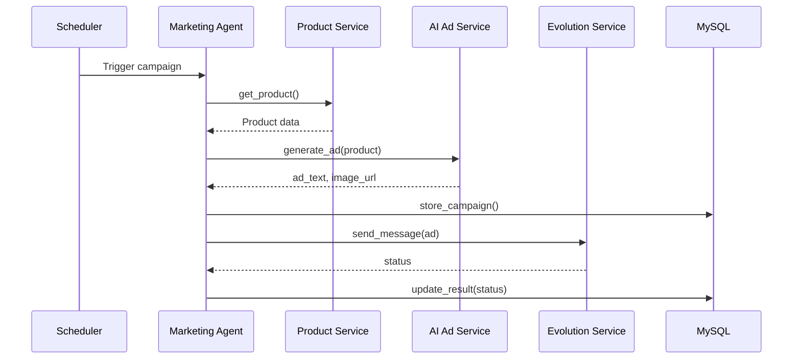

# Marketing Agent Microservice Documentation

## Overview
The **Marketing Agent** microservice is responsible for generating ad creatives, constructing campaign messages, and sending them through the Evolution (WhatsApp) API. It interacts with several internal services:

- **Product Service** – provides product data.
- **AI Ad Service** – generates ad copy and images via OpenRouter.
- **Evolution Service** – sends WhatsApp messages.
- **MySQL Database** – stores contacts and campaign results.
- **Kafka & Redis** – used for asynchronous processing and caching.

The service runs in Docker and is orchestrated via `docker-compose-full-vps.yml`.

## Architecture Diagram


## Service Flow (Sequence Diagram)


## Docker Compose Snippet
```yaml
marketing-agent:
  build:
    context: ./marketing_agent
    dockerfile: Dockerfile
  container_name: marketing-agent
  restart: on-failure
  env_file:
    - .env.vps
  environment:
    - TZ=America/Bogota
    - BACKEND_URL=http://backend-api:8080
    - EVOLUTION_API_URL=http://evolution-api:8080
    - DB_HOST=mysql
    - DB_PORT=3306
    - DB_NAME=cloud_master
    - DB_USER=root
    - DB_PASSWORD=${DB_PASSWORD}
    - KAFKA_HOST=kafka:9092
    - REDIS_HOST=redis
    - OPENROUTER_API_KEY=${OPENROUTER_API_KEY}
  networks:
    - app-net
  depends_on:
    - mysql
    - backend-api
    - evolution-api
  healthcheck:
    test: ["CMD", "curl", "-f", "http://localhost:8080/health"]
    interval: 30s
    timeout: 5s
    retries: 3
```

## Environment Variables
| Variable | Description | Example |
|----------|-------------|---------|
| `BACKEND_URL` | URL of the backend API | `http://backend-api:8080` |
| `EVOLUTION_API_URL` | Evolution (WhatsApp) API endpoint | `http://evolution-api:8080` |
| `DB_HOST` | MySQL host | `mysql` |
| `DB_PORT` | MySQL port | `3306` |
| `DB_NAME` | Database name | `cloud_master` |
| `DB_USER` | DB user | `root` |
| `DB_PASSWORD` | DB password (from .env.vps) | `mysecret` |
| `OPENROUTER_API_KEY` | API key for AI ad generation | `sk-xxxx` |
| `KAFKA_HOST` | Kafka broker address | `kafka:9092` |
| `REDIS_HOST` | Redis host | `redis` |

## Testing Strategy
- **Unit Tests** – located in `tests/` (e.g., `test_campaign_service.py`).
- **Integration Tests** – spin up Docker stack and hit `/health` endpoints (`test_cloud94.py`, `test_cloud92.py`).
- **E2E Tests** – full campaign flow using real services (`test_integration_complete.py`).

## Health Check Endpoint
The service exposes `GET /health` returning `{ "status": "ok" }`. It is used by Docker healthchecks and integration tests.

---
*Documentation generated by the AI Technical Writer.*