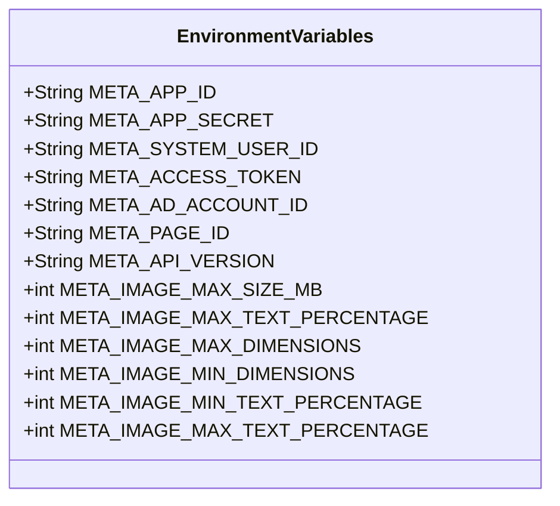

# Marketing Agent Documentation

The Marketing Agent is a lightweight Python library that handles all interactions with Meta’s (Facebook) Ads API. It is used by the `marketing-worker` service to create, update and manage ad campaigns, creatives and audiences.

> **NOTE**
> This documentation is the *single source of truth* for the Meta integration. It is kept in sync with:
> * `marketing_agent/.env.example` – the environment variables that must be set at runtime.
> * `marketing_agent/META_API_SPECIFICATION.md` – the formal contract for request/response payloads, error codes, image limits, etc.

---

## 📦 Installation

```bash
pip install -e .
```

> The library is pure Python and has no external dependencies beyond the standard library and `requests`.

---

## ⚙️ Configuration

All configuration is read from environment variables. The following table lists every Meta‑related variable, its purpose and an example value. Copy the file `marketing_agent/.env.example` and adjust the values for your environment.



| Variable | Description | Example |
|----------|-------------|---------|
| `META_APP_ID` | Facebook App ID created in the Meta Developer portal. | `123456789012345` |
| `META_APP_SECRET` | App secret for server‑to‑server token generation. | `a1b2c3d4e5f6g7h8i9j0` |
| `META_SYSTEM_USER_ID` | ID of the System User created in Business Manager. | `1234567890123456` |
| `META_ACCESS_TOKEN` | Long‑lived System User token with `ads_management`, `pages_read_engagement`, `business_management` scopes. | `EAAGm0PX4ZC...` |
| `META_AD_ACCOUNT_ID` | Ad account identifier (must include `act_` prefix). | `act_123456789012345` |
| `META_PAGE_ID` | Facebook Page ID used for ad creatives. | `112233445566778` |
| `META_API_VERSION` | Graph API version to target (e.g., `v18.0`). | `v18.0` |
| `META_IMAGE_MAX_SIZE_MB` | Max image size enforced by the API (8 MB). | `8` |
| `META_IMAGE_MAX_TEXT_PERCENTAGE` | Maximum text overlay allowed (20 %). | `20` |
| `META_IMAGE_MAX_DIMENSIONS` | Max image dimensions (pixels). | `4096` |
| `META_IMAGE_MIN_DIMENSIONS` | Min image dimensions (pixels). | `200` |
| `META_IMAGE_MIN_TEXT_PERCENTAGE` | Minimum text coverage for certain placements. | `5` |
| `META_IMAGE_MAX_TEXT_PERCENTAGE` | Maximum text coverage for certain placements. | `20` |

> **Tip** – Keep the `META_` prefix consistent; it makes filtering easier in CI pipelines.

---

## 📚 Meta Setup Guide

### Step 1: Create Meta Developer Account
1. Go to [Meta for Developers](https://developers.facebook.com/)
2. Click **Get Started** and create a developer account
3. Verify your account with a phone number

### Step 2: Create a Business App
1. In Meta for Developers, click **Create App**
2. Select **Business** as app type
3. Fill in app details and create

### Step 3: Get Access Token
1. Go to **Business Manager → System Users**
2. Create a new System User
3. Assign permissions: `ads_management`, `pages_read_engagement`, `business_management`
4. Generate Access Token with these permissions

### Step 4: Find Ad Account ID
1. Go to [Ads Manager](https://www.facebook.com/adsmanager/)
2. Click on account dropdown
3. Find your Account ID (format: `act_XXXXXXXXXXXXXXX`)

### Step 5: Find Page ID
1. Go to your Facebook Page
2. Click **About → Page Transparency**
3. Find Page ID at bottom of section

---

## 🔧 Troubleshooting

### Common API Errors

| Error Code | Description | Solution |
|------------|-------------|----------|
| 17 | User-level throttling | Reduce request rate, wait before retrying |
| 32 | Page-level throttling | Reduce request rate, wait before retrying |
| 613 | Rate limit exceeded | Implement exponential backoff |

### Image Upload Issues
- **Error**: *"Invalid image format"* – **Solution**: Use JPEG, PNG, or WebP formats only
- **Error**: *"Image too large"* – **Solution**: Keep images under 8 MB
- **Error**: *"Image rejected"* – **Solution**: Ensure less than 20% text coverage

### Authentication Problems
- **Error**: *"Invalid OAuth token"* – **Solution**: Token may expire, generate new System User token
- **Error**: *"Insufficient permissions"* – **Solution**: Verify `ads_management` permission is granted
- **Error**: *"Ad account not found"* – **Solution**: Check `META_AD_ACCOUNT_ID` format (must include `act_` prefix)

---

## 📸 Image Specifications

### Recommended Dimensions

| Placement | Size | Aspect Ratio |
|-----------|------|--------------|
| Facebook Feed | 1200 × 628 px | 1.91:1 |
| Instagram Feed | 1080 × 1080 px | 1:1 |
| Instagram Stories | 1080 × 1920 px | 9:16 |

### File Requirements
- **Formats**: JPEG, PNG, WebP, BMP, TIFF
- **Max Size**: 8 MB
- **Min Size**: 1 KB (recommended 100 + KB)
- **Text Coverage**: Less than 20 %

---

## 🚀 Usage

```python
from marketing_agent.meta_ads_service import MetaAdsService
import os

service = MetaAdsService()

ad_id = service.create_image_ad(
    name="Summer Sale",
    image_path="/tmp/summer.jpg",
    link="https://example.com/sale",
    page_id=os.getenv("META_PAGE_ID"),
    ad_account_id=os.getenv("META_AD_ACCOUNT_ID")
)

print(f"Ad created: {ad_id}")
```

> All methods raise `MetaAdsError` on failure. The library automatically handles token refresh, rate‑limiting and back‑off.

---

## 🧪 Testing

Run the full test suite:

```bash
pytest -q
```

All tests are located under `marketing_agent/tests/`. They cover environment variable validation, API contract compliance, error handling, retry logic, and image validation rules.

---

## 📦 Docker

The Marketing Agent is used by the `marketing-worker` container. No separate Docker image is required for the library itself.

```yaml
services:
  marketing-worker:
    image: cloudfly/marketing-worker:latest
    env_file:
      - marketing_agent/.env.example
    depends_on:
      - redis
      - kafka
```

---

## 📚 References

- [Meta Ads API Documentation](https://developers.facebook.com/docs/marketing-api/)
- [META_API_SPECIFICATION.md](META_API_SPECIFICATION.md) – contract for request/response payloads, error codes, image limits, etc.
- [marketing_agent/.env.example](.env.example) – example environment variables.

---

## 📬 Contact

For questions or support, open an issue in this repository or contact the CloudFly DevOps team.

---