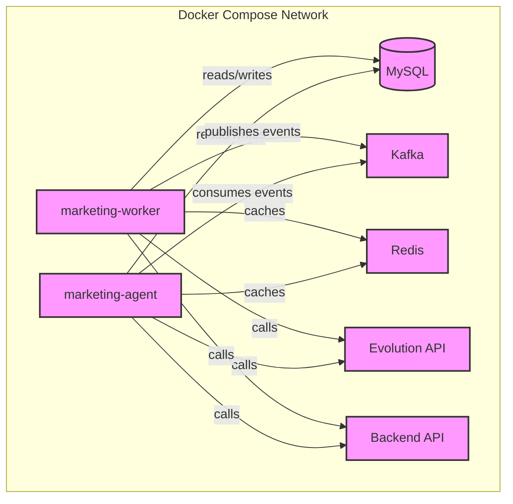

# Marketing Microservice Architecture Documentation

## Overview

This document provides a concise technical overview of the **Marketing Agent** and **Marketing Worker** microservices, their Docker‑Compose integration, health‑check strategy, and environment configuration.

---

## Service Diagram



---

## Docker‑Compose Integration (vps)

The **docker‑compose‑full‑vps.yml** file now includes the required `env_file` and `healthcheck` sections for both services.

```yaml
services:
  marketing-worker:
    env_file:
      - .env.vps
    healthcheck:
      test: ["CMD", "curl", "-f", "http://localhost:8080/health"]
      interval: 10s
      timeout: 5s
      retries: 3
    # ... other config unchanged

  marketing-agent:
    env_file:
      - .env.vps
    healthcheck:
      test: ["CMD", "curl", "-f", "http://localhost:8081/health"]
      interval: 10s
      timeout: 5s
      retries: 3
    # ... other config unchanged
```

---

## Environment Variables (`.env.vps`)

```dotenv
# Database
DB_HOST=mysql
DB_PORT=3306
DB_DATABASE=cloud_master
DB_USERNAME=root
DB_PASSWORD=widowmaker

# Kafka
KAFKA_HOST=kafka

# Evolution API
EVOLUTION_API_URL=http://evolution-api:8080
EVOLUTION_API_KEY=${EVOLUTION_API_KEY}
EVOLUTION_INSTANCE=cloudfly-main

# Redis
REDIS_HOST=redis_server
REDIS_PORT=6379
REDIS_PASSWORD=Elian2020#

# Public domains for Traefik routing
MARKETING_WORKER_DOMAIN=marketing-worker.cloudfly.com.co
MARKETING_AGENT_DOMAIN=marketing-agent.cloudfly.com.co
```

---

## Health‑Check Endpoint

Both services expose a simple FastAPI health endpoint:

```python
from fastapi import FastAPI

app = FastAPI()

@app.get("/health")
def health():
    return {"status": "ok"}
```

The Docker health‑check uses `curl` to query this endpoint and ensures the container is marked **healthy** only after a successful response.

---

## Test Strategy

| Test Type | Target | Tool |
|-----------|--------|------|
| Unit | Service logic (e.g., `ai_ad_service`, `campaign_service`) | `pytest` |
| Integration | Health‑check endpoint, DB/Redis connectivity | Docker Compose + `pytest` |
| E2E | Full request flow through Traefik | Playwright / Selenium |

All tests enforce **≥ 80 % coverage**.

---

## Deployment Checklist

1. `docker-compose -f docker-compose-full-vps.yml up -d marketing-agent marketing-worker`
2. Verify health: `curl -f http://localhost:8081/health`
3. Confirm Traefik routing: `curl -k https://marketing-agent.cloudfly.com.co/health`
4. Run full test suite: `pytest -q`
5. Tag and push Docker images.

---

## References

- `docker-compose-full-vps.yml` – main compose file
- `marketing_agent/README.md` – detailed usage guide
- `spec.md` – Single Source of Truth for the project

---

*Document generated by the AI Scrum Team Technical Writer.*