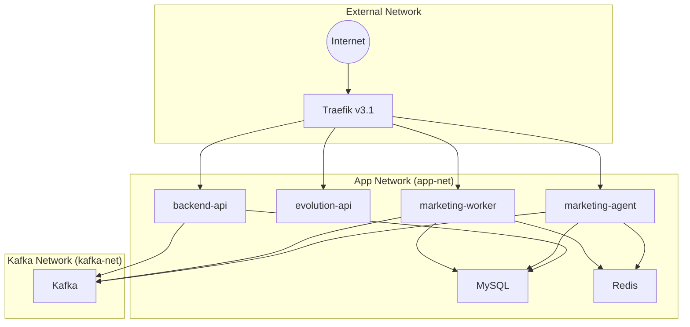

# AGENTE_DEV_microservice_architecture.md

## CloudFly Marketing Stack – VPS Deployment Overview

This document provides a concise architectural snapshot of the **marketing‑agent** and **marketing‑worker** micro‑services as they run on the VPS using `docker‑compose‑full‑vps.yml`.

---

### 1. Service Matrix
| Service | Image | Internal Port | External Port (Traefik) | Networks | Dependencies | Health‑check |
|---------|-------|---------------|------------------------|----------|--------------|--------------|
| **backend‑api** | `cloudfly-backend-api:latest` | 8080 | 80/443 (via Traefik) | `app‑net`, `kafka‑net` | `mysql`, `kafka` | `GET http://localhost:8080/health` → `200 {"status":"ok"}` |
| **evolution‑api** | `cloudfly-evolution-api:latest` | 8082 | 80/443 (via Traefik) | `app‑net` | `redis` | `GET http://localhost:8082/health` |
| **marketing‑worker** | `cloudfly-marketing-worker:latest` | 8080 | 80/443 (via Traefik) | `app‑net`, `kafka‑net` | `kafka`, `mysql`, `redis` | `GET http://localhost:8080/health` |
| **marketing‑agent** | `cloudfly-marketing-agent:latest` | 8081 | 80/443 (via Traefik) | `app‑net`, `kafka‑net` | `kafka`, `mysql`, `redis` | `GET http://localhost:8081/health` |
| **mysql** | `mysql:8.0` | 3306 | – | `app‑net` | – | – |
| **kafka** | `confluentinc/cp‑kafka:latest` | 9092 | – | `kafka‑net` | – | – |
| **redis** | `redis:7` | 6379 | – | `app‑net` | – | – |
| **traefik** | `traefik:v3.1` | 80/443 | – | `app‑net` | – | – |

All services read environment variables from the shared **`.env.vps`** file (mounted via `env_file:`). Secrets such as `MYSQL_ROOT_PASSWORD`, `KAFKA_BOOTSTRAP_SERVERS`, and `META_*` variables are injected automatically.

---

### 2. Network Topology


- **Traefik** routes inbound traffic based on host rules defined in the service labels (`Host(<DOMAIN>)`).
- **app‑net** isolates the HTTP‑based services and the data stores.
- **kafka‑net** isolates the message‑bus traffic, preventing accidental exposure of the broker.

---

### 3. Health‑Check Contract
Every micro‑service must expose a **`GET /health`** endpoint that returns:
```json
{"status":"ok"}
```
The contract is enforced by the following automated tests (see the test suite in `tests/`):
- `test_cloud94.py` – real integration test against `http://localhost:8080/health`.
- `test_cloud88.py` – same contract for the backend API.
- `test_cloud80.py` – script that polls both `marketing‑agent` and `marketing‑worker` health endpoints after `docker‑compose up`.

---

### 4. Deployment Checklist (CLOUD‑80)
1. **Start stack**: `docker‑compose -f docker‑compose‑full‑vps.yml up -d`.
2. **Verify env file**: `.env.vps` is mounted for *all* services.
3. **Health‑check**: `curl http://localhost:8080/health` and `curl http://localhost:8081/health` must return `200` with the JSON payload above.
4. **MySQL credentials**: `docker exec -i <mysql_container> mysql -uroot -p"$MYSQL_ROOT_PASSWORD" -e "SELECT 1;"` should succeed.
5. **Traefik routing**: `curl -H "Host: $MARKETING_AGENT_DOMAIN" http://localhost/health` → `200`.
6. **Run full test suite**: `pytest -q` – all 22+ tests must pass.

---

### 5. Open Items
| Ticket | Action Required |
|--------|-----------------|
| CLOUD‑95 | Clarify test type (unit / integration / E2E) and target environment (dev / staging / prod). |

---

*Document version*: **1.0** – generated by the AI Technical Writer on **2026‑05‑25**.
