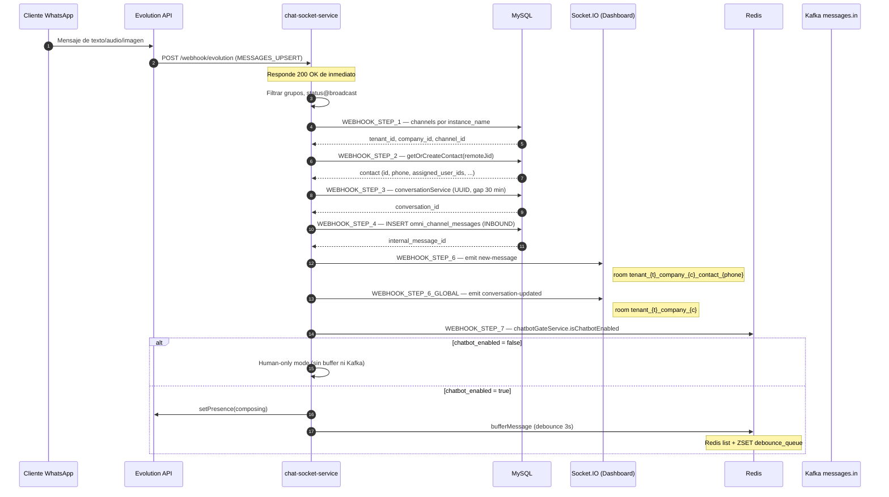
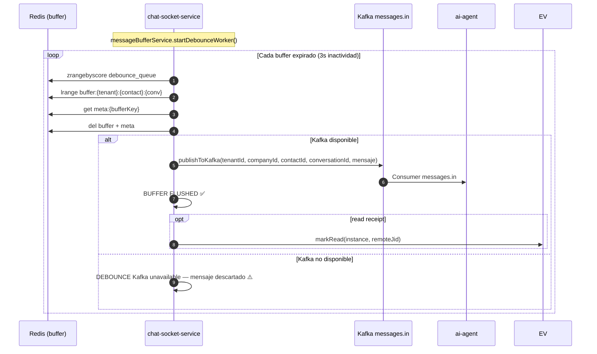
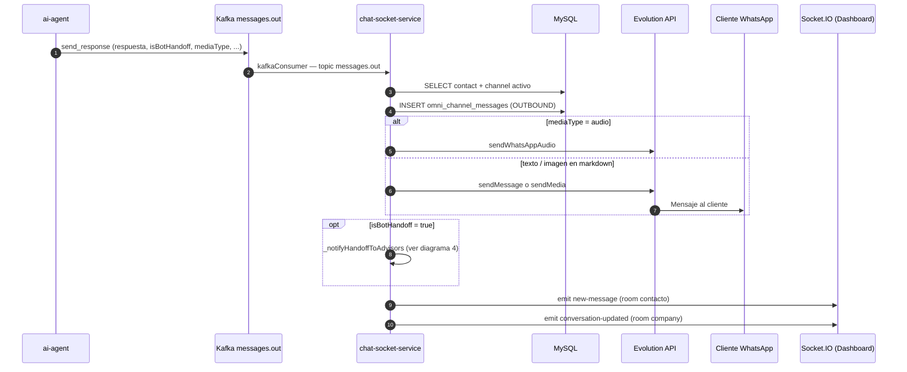
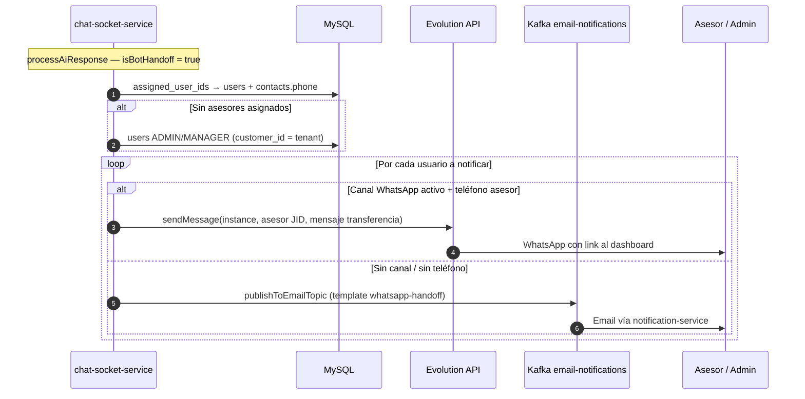
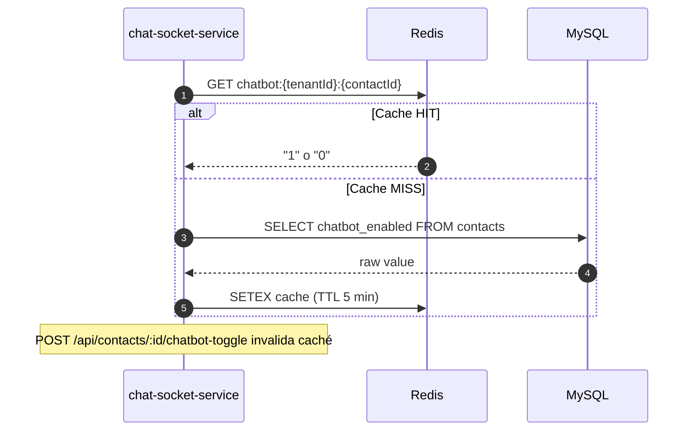
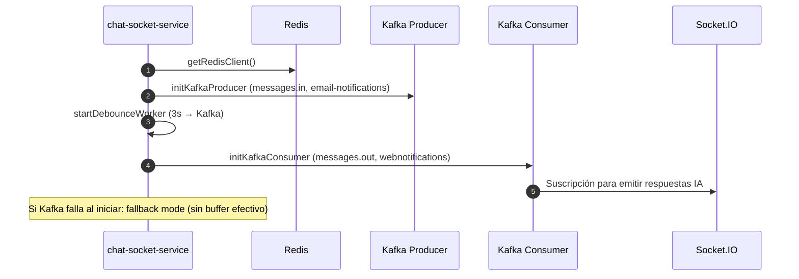

# Chat Socket Service — Lógica y diagramas de secuencia

Servicio Node.js (`chat_socket`) que recibe webhooks de WhatsApp (Evolution API), persiste mensajes, emite eventos en tiempo real vía Socket.IO, y orquesta el envío hacia el agente de IA vía Kafka.

---

## Componentes principales

| Componente | Rol |
|------------|-----|
| **Evolution API** | WhatsApp: webhooks entrantes y envío de mensajes |
| **chat-socket-service** | Orquestador HTTP + Socket.IO |
| **MySQL** | `channels`, `contacts`, `omni_channel_messages` |
| **Redis** | Caché chatbot gate + buffer debounce (3s) |
| **Kafka** | `messages.in` (→ IA), `messages.out` (← IA), `email-notifications`, `webnotifications` |
| **ai-agent** | Consume `messages.in`, publica `messages.out` |
| **Dashboard (frontend)** | Cliente Socket.IO en salas por tenant/company/contacto |

---

## 1. Mensaje entrante WhatsApp (webhook Evolution)

Flujo principal: `POST /webhook/evolution` → `ChatService.processEvolutionWebhook`.

---

## 2. Debounce → publicación a Kafka (hacia ai-agent)

Worker interno cada 500ms; al expirar 3s sin nuevos mensajes, concatena y publica.

---

## 3. Respuesta del agente de IA (Kafka messages.out)

El `ai-agent` publica en `messages.out`; `kafkaConsumer` de chat-socket lo consume.

---

## 4. Notificación de handoff a asesores (desde chat-socket)

Cuando `messages.out` trae `isBotHandoff: true`, chat-socket notifica por su cuenta (además del flujo CLOUD-158 en `ai-agent` → `whatsapp-notifications`).

---

## 5. Chatbot Gate (Redis + MySQL)

---

## 6. Arranque del servicio (AI-INFRA)

---

## Salas Socket.IO

| Sala | Uso |
|------|-----|
| `tenant_{tenantId}_company_{companyId}_contact_{phone}` | Chat en vivo del contacto (webhook + respuestas IA) |
| `tenant_{tenantId}_company_{companyId}` | Kanban / lista conversaciones (`conversation-updated`) |
| `tenant_{tenantId}_contact_{phone}` | Emisión alternativa desde kafkaConsumer (respuesta IA) |
| `tenant_{tenantId}` / `tenant_{tenantId}_company_{companyId}` | Notificaciones web (`webnotifications`) |

---

## Mapa de logs → pasos

| Log | Paso |
|-----|------|
| `[WEBHOOK_STEP_1]` | Resolver canal por `instance_name` |
| `[WEBHOOK_STEP_2]` | Resolver/crear contacto |
| `[WEBHOOK_STEP_3]` | UUID de conversación |
| `[WEBHOOK_STEP_4]` | Guardar mensaje INBOUND |
| `[WEBHOOK_STEP_6]` / `[WEBHOOK_STEP_6_OK]` | Socket.IO contacto |
| `[WEBHOOK_STEP_6_GLOBAL]` | Socket.IO company (Kanban) |
| `[WEBHOOK_STEP_7]` | Chatbot gate |
| `[WEBHOOK_GATE]` | Buffer o modo humano |
| `[BUFFER]` / `[DEBOUNCE] BUFFER FLUSHED` | Cola debounce → Kafka |
| `[KAFKA-CONSUMER]` | Respuesta IA desde `messages.out` |
| `[AI-RESPONSE]` | Persistir OUTBOUND + Evolution |
| `[HANDOFF_NOTIFY]` | Notificar asesores (handoff en chat-socket) |

---

## Relación con CLOUD-158 (ai-agent)

El handoff a humano tiene **dos caminos** de notificación a asesores:

1. **ai-agent** (historia CLOUD-158): al detectar `handoff_request`, publica en Kafka `whatsapp-notifications` → `notification-service` → Evolution.
2. **chat-socket** (este documento): si `isBotHandoff` en `messages.out`, ejecuta `_notifyHandoffToAdvisors` directo (Evolution o email).

Ambos pueden coexistir; conviene alinear criterios de destinatarios para evitar duplicados.

---

## Archivos de referencia en código

| Archivo | Responsabilidad |
|---------|-----------------|
| `src/index.js` | HTTP, webhooks, Socket.IO, startup AI-INFRA |
| `src/services/chatService.js` | `processEvolutionWebhook`, `processAiResponse`, handoff |
| `src/services/messageBufferService.js` | Debounce 3s → `messages.in` |
| `src/services/kafkaConsumer.js` | Consume `messages.out`, `webnotifications` |
| `src/services/kafkaProducer.js` | Produce `messages.in`, `email-notifications` |
| `src/services/chatbotGateService.js` | Gate Redis/MySQL |
| `src/services/conversationService.js` | UUID conversación (30 min gap) |
