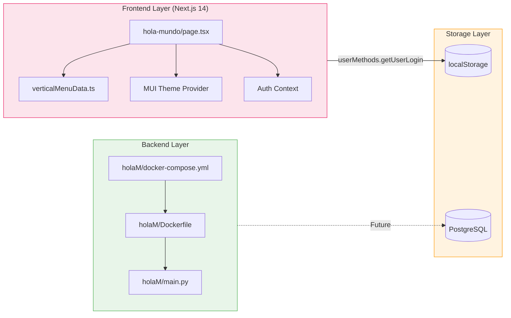
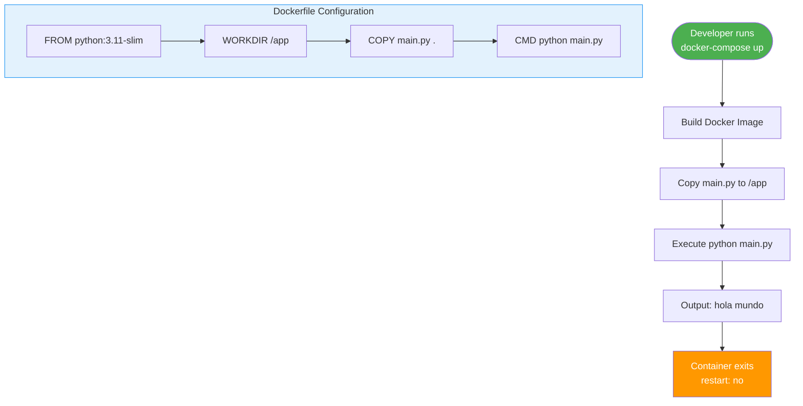
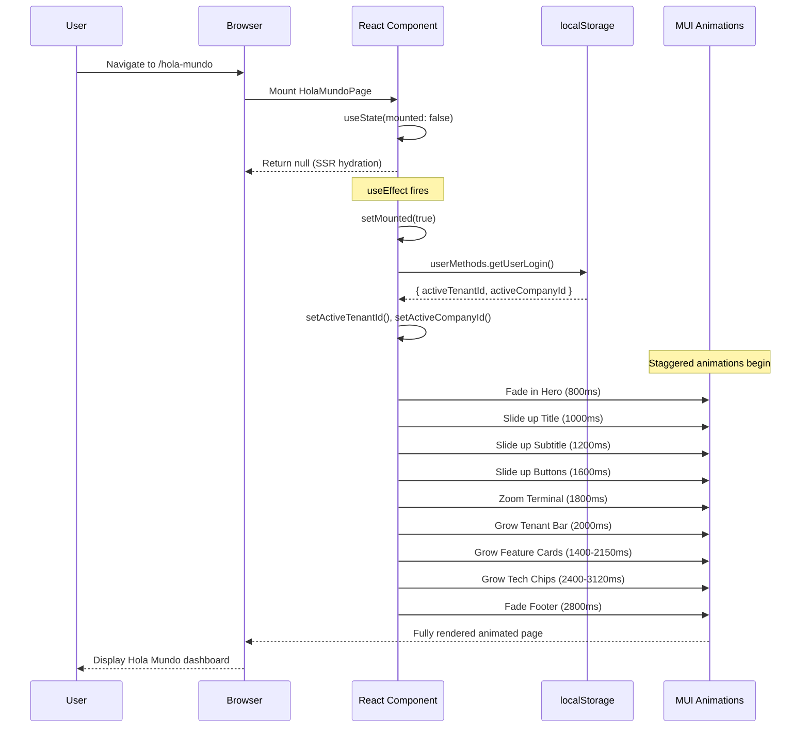
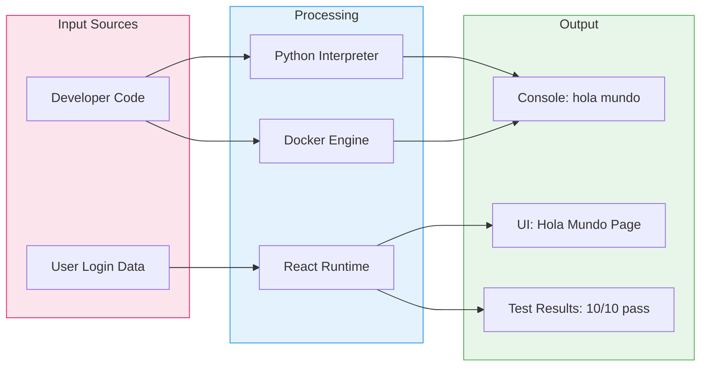
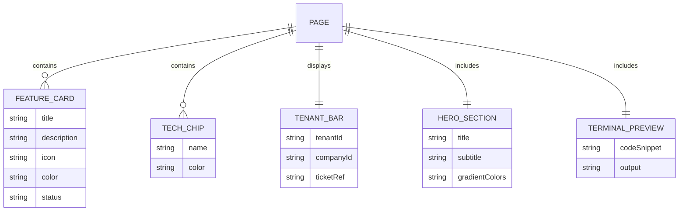
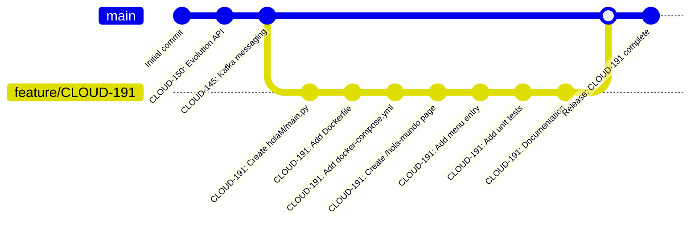
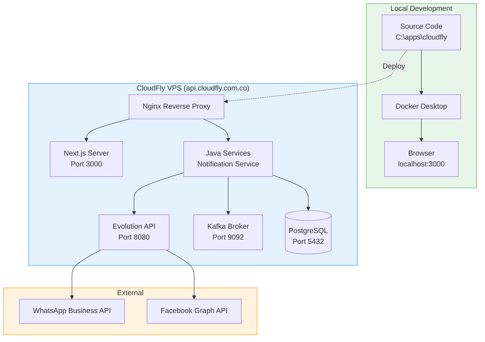

# CLOUD-191 "Hola Mundo" — Architecture Diagrams

> **Ticket**: CLOUD-191  
> **Status**: ✅ Done  
> **Agent**: Technical Writer & Diagram Specialist  

---

## 1. System Context Diagram

```mermaid
graph TB
    subgraph Users["👥 Users"]
        DEV[Developer]
        ADMIN[Admin User]
        MANAGER[Manager]
    end

    subgraph CloudFly["CloudFly AI Platform"]
        WEB[Next.js 14 Frontend<br/>Port 3000]
        API[Backend Services<br/>Python + Java]
        DB[(PostgreSQL<br/>Port 5432)]
        KAFKA[Apache Kafka<br/>Port 9092]
        EVOLUTION[Evolution API<br/>Port 8080]
    end

    subgraph External["External Services"]
        WA[WhatsApp Business API]
        FB[Facebook Messenger]
    end

    subgraph CLOUD191["🆕 CLOUD-191 Feature"]
        HOLAM[holaM/main.py]
        DOCKER[Docker Container<br/>hola-mundo]
        PAGE[/hola-mundo Page]
    end

    DEV --> WEB
    ADMIN --> WEB
    MANAGER --> WEB
    
    WEB --> API
    API --> DB
    API --> KAFKA
    API --> EVOLUTION
    
    EVOLUTION --> WA
    EVOLUTION --> FB
    
    HOLAM --> DOCKER
    DOCKER -.->|Future Integration| API
    PAGE --> WEB

    style CLOUD191 fill:#e8f5e9,stroke:#4caf50,stroke-width:3px
    style CloudFly fill:#e3f2fd,stroke:#2196f3
    style Users fill:#fce4ec,stroke:#e91e63
    style External fill:#fff3e0,stroke:#ff9800
```

---

## 2. Component Architecture



---

## 3. Docker Deployment Flow



---

## 4. Frontend Page Render Sequence



---

## 5. Navigation Integration

```mermaid
graph TD
    subgraph Menu["Vertical Menu Data"]
        HOLA[Hola Mundo<br/>🚀 rocket-launch<br/>Roles: MANAGER, ADMIN, USER]
        COM[Comunicaciones]
        MKT[Marketing]
        CAL[Calendario]
        USR[Usuarios y Roles]
        VEN[Ventas]
        ADM[Administracion]
        
        HOLA --> COM --> MKT --> CAL --> USR --> VEN --> ADM
    end

    subgraph Routes["Route Mapping"]
        R1[/hola-mundo]
        R2[/comunicaciones/*]
        R3[/marketing/*]
        R4[/calendar/*]
        R5[/accounts/*]
        R6[/ventas/*]
        R7[/administracion/*]
    end

    HOLA --> R1
    COM --> R2
    MKT --> R3
    CAL --> R4
    USR --> R5
    VEN --> R6
    ADM --> R7

    style HOLA fill:#4caf50,color:#fff,stroke-width:3px
    style R1 fill:#e8f5e9,stroke:#4caf50
```

---

## 6. Test Coverage Map

```mermaid
graph TB
    subgraph Tests["10 Unit Tests (Vitest)"]
        T1[Test 1: Default export exists]
        T2[Test 2: Main heading renders]
        T3[Test 3: CloudFly AI badge renders]
        T4[Test 4: Code snippet renders]
        T5[Test 5: Tenant info renders]
        T6[Test 6: Ticket reference renders]
        T7[Test 7: Feature cards render]
        T8[Test 8: Tech stack chips render]
        T9[Test 9: Completion chip renders]
        T10[Test 10: Component mounts without errors]
    end

    subgraph Mocks["Mocked Dependencies"]
        M1[userMethods.getUserLogin]
        M2[useMediaQuery]
        M3[useTheme]
        M4[SocketContext]
        M5[Redux hooks]
        M6[next/navigation]
    end

    T1 --> Mocks
    T2 --> Mocks
    T3 --> Mocks
    T4 --> Mocks
    T5 --> M1
    T6 --> Mocks
    T7 --> Mocks
    T8 --> Mocks
    T9 --> Mocks
    T10 --> Mocks

    style Tests fill:#e8f5e9,stroke:#4caf50
    style Mocks fill:#fff3e0,stroke:#ff9800
```



---

## 7. Data Flow Diagram



---

## 8. Feature Cards Entity Relationship



---

## 9. Animation Timing Diagram

```mermaid
gantt
    title Animation Stagger Timeline
    dateFormat X
    axisFormat %L ms
    
    section Hero
    Fade In           :0, 800
    
    section Title
    Slide Up (Title)  :200, 1000
    Slide Up (Subtitle):400, 1200
    Slide Up (Buttons):600, 1600
    
    section Preview
    Zoom Terminal     :800, 1800
    
    section Info
    Grow Tenant Bar   :1000, 2000
    
    section Features
    Grow Card 1       :400, 1400
    Grow Card 2       :550, 1550
    Grow Card 3       :700, 1700
    Grow Card 4       :850, 1850
    Grow Card 5       :1000, 2000
    Grow Card 6       :1150, 2150
    
    section Tech
    Grow Chip 1       :1400, 2400
    Grow Chip 2       :1480, 2480
    Grow Chip 3       :1560, 2560
    Grow Chip 4       :1640, 2640
    Grow Chip 5       :1720, 2720
    Grow Chip 6       :1800, 2800
    Grow Chip 7       :1880, 2880
    Grow Chip 8       :1960, 2960
    Grow Chip 9       :2040, 3040
    Grow Chip 10      :2120, 3120
    
    section Footer
    Fade Footer       :1800, 2800
```



---

## 10. Git Commit History



---

## 11. Platform Integration Map

```mermaid
graph TB
    subgraph CLOUD191["CLOUD-191 Feature"]
        MAIN[holaM/main.py]
        PAGE[/hola-mundo Page]
    end
    
    subgraph Platform["CloudFly Platform Services"]
        AUTH[Auth Service<br/>userMethods]
        TENANT[Tenant Service<br/>Multi-tenant isolation]
        MSG[Messaging Service<br/>Kafka + Evolution API]
        CRM[CRM Service<br/>Pipelines + Contacts]
        BILL[Billing Service<br/>Invoicing + Payments]
        HR[HR Service<br/>Payroll + Employees]
    end
    
    PAGE --> AUTH
    PAGE --> TENANT
    PAGE -.->|Future| MSG
    PAGE -.->|Future| CRM
    PAGE -.->|Future| BILL
    PAGE -.->|Future| HR
    
    MAIN -.->|Future| MSG

    style CLOUD191 fill:#e8f5e9,stroke:#4caf50,stroke-width:3px
    style Platform fill:#e3f2fd,stroke:#2196f3
```

---

## 12. Environment Architecture



---

*Diagrams generated by 🤖 Technical Writer & Diagram Specialist*  
*CloudFly AI Platform — 2025-12-11*
