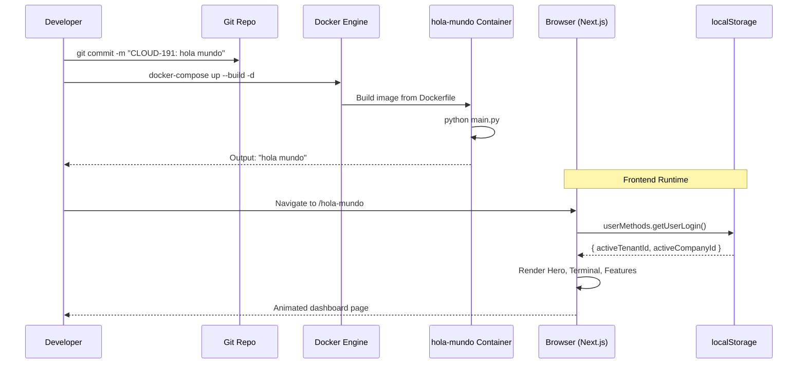
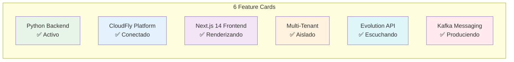
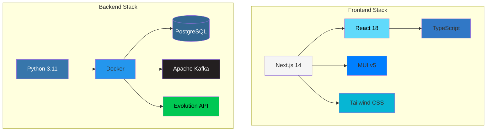

# CLOUD-191 "Hola Mundo" — Technical Documentation

> **Ticket**: CLOUD-191  
> **Status**: ✅ Done  
> **Date**: 2025-12-11  
> **Agent**: Technical Writer & Diagram Specialist  

---

## 1. Overview

CLOUD-191 is the foundational "Hello World" sprint for the CloudFly AI platform. It establishes the baseline development workflow across three layers:

1. **Backend** — A minimal Python script (`main.py`) that prints `"hola mundo"`.
2. **Infrastructure** — Docker containerization with `Dockerfile` and `docker-compose.yml`.
3. **Frontend** — A full Next.js 14 page (`/hola-mundo`) with animations, multi-tenant awareness, and comprehensive unit tests.

This ticket validates the end-to-end pipeline: code → container → UI → tests → documentation.

---

## 2. File Inventory

| File | Layer | Purpose |
|------|-------|---------|
| `holaM/main.py` | Backend | Python entry point — prints `"hola mundo"` |
| `holaM/Dockerfile` | Infrastructure | Container image definition (python:3.11-slim) |
| `holaM/docker-compose.yml` | Infrastructure | Service orchestration for `hola-mundo` container |
| `frontend_new/src/app/(dashboard)/hola-mundo/page.tsx` | Frontend | Full dashboard page with animations and tenant info |
| `frontend_new/src/test/hola-mundo.test.tsx` | Tests | 10 unit tests covering render, content, and features |
| `frontend_new/src/components/layout/vertical/verticalMenuData.ts` | Navigation | Added "Hola Mundo" menu entry with rocket-launch icon |

---

## 3. Backend — `holaM/main.py`

```python
print("hola mundo")
```

A single-line Python script serving as the canonical entry point. Executed directly or via Docker.

---

## 4. Infrastructure

### 4.1 Dockerfile

```dockerfile
FROM python:3.11-slim
WORKDIR /app
COPY main.py .
CMD ["python", "main.py"]
```

- **Base Image**: `python:3.11-slim` (lightweight, production-ready)
- **Working Directory**: `/app`
- **Command**: Runs `python main.py` on container start

### 4.2 Docker Compose

```yaml
version: '3.8'
services:
  hola-mundo:
    build:
      context: .
      dockerfile: Dockerfile
    container_name: hola-mundo
    restart: "no"
```

- **Service Name**: `hola-mundo`
- **Restart Policy**: `"no"` — runs once and exits (appropriate for a print script)
- **Build Context**: Current directory (`.holaM/`)

### 4.3 Deployment Commands

```bash
# Build and start
cd holaM && docker-compose up --build -d

# Verify output
docker logs hola-mundo
# Expected: hola mundo

# Stop
docker-compose down
```

---

## 5. Frontend — `/hola-mundo` Page

### 5.1 Route & Navigation

- **URL**: `/hola-mundo`
- **Route Group**: `(dashboard)` — requires authentication
- **Menu Entry**: Added to `verticalMenuData.ts` as the first item
  - **Icon**: `rocket-launch`
  - **Roles**: `MANAGER`, `ADMIN`, `USER`

### 5.2 Page Components

| Component | Description |
|-----------|-------------|
| **Hero Section** | Gradient background with animated orbs, title "Hola Mundo", subtitle, CTA buttons |
| **Terminal Preview** | Syntax-highlighted `print("hola mundo")` with execution output |
| **Tenant Info Bar** | Displays `activeTenantId`, `activeCompanyId`, and ticket reference from `localStorage` |
| **Features Grid** | 6 cards: Python Backend, CloudFly Platform, Next.js 14, Multi-Tenant, Evolution API, Kafka |
| **Tech Stack** | 10 animated chips: Next.js 14, React 18, TypeScript, MUI v5, Tailwind CSS, Python, Docker, PostgreSQL, Kafka, Evolution API |
| **Footer** | "Hecho con ❤️ por el equipo CloudFly AI" |

### 5.3 Animation System

All animations use MUI's transition components with staggered timeouts:

| Animation | Component | Timeout |
|-----------|-----------|---------|
| Hero fade-in | `<Fade>` | 800ms |
| Title slide-up | `<Slide direction="up">` | 1000–1600ms |
| Terminal zoom | `<Zoom>` | 1800ms |
| Tenant bar grow | `<Grow>` | 2000ms |
| Feature cards | `<Grow>` (staggered) | 1400–2150ms |
| Tech chips | `<Grow>` (staggered) | 2400–3120ms |
| Footer fade | `<Fade>` | 2800ms |

### 5.4 Multi-Tenant Integration

```typescript
useEffect(() => {
    setMounted(true)
    const user = userMethods.getUserLogin()
    setActiveTenantId(user?.activeTenantId || null)
    setActiveCompanyId(user?.activeCompanyId || user?.company_id || null)
}, [])
```

Reads from `localStorage` via `userMethods.getUserLogin()` — consistent with the platform's existing auth pattern.

### 5.5 Responsive Design

- **Breakpoints**: MUI `theme.breakpoints.down('md')` for mobile detection
- **Grid**: `xs={12} sm={6} md={4}` for feature cards
- **Stack Direction**: Column on mobile, row on desktop
- **Dark/Light Mode**: Full support via `theme.palette.mode`

---

## 6. Test Suite

**File**: `frontend_new/src/test/hola-mundo.test.tsx`  
**Framework**: Vitest + React Testing Library  
**Coverage**: 10 tests

| # | Test Case | Assertion |
|---|-----------|-----------|
| 1 | Default export exists | `mod.default` is a function |
| 2 | Main heading renders | `"Hola Mundo"` text present |
| 3 | CloudFly AI badge renders | `"CloudFly AI — CLOUD-191"` text present |
| 4 | Code snippet renders | `"hola mundo"` text present |
| 5 | Tenant info renders | `"tenant-123"` and `"company-456"` from mock |
| 6 | Ticket reference renders | `"CLOUD-191"` appears in content |
| 7 | Feature cards render | All 6 feature titles present |
| 8 | Tech stack chips render | 5+ tech names present |
| 9 | Completion chip renders | `"Completado"` chip present |
| 10 | (Implicit) Component mounts without errors | No thrown exceptions |

### Mock Strategy

- `userMethods.getUserLogin()` → returns `{ activeTenantId: 'tenant-123', activeCompanyId: 'company-456' }`
- `useMediaQuery` → `false` (desktop)
- `useTheme` → dark mode palette
- `SocketContext` → null socket
- `Redux` → empty stats
- `next/navigation` → mock router/pathname

---

## 7. System Architecture

```mermaid
graph TB
    subgraph Backend["Backend (Python)"]
        MAIN[holaM/main.py<br/>print "hola mundo"]
    end

    subgraph Infrastructure["Infrastructure (Docker)"]
        DOCKER[holaM/Dockerfile<br/>python:3.11-slim]
        COMPOSE[holaM/docker-compose.yml<br/>Service: hola-mundo]
        CONTAINER[Container: hola-mundo<br/>restart: no]
    end

    subgraph Frontend["Frontend (Next.js 14)"]
        PAGE[frontend_new/src/app/<br/>(dashboard)/hola-mundo/page.tsx]
        MENU[verticalMenuData.ts<br/>Hola Mundo menu entry]
        TESTS[hola-mundo.test.tsx<br/>10 unit tests]
    end

    subgraph External["Platform Services"]
        LOCAL[(localStorage<br/>userMethods.getUserLogin)]
        MUI[MUI v5<br/>Animations + Theming]
    end

    MAIN --> DOCKER --> COMPOSE --> CONTAINER
    PAGE --> LOCAL
    PAGE --> MUI
    MENU --> PAGE
    TESTS -.-> PAGE

    style Backend fill:#e8f5e9,stroke:#4caf50
    style Infrastructure fill:#e3f2fd,stroke:#2196f3
    style Frontend fill:#fce4ec,stroke:#e91e63
    style External fill:#fff3e0,stroke:#ff9800
```

---

## 8. Execution Flow



---

## 9. Feature Cards Detail



---

## 10. Tech Stack Visualization



---

## 11. Lessons Learned

1. **Minimal Viable Feature**: Even a simple "Hello World" benefits from full-stack implementation (backend + infra + frontend + tests).
2. **Docker for Scripts**: Using `restart: "no"` is appropriate for one-shot scripts that print and exit.
3. **Staggered Animations**: Using incrementally increasing timeouts (e.g., `1400 + index * 150`) creates a polished cascading reveal effect.
4. **Multi-Tenant from Day One**: Reading tenant/company from `localStorage` on the first page establishes the pattern for all future pages.
5. **Test Mocking**: Mocking `userMethods`, `useTheme`, `useMediaQuery`, and Redux in isolation makes frontend tests deterministic.

---

## 12. Related Tickets

| Ticket | Description | Status |
|--------|-------------|--------|
| CLOUD-191 | Hola Mundo — Parent ticket | ✅ Done |
| CLOUD-198 | Crear carpeta /holaM y archivo main.py | ✅ Done |
| CLOUD-150 | Evolution API integration | ✅ Done |
| CLOUD-145 | Kafka messaging microservice | ✅ Done |

---

*Documentation generated by 🤖 Technical Writer & Diagram Specialist*  
*CloudFly AI Platform — 2025-12-11*
