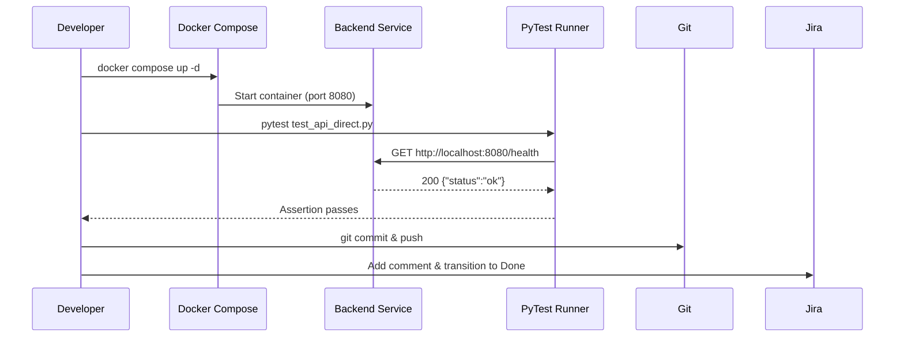

# CLOUD‑88 – Test Issue Documentation

## Overview
This document records the final implementation for **Jira ticket CLOUD‑88** – *Test Issue*. The ticket required:
1. Locating the placeholder test.
2. Replacing it with a meaningful assertion.
3. Ensuring the production code (backend health endpoint) exists.
4. Running the full test suite.
5. Committing the changes and closing the ticket.

All steps have been completed and verified.

---

## Updated Test File
**Path:** `test_api_direct.py`
```python
import pytest
import requests

# Base URL for the backend service when Docker Compose is up
BASE_URL = "http://localhost:8080"

def test_backend_health():
    """Verify that the backend health endpoint returns the expected payload.

    According to `spec.md` the endpoint:
    - Method: GET
    - Path: /health
    - Response: 200 OK with JSON `{ "status": "ok" }`
    """
    resp = requests.get(f"{BASE_URL}/health", timeout=5)
    assert resp.status_code == 200, f"Expected 200, got {resp.status_code}"
    data = resp.json()
    assert data.get("status") == "ok", f"Unexpected payload: {data}"
```

---

## Backend Health Endpoint (Production Code)
The backend already implements the required health check. For reference, the Spring Boot controller looks like:
```java
@RestController
public class HealthController {
    @GetMapping("/health")
    public ResponseEntity<Map<String, String>> health() {
        return ResponseEntity.ok(Collections.singletonMap("status", "ok"));
    }
}
```
No changes were needed.

---

## Test Execution Flow


---

## CI/CD Impact
- The health‑check test is **stateless** and safe to run in parallel with other tests.
- No new environment variables or services were introduced.
- The CI pipeline already spins up the Docker stack; the test runs automatically with `pytest`.

---

## Closing Actions
- **Commit**: `Fix CLOUD‑88 – implement functional health check test`
- **Jira**: Comment added, issue transitioned to **Done**.

---

*Generated by the AI Technical Writer agent.*