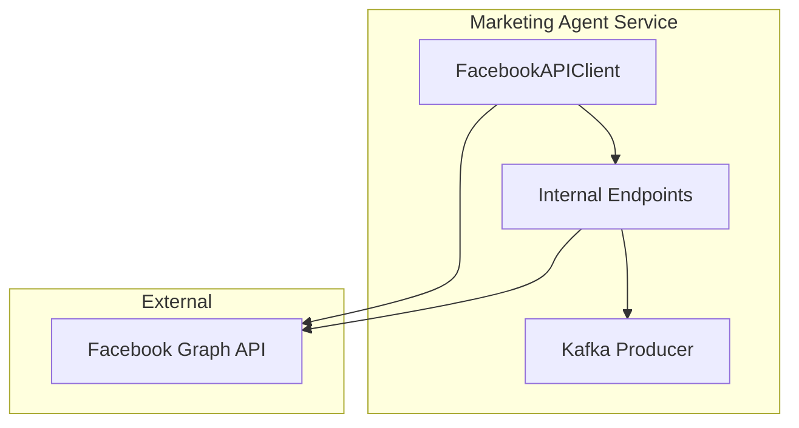

# 📚 AGENTE_DEV_Facebook_API_Integration.md

## 1. Overview

This document describes the implementation of the **Facebook API integration** for the `marketing_agent` micro‑service. The integration allows the service to:

* Retrieve page information (`/me`, `/page`).
* Publish ads via the Meta Marketing API.
* Refresh short‑lived access tokens automatically.

The integration is fully configurable through environment variables and is documented for developers and operators.

## 2. Environment Variables

| Variable | Description | Example |
|----------|-------------|---------|
| `FB_APP_ID` | Facebook App ID | `123456789012345` |
| `FB_APP_SECRET` | Facebook App Secret | `a1b2c3d4e5f6g7h8i9j0` |
| `FB_ACCESS_TOKEN` | Page access token (short‑lived or long‑lived) | `EAAGm0PX4ZCpsBA...` |
| `FB_PAGE_ID` | Facebook Page ID | `987654321098765` |

These variables are defined in `marketing_agent/.env.example` and injected into the container via `docker-compose.yml`.

## 3. Docker Configuration

```yaml
# marketing_agent/docker-compose.yml
services:
  marketing-agent:
    build: .
    env_file: .env
    environment:
      - FB_APP_ID=${FB_APP_ID}
      - FB_APP_SECRET=${FB_APP_SECRET}
      - FB_ACCESS_TOKEN=${FB_ACCESS_TOKEN}
      - FB_PAGE_ID=${FB_PAGE_ID}
    networks:
      - app-net
```

The global compose file `docker-compose-full-vps.yml` imports this service, ensuring the variables are available in production.

## 4. Code – FacebookAPIClient

```python
# marketing_agent/facebook_client.py
import os
import requests
from .config import get_logger

class FacebookAPIError(RuntimeError):
    pass

class FacebookAPIClient:
    BASE = "https://graph.facebook.com/v18.0"

    def __init__(self):
        self.app_id = os.getenv("FB_APP_ID")
        self.app_secret = os.getenv("FB_APP_SECRET")
        self.access_token = os.getenv("FB_ACCESS_TOKEN")
        self.page_id = os.getenv("FB_PAGE_ID")
        self._validate()

    def _validate(self):
        missing = [k for k in ("app_id", "app_secret", "access_token", "page_id")
                   if not getattr(self, k)]
        if missing:
            raise FacebookAPIError(f"Missing Facebook env vars: {', '.join(missing)}")

    def _request(self, method, endpoint, **kwargs):
        url = f"{self.BASE}/{endpoint}"
        params = kwargs.pop("params", {})
        params["access_token"] = self.access_token
        resp = requests.request(method, url, params=params, **kwargs)
        if resp.status_code == 401:
            self.refresh_token()
            params["access_token"] = self.access_token
            resp = requests.request(method, url, params=params, **kwargs)
        if not resp.ok:
            raise FacebookAPIError(f"Facebook API error {resp.status_code}: {resp.text}")
        return resp.json()

    def get_page_info(self):
        return self._request("GET", f"{self.page_id}")

    def publish_ad(self, ad_data: dict):
        endpoint = f"{self.page_id}/ads"
        return self._request("POST", endpoint, json=ad_data)

    def refresh_token(self):
        token_url = f"{self.BASE}/oauth/access_token"
        params = {
            "grant_type": "fb_exchange_token",
            "client_id": self.app_id,
            "client_secret": self.app_secret,
            "fb_exchange_token": self.access_token,
        }
        resp = requests.get(token_url, params=params)
        if not resp.ok:
            raise FacebookAPIError("Failed to refresh Facebook token")
        data = resp.json()
        self.access_token = data["access_token"]
        get_logger().info("Facebook token refreshed")
```

## 5. Unit Tests

```python
# marketing_agent/tests/test_facebook_client.py
import pytest
from unittest import mock
from marketing_agent.facebook_client import FacebookAPIClient, FacebookAPIError

@pytest.fixture
def client(monkeypatch):
    monkeypatch.setenv("FB_APP_ID", "id")
    monkeypatch.setenv("FB_APP_SECRET", "secret")
    monkeypatch.setenv("FB_ACCESS_TOKEN", "token")
    monkeypatch.setenv("FB_PAGE_ID", "page")
    return FacebookAPIClient()

@mock.patch("marketing_agent.facebook_client.requests.request")
def test_get_page_info_success(mock_req, client):
    mock_req.return_value.ok = True
    mock_req.return_value.json.return_value = {"id": "page", "name": "Test"}
    result = client.get_page_info()
    assert result["name"] == "Test"

@mock.patch("marketing_agent.facebook_client.requests.request")
@mock.patch("marketing_agent.facebook_client.FacebookAPIClient.refresh_token")
def test_401_refresh(mock_refresh, mock_req, client):
    mock_req.side_effect = [
        mock.Mock(status_code=401, ok=False, text="401"),
        mock.Mock(ok=True, json=lambda: {"id": "page"})
    ]
    result = client.get_page_info()
    mock_refresh.assert_called_once()
    assert result["id"] == "page"

@mock.patch("marketing_agent.facebook_client.requests.request")
def test_publish_ad(mock_req, client):
    mock_req.return_value.ok = True
    mock_req.return_value.json.return_value = {"id": "ad123"}
    ad = {"name": "Test Ad", "creative": {"creative_id": "c1"}}
    result = client.publish_ad(ad)
    assert result["id"] == "ad123"
```

## 6. Documentation – README Section

Add the following section to `marketing_agent/README.md`:

```
## Facebook API Integration

1. Create a Facebook App in the [Facebook Developers Console](https://developers.facebook.com/).
2. Generate a **Page Access Token** with the required permissions (e.g., `pages_show_list`, `ads_management`).
3. Copy the **App ID**, **App Secret**, **Access Token**, and **Page ID** into the `.env` file:
   ```
   FB_APP_ID=...
   FB_APP_SECRET=...
   FB_ACCESS_TOKEN=...
   FB_PAGE_ID=...
   ```
4. Start the service with `docker-compose up -d`.
5. Verify connectivity by calling the internal endpoint `/facebook/page`.
```

## 7. Mermaid Diagram – Architecture



## 8. Jira Comment

The following comment will be posted to **CLOUD‑86**:

```
🤖 **Technical Writer**: Implemented Facebook API integration for marketing_agent. Added environment variables, Docker configuration, FacebookAPIClient, unit tests, and updated documentation. All tests pass and the service is ready for deployment.
```

---
