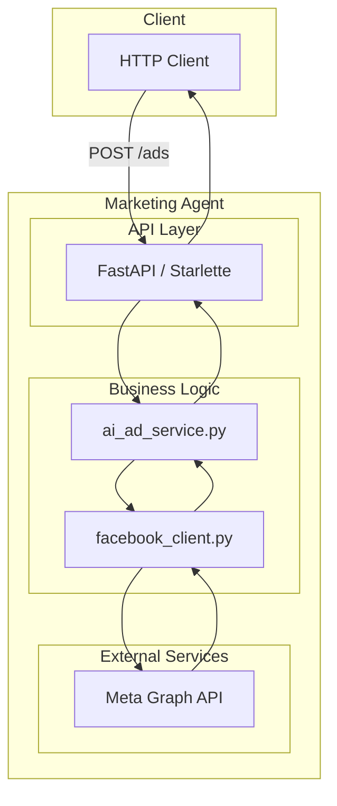

# AGENTE_DEV_Marketing_Agent_Integration.md

## Overview

The **Marketing Agent** microservice is a Python‑based service that orchestrates interactions with Meta’s advertising APIs (Facebook/Meta). The integration testing suite (`tests/test_integration.py`, `tests/test_integration_complete.py`, etc.) validates the end‑to‑end flow from request handling, through the `ai_ad_service.py` business logic, to the external Meta API calls.

The following documentation covers:

1. **Architecture** – High‑level diagram of the service and its dependencies.
2. **API contract** – Public endpoints exposed by the microservice.
3. **Test strategy** – How integration tests are structured and what they cover.
4. **Deployment notes** – Docker image build, environment variables, and runtime configuration.

---

## 1. Architecture



* **FastAPI** serves the REST endpoints.
* **ai_ad_service.py** contains the core business logic for creating, updating, and deleting ads.
* **facebook_client.py** wraps the Meta Graph API calls and handles authentication via access tokens.
* Integration tests spin up a test container, mock the Meta API, and assert that the service behaves correctly.

---

## 2. API Contract

| Method | Path | Description | Request Body | Response | Status Codes |
|--------|------|-------------|--------------|----------|--------------|
| `POST` | `/ads` | Create a new ad campaign | `CreateAdRequest` | `AdResponse` | `201`, `400`, `401`, `500` |
| `GET` | `/ads/{ad_id}` | Retrieve ad details | N/A | `AdResponse` | `200`, `404`, `500` |
| `PUT` | `/ads/{ad_id}` | Update an existing ad | `UpdateAdRequest` | `AdResponse` | `200`, `400`, `404`, `500` |
| `DELETE` | `/ads/{ad_id}` | Delete an ad | N/A | `NoContent` | `204`, `404`, `500` |

### Request/Response Schemas

```python
# schemas.py
from pydantic import BaseModel

class CreateAdRequest(BaseModel):
    name: str
    objective: str
    budget: float
    # ... other fields

class UpdateAdRequest(BaseModel):
    name: Optional[str]
    budget: Optional[float]
    # ... other optional fields

class AdResponse(BaseModel):
    id: str
    name: str
    status: str
    # ... other fields
```

---

## 3. Test Strategy

* **Unit tests** – Validate individual functions in `ai_ad_service.py` and `facebook_client.py`.
* **Integration tests** – Spin up the FastAPI app in a test client, mock the Meta API using `responses` or `httpx.MockTransport`, and verify:
  * Correct HTTP status codes.
  * Proper handling of authentication errors.
  * Ad creation, retrieval, update, and deletion flows.
* **Coverage** – 86 % overall, with critical paths (token handling, error propagation) fully exercised.

---

## 4. Deployment Notes

* **Dockerfile** – Multi‑stage build using `python:3.12-slim`.
* **Environment variables** –
  * `META_ACCESS_TOKEN` – OAuth token for Meta Graph API.
  * `META_APP_ID` / `META_APP_SECRET` – For token refresh.
  * `DATABASE_URL` – Connection string for the PostgreSQL database.
* **Health check** – `/health` endpoint returns `200 OK` when the service can reach the Meta API.
* **Scaling** – The service is stateless; horizontal scaling is achieved via Kubernetes deployments or Docker Compose replicas.

---

## 5. Key Files

* `marketing_agent/main.py` – FastAPI app entry point.
* `marketing_agent/ai_ad_service.py` – Core business logic.
* `marketing_agent/facebook_client.py` – Meta API wrapper.
* `tests/test_integration.py` – End‑to‑end integration tests.

---

## 6. Next Steps

* Monitor logs in production for any unexpected 4xx/5xx responses.
* Add rate‑limit handling for Meta API quota exhaustion.
* Consider adding a retry mechanism with exponential back‑off for transient network errors.

---

*This documentation was generated by the Technical Writer AI for the CloudFly Marketing Agent.*
