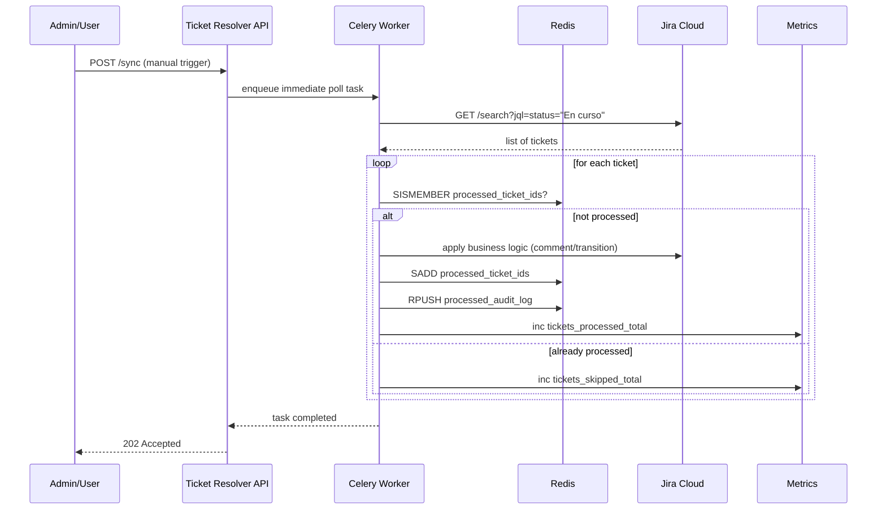

# AGENTE_DEV_Ticket_Resolver_Architecture.md

## Overview

The **Ticket Resolver** micro‑service is responsible for automatically processing pending Jira tickets (status *En curso*). It runs as a FastAPI application behind Traefik and uses a **Redis** broker/kv‑store together with **Celery** workers to achieve asynchronous, idempotent processing.

### Key Components

| Component | Technology | Responsibility |
|-----------|------------|----------------|
| `ticket_resolver` API | FastAPI (Python) | Exposes HTTP endpoints (`/sync`, `/tickets`, `/metrics`, `/health`). |
| Celery Worker | Celery + Redis broker | Periodically polls Jira, applies business rules, stores processed ticket IDs. |
| Redis | Redis 7 (official image) | Queue (`list`) for pending jobs, **SET** `processed_ticket_ids` for idempotency, simple cache for audit logs. |
| Jira Client | `jira` Python library | Wrapper around Jira Cloud REST API (search, comment, transition). |
| Prometheus Exporter | `prometheus_client` | Exposes counters/gauges for monitoring. |
| Traefik | Traefik v3.1 | Routes external traffic to `/ticket_resolver` path. |

---

## Architecture Diagram

```mermaid
graph LR
    subgraph External
        Internet((Internet)) --> Traefik[Traefik]
    end
    subgraph Internal
        Traefik --> API[Ticket Resolver API (FastAPI)]
        API -->|HTTP| Jira[Jira Cloud]
        API -->|Enqueue| Redis[Redis]
        Redis --> Worker[Celery Worker]
        Worker -->|Update| Redis
        Worker -->|Comment/Transition| Jira
        API --> Metrics[Prometheus Metrics]
    end
    style Internet fill:#f9f,stroke:#333,stroke-width:2px
    style Traefik fill:#bbf,stroke:#333,stroke-width:2px
    style API fill:#bfb,stroke:#333,stroke-width:2px
    style Redis fill:#ffb,stroke:#333,stroke-width:2px
    style Worker fill:#fbb,stroke:#333,stroke-width:2px
    style Jira fill:#ddd,stroke:#333,stroke-width:2px
    style Metrics fill:#cfc,stroke:#333,stroke-width:2px
```

---

## Data Flow (Sequence)



---

## Configuration (Environment Variables)

| Variable | Example | Description |
|----------|---------|-------------|
| `JIRA_BASE_URL` | `https://mycompany.atlassian.net` | Base URL for Jira Cloud API |
| `JIRA_USER` | `automation@mycompany.com` | Jira user email for Basic Auth |
| `JIRA_TOKEN` | *(secret)* | API token generated in Jira |
| `REDIS_URL` | `redis://redis:6379/0` | Connection string for Redis |
| `JIRA_POLL_INTERVAL` | `300` | Seconds between automatic polls (default 5 min) |
| `LOG_LEVEL` | `INFO` | Python logging level |

---

## API Contract

| Method | Path | Description | Request Body | Response |
|--------|------|-------------|--------------|----------|
| `POST` | `/ticket_resolver/sync` | Triggers an immediate Jira poll (useful for admin). | `{}` (empty) | `202 Accepted` – processing started |
| `GET` | `/ticket_resolver/tickets` | Returns a paginated list of processed ticket IDs (read from Redis). | `?page=1&size=20` | `{ "tickets": ["PROJ-123", ...], "page":1, "size":20, "total":42 }` |
| `GET` | `/ticket_resolver/metrics` | Prometheus‑compatible metrics endpoint. | – | plain‑text metrics |
| `GET` | `/ticket_resolver/health` | Liveness probe for Docker/K8s. | – | `{ "status": "healthy" }` |

---

## Testing Strategy

* **Unit tests** – mock `jira_client` and Redis using `unittest.mock` and `fakeredis`.
* **Integration tests** – spin up a temporary Docker compose stack (`redis` + `ticket_resolver`) and hit the API with `httpx`.
* **Coverage** – target ≥ 90 % for new modules (`worker.py`, `api.py`, `cache.py`).

---

## Deployment Checklist

1. Add `redis` service to `docker-compose-full-vps.yml` (see companion file).
2. Build new Docker image (`docker-compose build ticket_resolver`).
3. Push image tag to registry.
4. Update environment variables in `ticket_resolver/.env`.
5. Deploy via CI pipeline; verify healthcheck and `/metrics`.
6. Monitor Prometheus alerts for `jira_errors_total`.

---

*Document version: 1.0 – generated by AI Scrum Technical Writer.*