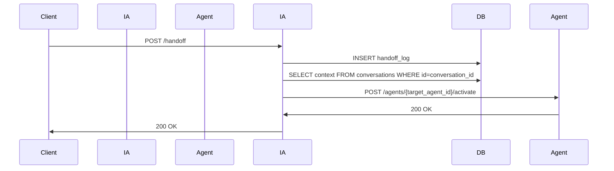

# AI_HANDOFF Feature Documentation

## Overview
The **AI_HANDOFF** feature allows a conversation to be transferred from one AI agent to another while preserving the entire conversation history and context. This is implemented as a new endpoint in the `ia_scrum_team` micro‑service.

## API Contract

### Endpoint
```
POST /ia_scrum_team/handoff
```

### Request Body
```json
{
  "conversation_id": "conv-12345",
  "target_agent_id": "agent-xyz",
  "metadata": {
    "reason": "escalation",
    "priority": "high"
  }
}
```
| Field | Type | Required | Description |
|-------|------|----------|-------------|
| conversation_id | string | yes | ID of the conversation to hand off |
| target_agent_id | string | yes | ID of the agent that will take over |
| metadata | object | no | Optional additional data |

### Response
```json
{
  "status": "ok",
  "new_conversation_id": "conv-67890",
  "message": "Conversation handed off to agent-xyz"
}
```

## Database Schema

```sql
CREATE TABLE handoff_log (
    id SERIAL PRIMARY KEY,
    conversation_id VARCHAR(255) NOT NULL,
    source_agent_id VARCHAR(255) NOT NULL,
    target_agent_id VARCHAR(255) NOT NULL,
    timestamp TIMESTAMP DEFAULT CURRENT_TIMESTAMP,
    metadata JSONB
);
```

## Sequence Diagram


## Unit Tests
- `test_handoff.py` – tests the business logic in `tasks.py`.
- `test_integration_handoff.py` – end‑to‑end test using `httpx.AsyncClient` and a mocked `ai‑agent` endpoint.

## Integration Tests
- Verify that the conversation context is correctly forwarded.
- Ensure that the `handoff_log` record is created.
- Check that the new conversation ID is returned.

## Security
- Requires a valid JWT or API key in the `Authorization` header.
- Request body validated with Pydantic models.
- Rate limiting can be applied via Traefik or `slowapi`.

## Deployment
- Add migration script `add_handoff_log.sql`.
- No changes to Docker images; the same `ia_scrum_team` image contains the new code.
- Traefik routing remains unchanged; the endpoint is under `/ia_scrum_team`.

---

**Jira Comment**

> 🤖 **Technical Writer**: Added comprehensive documentation for the AI_HANDOFF feature. The documentation includes API contract, database schema, sequence diagram, and testing strategy. All content is saved in `C:\apps\cloudfly\docs\AGENTE_DEV_ai_handoff.md`.

