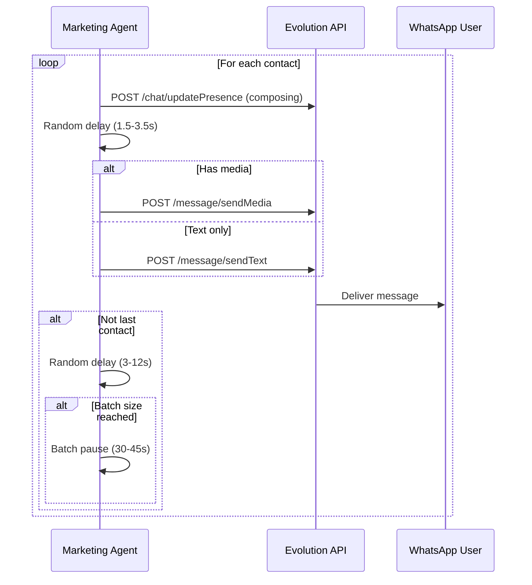

# 🤖 Marketing Agent Microservice - API Reference

## Overview

The Marketing Agent Microservice provides automated campaign execution capabilities within the CloudFly ecosystem. This document details all API contracts, data models, and integration patterns.

---

## 1. Internal API Contracts

### 1.1 Product Service API

#### `ProductService.get_active_product_with_image(tenant_id: int) -> dict`

Fetches products from backend API and returns the first active product with valid image and description.

**Parameters**:
| Name | Type | Description |
|------|------|-------------|
| `tenant_id` | `int` | Tenant ID for multi-tenancy filtering |

**Returns**:
```python
{
    "id": int,
    "productName": str,
    "description": str,
    "price": float,
    "salePrice": float,
    "sku": str,
    "status": str,
    "imageIds": List[int],
    "images": List[dict],
    "image_url": str  # Computed field - first image URL
}
```

**Raises**:
- `ProductNotFoundException`: When no valid product is found
- `requests.exceptions.RequestException`: On API communication errors

**Example**:
```python
from services.product_service import ProductService

service = ProductService()
try:
    product = service.get_active_product_with_image(tenant_id=1)
    print(f"Found: {product['productName']}")
except ProductNotFoundException:
    print("No valid product found")
```

---

### 1.2 Campaign Service API

#### `CampaignService.build_campaign_message(product: dict) -> CampaignMessage`

Builds a formatted WhatsApp campaign message from product data.

**Parameters**:
| Name | Type | Description |
|------|------|-------------|
| `product` | `dict` | Product dictionary with name, description, price, image_url |

**Returns**:
```python
CampaignMessage(
    str="🎉 ¡Nuevo Producto Disponible!\n\n📦 *Product Name*\n\nDescription...\n\n💰 Precio: $90.000\n🖼️ Imagen: https://...\n\n¡Contáctanos para más información!",
    media_url="https://example.com/image.jpg",
    media_type="image",
    caption="🎉 ¡Nuevo Producto Disponible!..."
)
```

**Example**:
```python
from services.campaign_service import CampaignService

service = CampaignService()
message = service.build_campaign_message({
    "productName": "Test Product",
    "description": "Test description",
    "salePrice": 90000,
    "image_url": "https://example.com/image.jpg"
})
```

---

### 1.3 Evolution Service API

#### `EvolutionService.send_campaign(phone: str, message: CampaignMessage) -> bool`

Sends a campaign message to a phone number via Evolution API.

**Parameters**:
| Name | Type | Description |
|------|------|-------------|
| `phone` | `str` | Phone number in format `57XXXXXXXXXX` |
| `message` | `CampaignMessage` | Campaign message to send |

**Returns**:
- `True`: Message sent successfully
- `False`: Send failed (logged internally)

**Side Effects**:
- Sends composing presence before message
- Adds random delay (1.5-3.5s) before sending
- Logs success/failure

**Example**:
```python
from services.evolution_service import EvolutionService
from models.campaign import CampaignMessage

service = EvolutionService()
message = CampaignMessage(
    text="Hello World!",
    media_url="https://example.com/image.jpg",
    media_type="image",
    caption="Hello with image!"
)
success = service.send_campaign("573001234567", message)
```

---

## 2. External API Contracts

### 2.1 Backend Product API

#### `GET /productos/tenant/{tenantId}`

**Authentication**: Bearer token required

**Request Headers**:
```
Authorization: Bearer {BACKEND_API_KEY}
Content-Type: application/json
```

**Path Parameters**:
| Name | Type | Description |
|------|------|-------------|
| `tenantId` | `int` | Tenant ID |

**Response** (200 OK):
```json
{
  "data": [
    {
      "id": 1,
      "tenantId": 1,
      "productName": "Camiseta Deportiva Ultralight",
      "productType": "PRODUCT",
      "description": "Camiseta deportiva transpirable ideal para entrenamientos de alto rendimiento.",
      "price": 49900.00,
      "salePrice": 44900.00,
      "sku": "CAM-ULT-001",
      "status": "ACTIVE",
      "inventoryQty": 150,
      "manageStock": true,
      "imageIds": [1, 2, 3],
      "images": [
        {
          "id": 1,
          "url": "https://img.cloudfly.com.co/products/camiseta-ultralight.jpg",
          "altText": "Camiseta Deportiva Ultralight - Vista frontal"
        }
      ],
      "brand": "ActiveFit",
      "model": "2026-X"
    }
  ]
}
```

**Error Responses**:
| Status | Description |
|--------|-------------|
| 401 | Invalid or missing API key |
| 404 | Tenant not found |
| 500 | Internal server error |

---

### 2.2 Evolution API

#### `POST /chat/updatePresence/{instance}`

**Authentication**: API key required

**Request Headers**:
```
apikey: {EVOLUTION_API_KEY}
Content-Type: application/json
```

**Request Body**:
```json
{
  "number": "573001234567",
  "presence": "composing"
}
```

**Response** (200 OK):
```json
{
  "success": true
}
```

---

#### `POST /message/sendText/{instance}`

**Request Body**:
```json
{
  "number": "573001234567",
  "text": "Campaign message text...",
  "delay": 1200
}
```

**Response** (200 OK):
```json
{
  "key": {
    "remoteJid": "573001234567@s.whatsapp.net",
    "fromMe": true,
    "id": "ABC123DEF456"
  },
  "message": {
    "conversation": "Campaign message text..."
  },
  "messageTimestamp": 1704067200,
  "status": "PENDING"
}
```

---

#### `POST /message/sendMedia/{instance}`

**Request Body**:
```json
{
  "number": "573001234567",
  "media": "https://example.com/image.jpg",
  "mediatype": "image",
  "caption": "Campaign message text...",
  "delay": 1500
}
```

**Response** (200 OK):
```json
{
  "key": {
    "remoteJid": "573001234567@s.whatsapp.net",
    "fromMe": true,
    "id": "XYZ789ABC123"
  },
  "message": {
    "imageMessage": {
      "url": "https://example.com/image.jpg",
      "caption": "Campaign message text...",
      "mimetype": "image/jpeg"
    }
  },
  "messageTimestamp": 1704067200,
  "status": "PENDING"
}
```

---

## 3. Data Models

### 3.1 CampaignMessage

```python
from dataclasses import dataclass
from typing import Optional

@dataclass
class CampaignMessage:
    """
    Represents a marketing campaign message to be sent via WhatsApp.
    
    Attributes:
        text: The message text content (Markdown formatted for WhatsApp)
        media_url: Optional URL to media file (image/video)
        media_type: Type of media ('image', 'video', 'audio', 'document')
        caption: Caption for media messages
    """
    text: str
    media_url: Optional[str] = None
    media_type: Optional[str] = None
    caption: Optional[str] = None
```

### 3.2 Product

```python
from dataclasses import dataclass
from typing import List, Optional

@dataclass
class ProductImage:
    id: int
    url: str
    altText: Optional[str] = None

@dataclass
class Product:
    """
    Represents a product from the backend API.
    
    Attributes:
        id: Product ID
        productName: Name of the product
        description: Product description
        price: Original price
        salePrice: Sale price (optional)
        sku: Stock keeping unit
        status: Product status (ACTIVE/INACTIVE)
        imageIds: List of image IDs
        images: List of ProductImage objects
        image_url: Computed first image URL
    """
    id: int
    productName: str
    description: str
    price: float
    salePrice: Optional[float]
    sku: str
    status: str
    imageIds: List[int]
    images: List[ProductImage]
    image_url: Optional[str] = None
```

### 3.3 Contact

```python
from dataclasses import dataclass

@dataclass
class Contact:
    """
    Represents a contact from the database.
    
    Attributes:
        id: Contact ID
        name: Contact name
        email: Contact email
        phone: Contact phone number
    """
    id: int
    name: str
    email: str
    phone: str
```

---

## 4. Configuration Reference

### 4.1 Environment Variables

| Variable | Type | Default | Required | Description |
|----------|------|---------|----------|-------------|
| `BACKEND_URL` | `str` | `http://backend:8080` | Yes | Backend API base URL |
| `BACKEND_API_KEY` | `str` | `` | Yes | Backend API authentication key |
| `EVOLUTION_API_URL` | `str` | `http://evolution-api:8080` | Yes | Evolution API base URL |
| `EVOLUTION_API_KEY` | `str` | `` | Yes | Evolution API authentication key |
| `EVOLUTION_INSTANCE` | `str` | `cloudfly-main` | Yes | Evolution instance name |
| `DB_HOST` | `str` | `localhost` | Yes | MySQL host |
| `DB_PORT` | `int` | `3306` | No | MySQL port |
| `DB_NAME` | `str` | `cloud_master` | Yes | Database name |
| `DB_USER` | `str` | `root` | Yes | Database user |
| `DB_PASSWORD` | `str` | `` | Yes | Database password |
| `TENANT_ID` | `int` | `1` | Yes | Tenant ID for multi-tenancy |
| `COMPANY_ID` | `int` | `1` | Yes | Company ID for filtering |
| `MIN_DELAY_MS` | `int` | `3000` | No | Minimum delay between messages |
| `MAX_DELAY_MS` | `int` | `12000` | No | Maximum delay between messages |
| `BATCH_SIZE` | `int` | `20` | No | Messages per batch |
| `BATCH_PAUSE_MS` | `int` | `30000` | No | Pause duration between batches |

### 4.2 .env.example

```env
# Backend API Configuration
BACKEND_URL=http://backend:8080
BACKEND_API_KEY=your_backend_api_key_here

# Evolution API Configuration
EVOLUTION_API_URL=http://evolution-api:8080
EVOLUTION_API_KEY=your_evolution_api_key_here
EVOLUTION_INSTANCE=cloudfly-main

# Database Configuration
DB_HOST=mysql_host
DB_PORT=3306
DB_NAME=cloud_master
DB_USER=root
DB_PASSWORD=your_db_password_here

# Campaign Configuration
TENANT_ID=1
COMPANY_ID=1

# Anti-Spam Configuration
MIN_DELAY_MS=3000
MAX_DELAY_MS=12000
BATCH_SIZE=20
BATCH_PAUSE_MS=30000
```

---

## 5. Database Schema

### 5.1 contacts Table

```sql
CREATE TABLE contacts (
    id BIGINT AUTO_INCREMENT PRIMARY KEY,
    tenant_id BIGINT NOT NULL,
    company_id BIGINT,
    name VARCHAR(255) NOT NULL,
    email VARCHAR(255),
    phone VARCHAR(20),
    is_active TINYINT(1) DEFAULT 1,
    created_at TIMESTAMP DEFAULT CURRENT_TIMESTAMP,
    updated_at TIMESTAMP DEFAULT CURRENT_TIMESTAMP ON UPDATE CURRENT_TIMESTAMP,
    INDEX idx_tenant_company (tenant_id, company_id),
    INDEX idx_phone (phone),
    INDEX idx_is_active (is_active)
);
```

### 5.2 Query Examples

**Fetch Active Contacts**:
```sql
SELECT id, name, email, phone 
FROM contacts 
WHERE tenant_id = ? 
  AND company_id = ? 
  AND is_active = 1;
```

---

## 6. Anti-Spam Configuration

### 6.1 Delay Parameters

| Parameter | Default | Range | Description |
|-----------|---------|-------|-------------|
| `MIN_DELAY_MS` | 3000 | 1000-30000 | Minimum delay between messages |
| `MAX_DELAY_MS` | 12000 | 1000-60000 | Maximum delay between messages |
| `BATCH_SIZE` | 20 | 1-100 | Messages before batch pause |
| `BATCH_PAUSE_MS` | 30000 | 1000-120000 | Pause duration between batches |

### 6.2 Anti-Spam Flow



---

## 7. Error Codes

### 7.1 Custom Exceptions

| Exception | HTTP Status | Description |
|-----------|-------------|-------------|
| `ProductNotFoundException` | 404 | No active product with image found |
| `requests.exceptions.ConnectionError` | 503 | Cannot connect to backend API |
| `requests.exceptions.Timeout` | 504 | Backend API timeout |
| `mysql.connector.Error` | 503 | Database connection error |

### 7.2 Error Response Format

```json
{
  "error": {
    "type": "ProductNotFoundException",
    "message": "No active product with image and description found",
    "timestamp": "2024-01-01T00:00:00Z"
  }
}
```

---

## 8. Logging Format

### 8.1 Log Structure

```
%(asctime)s [%(levelname)s] %(name)s: %(message)s
```

### 8.2 Example Logs

```
2024-01-01 12:00:00 [INFO] __main__: 🚀 Marketing Agent started
2024-01-01 12:00:00 [INFO] __main__: 📦 Fetching active product for tenant 1...
2024-01-01 12:00:01 [INFO] services.product_service: ✅ Product found: Test Product
2024-01-01 12:00:01 [INFO] __main__: 📝 Building campaign message...
2024-01-01 12:00:01 [INFO] __main__: ✅ Campaign message built (media: True)
2024-01-01 12:00:01 [INFO] __main__: 👥 Fetching contacts for tenant 1...
2024-01-01 12:00:01 [INFO] __main__: ✅ Found 50 active contacts
2024-01-01 12:00:01 [INFO] __main__: 📤 [1/50] Sending to 573001234567...
2024-01-01 12:00:03 [INFO] services.evolution_service: ✅ Media sent to 573001234567
2024-01-01 12:00:03 [INFO] __main__: ⏳ Waiting 5.2s before next message...
2024-01-01 12:00:20 [INFO] __main__: ⏸️ Anti-spam batch pause: 30s
2024-01-01 12:01:00 [INFO] __main__: ✅ Campaign completed!
2024-01-01 12:01:00 [INFO] __main__: 📊 Summary: Product: Test Product, Total: 50, Sent: 48, Failed: 2
```

---

## 9. Security Considerations

### 9.1 Authentication

- Backend API: Bearer token in `Authorization` header
- Evolution API: API key in `apikey` header
- Database: Username/password authentication

### 9.2 Data Protection

- Phone numbers are validated before sending
- No sensitive data logged
- Environment variables for secrets (not hardcoded)

### 9.3 Rate Limiting

- Configurable delays between messages
- Batch pauses to prevent WhatsApp blocking
- Presence indicators to simulate human behavior

---

## 10. Performance Metrics

### 10.1 Expected Throughput

| Metric | Value |
|--------|-------|
| Messages per minute | 5-10 |
| Messages per hour | 300-600 |
| Batch size | 20 messages |
| Batch pause | 30-45 seconds |

### 10.2 Resource Usage

| Resource | Expected |
|----------|----------|
| CPU | Low (< 10%) |
| Memory | 50-100 MB |
| Network | Minimal (API calls only) |

---

*API Reference generated by Technical Writer Agent for CLOUD-61 Marketing Microservice*
