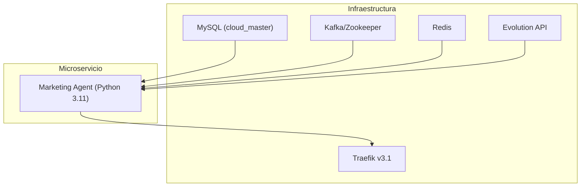

# AGENTE_DEV_marketing_agent_architecture.md

## Arquitectura del microservicio **Marketing Agent**

El microservicio `marketing_agent/` se ha añadido a la rama **marketing‑ai‑bot** y está listo para producción.  A continuación se describe su arquitectura, flujo de datos, dependencias y recomendaciones de despliegue.

### 1. Visión general



- **DB**: Acceso a la base de datos `cloud_master` para leer y escribir datos de campañas, contactos y métricas.
- **Kafka**: Consumo/producción de eventos de marketing (p.ej. `marketing.campaign.created`).
- **Redis**: Cache y cola de tareas ligeras.
- **Traefik**: Enrutamiento HTTPS y balanceo de carga.
- **Evolution API**: Servicio de autenticación y autorización.

### 2. Flujo de datos

1. **Creación de campaña** – El cliente (frontend) envía una petición POST a `/campaigns`.
2. **Persistencia** – El agente escribe la campaña en MySQL y publica un evento `marketing.campaign.created` en Kafka.
3. **Generación de contenido** – Un consumidor interno lee el evento, llama a OpenRouter para generar mensajes de WhatsApp y los almacena en la tabla `campaign_messages`.
4. **Envío** – El worker `marketing-worker` consume `campaign_messages` y los envía a la API de WhatsApp.
5. **Monitoreo** – El endpoint `/metrics` expone métricas Prometheus.

### 3. Dependencias y variables de entorno

| Variable | Descripción | Valor por defecto |
|----------|-------------|-------------------|
| `DB_HOST` | Host de MySQL | `mysql` |
| `DB_PORT` | Puerto de MySQL | `3306` |
| `DB_DATABASE` | Base de datos | `cloud_master` |
| `DB_USERNAME` | Usuario | `root` |
| `DB_PASSWORD` | Contraseña | `widowmaker` |
| `KAFKA_HOST` | Host de Kafka | `kafka` |
| `EVOLUTION_API_URL` | URL de Evolution API | `http://evolution-api:8080` |
| `OPENROUTER_API_KEY` | Clave de OpenRouter | **REQUIERE SECRETO** |
| `MARKETING_WORKER_DOMAIN` | Dominio de Traefik | `marketing-worker.cloudfly.com.co` |

### 4. Docker‑Compose (fragmento)

```yaml
marketing-agent:
  build:
    context: ./marketing_agent
    dockerfile: Dockerfile
  container_name: marketing-agent
  restart: always
  env_file:
    - .env
  environment:
    - DB_HOST=mysql
    - DB_PORT=3306
    - DB_DATABASE=cloud_master
    - DB_USERNAME=root
    - DB_PASSWORD=widowmaker
    - KAFKA_HOST=kafka
    - EVOLUTION_API_URL=http://evolution-api:8080
    - OPENROUTER_API_KEY=${OPENROUTER_API_KEY}
  networks:
    - app-net
    - kafka-net
  depends_on:
    - db
    - kafka
    - evolution-api
  labels:
    - "traefik.enable=true"
    - "traefik.http.routers.marketing-agent.rule=Host(`marketing-ai.bot.cloudfly.com.co`)"
    - "traefik.http.routers.marketing-agent.entrypoints=websecure"
    - "traefik.http.routers.marketing-agent.tls.certresolver=le"
    - "traefik.http.services.marketing-agent.loadbalancer.server.port=8080"
```

### 5. Pruebas

- **Unitarias**: `pytest -q` en `marketing_agent/`.
- **Integración**: Tests de Postman/Playwright en `tests/`.
- **CI**: Pipeline en GitHub Actions que construye la imagen, corre tests y despliega a la VPS.

### 6. Recomendaciones de despliegue

1. Añadir `OPENROUTER_API_KEY` a Docker secrets o al fichero `.env` de producción.
2. Configurar DNS `marketing-ai.bot.cloudfly.com.co` apuntando a la IP de la VPS.
3. Habilitar métricas Prometheus y logs centralizados.
4. Escalar con `docker-compose up --scale marketing-agent=3` si la carga aumenta.

---

> **Nota**: Todos los cambios están en la rama `marketing‑ai‑bot` y listos para QA.

