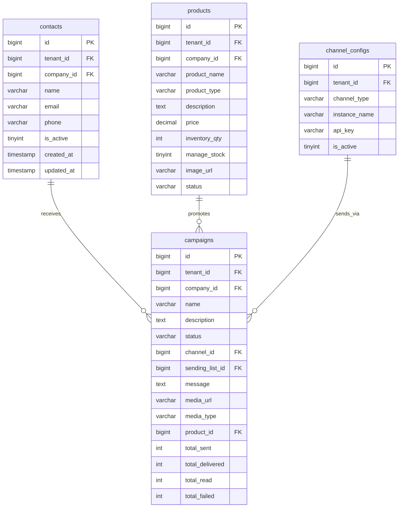

# 🤗 Marketing Agent Microservice - Database Schema Documentation

## Overview

The Marketing Agent Microservice interacts with the MySQL database to fetch target contacts for campaign execution. This document details the database schema, queries, and integration patterns.

---

## 1. Entity Relationship Diagram



---

## 2. Table Definitions

### 2.1 contacts Table

Stores contact information for marketing campaigns.

```sql
CREATE TABLE contacts (
    id BIGINT AUTO_INCREMENT PRIMARY KEY,
    tenant_id BIGINT NOT NULL,
    company_id BIGINT,
    name VARCHAR(255) NOT NULL,
    email VARCHAR(255),
    phone VARCHAR(20),
    is_active TINYINT(1) DEFAULT 1,
    created_at TIMESTAMP DEFAULT CURRENT_TIMESTAMP,
    updated_at TIMESTAMP DEFAULT CURRENT_TIMESTAMP ON UPDATE CURRENT_TIMESTAMP,
    
    -- Indexes for performance
    INDEX idx_tenant_company (tenant_id, company_id),
    INDEX idx_phone (phone),
    INDEX idx_is_active (is_active),
    INDEX idx_email (email)
) ENGINE=InnoDB DEFAULT CHARSET=utf8mb4 COLLATE=utf8mb4_unicode_ci;
```

**Columns**:
| Column | Type | Nullable | Default | Description |
|--------|------|----------|---------|-------------|
| `id` | `BIGINT` | NO | AUTO_INCREMENT | Primary key |
| `tenant_id` | `BIGINT` | NO | - | Tenant ID (multi-tenancy) |
| `company_id` | `BIGINT` | YES | NULL | Company ID (optional) |
| `name` | `VARCHAR(255)` | NO | - | Contact name |
| `email` | `VARCHAR(255)` | YES | NULL | Contact email |
| `phone` | `VARCHAR(20)` | YES | NULL | Phone number (format: 57XXXXXXXXXX) |
| `is_active` | `TINYINT(1)` | NO | 1 | Active status flag |
| `created_at` | `TIMESTAMP` | NO | CURRENT_TIMESTAMP | Record creation time |
| `updated_at` | `TIMESTAMP` | NO | CURRENT_TIMESTAMP | Last update time |

---

### 2.2 products Table

Stores product catalog information.

```sql
CREATE TABLE products (
    id BIGINT AUTO_INCREMENT PRIMARY KEY,
    tenant_id BIGINT NOT NULL,
    company_id BIGINT,
    product_name VARCHAR(255) NOT NULL,
    product_type VARCHAR(50) DEFAULT 'PRODUCT',
    description TEXT,
    price DECIMAL(15,2) NOT NULL,
    sale_price DECIMAL(15,2),
    sku VARCHAR(100),
    inventory_qty INT DEFAULT 0,
    manage_stock TINYINT(1) DEFAULT 0,
    image_url VARCHAR(500),
    status VARCHAR(20) DEFAULT 'ACTIVE',
    created_at TIMESTAMP DEFAULT CURRENT_TIMESTAMP,
    updated_at TIMESTAMP DEFAULT CURRENT_TIMESTAMP ON UPDATE CURRENT_TIMESTAMP,
    
    INDEX idx_tenant_company (tenant_id, company_id),
    INDEX idx_status (status),
    INDEX idx_sku (sku)
) ENGINE=InnoDB DEFAULT CHARSET=utf8mb4 COLLATE=utf8mb4_unicode_ci;
```

**Columns**:
| Column | Type | Nullable | Default | Description |
|--------|------|----------|---------|-------------|
| `id` | `BIGINT` | NO | AUTO_INCREMENT | Primary key |
| `tenant_id` | `BIGINT` | NO | - | Tenant ID |
| `company_id` | `BIGINT` | YES | NULL | Company ID |
| `product_name` | `VARCHAR(255)` | NO | - | Product name |
| `product_type` | `VARCHAR(50)` | NO | 'PRODUCT' | Product type |
| `description` | `TEXT` | YES | NULL | Product description |
| `price` | `DECIMAL(15,2)` | NO | - | Original price |
| `sale_price` | `DECIMAL(15,2)` | YES | NULL | Sale price |
| `sku` | `VARCHAR(100)` | YES | NULL | Stock keeping unit |
| `inventory_qty` | `INT` | NO | 0 | Available quantity |
| `manage_stock` | `TINYINT(1)` | NO | 0 | Stock management flag |
| `image_url` | `VARCHAR(500)` | YES | NULL | Primary image URL |
| `status` | `VARCHAR(20)` | NO | 'ACTIVE' | Product status |

---

### 2.3 channel_configs Table

Stores Evolution API instance configuration.

```sql
CREATE TABLE channel_configs (
    id BIGINT AUTO_INCREMENT PRIMARY KEY,
    tenant_id BIGINT NOT NULL,
    channel_type VARCHAR(50) NOT NULL DEFAULT 'WHATSAPP',
    instance_name VARCHAR(100) NOT NULL,
    api_url VARCHAR(500) NOT NULL,
    api_key VARCHAR(500) NOT NULL,
    is_active TINYINT(1) DEFAULT 1,
    created_at TIMESTAMP DEFAULT CURRENT_TIMESTAMP,
    updated_at TIMESTAMP DEFAULT CURRENT_TIMESTAMP ON UPDATE CURRENT_TIMESTAMP,
    
    INDEX idx_tenant (tenant_id),
    INDEX idx_instance (instance_name),
    INDEX idx_is_active (is_active)
) ENGINE=InnoDB DEFAULT CHARSET=utf8mb4 COLLATE=utf8mb4_unicode_ci;
```

---

### 2.4 campaigns Table

Stores campaign configuration and metrics.

```sql
CREATE TABLE campaigns (
    id BIGINT AUTO_INCREMENT PRIMARY KEY,
    tenant_id BIGINT NOT NULL,
    company_id BIGINT,
    name VARCHAR(255) NOT NULL,
    description TEXT,
    status ENUM('DRAFT', 'SCHEDULED', 'RUNNING', 'PAUSED', 'COMPLETED', 'CANCELLED', 'FAILED') DEFAULT 'DRAFT',
    channel_id BIGINT,
    sending_list_id BIGINT,
    message TEXT,
    media_url VARCHAR(500),
    media_type ENUM('IMAGE', 'VIDEO', 'AUDIO', 'DOCUMENT'),
    media_caption VARCHAR(500),
    product_id BIGINT,
    total_sent INT DEFAULT 0,
    total_delivered INT DEFAULT 0,
    total_read INT DEFAULT 0,
    total_failed INT DEFAULT 0,
    created_at TIMESTAMP DEFAULT CURRENT_TIMESTAMP,
    updated_at TIMESTAMP DEFAULT CURRENT_TIMESTAMP ON UPDATE CURRENT_TIMESTAMP,
    
    INDEX idx_tenant_company (tenant_id, company_id),
    INDEX idx_status (status),
    INDEX idx_product (product_id)
) ENGINE=InnoDB DEFAULT CHARSET=utf8mb4 COLLATE=utf8mb4_unicode_ci;
```

---

## 3. Query Reference

### 3.1 Fetch Active Contacts

```sql
-- Used by MarketingAgent.get_active_contacts()
SELECT id, name, email, phone 
FROM contacts 
WHERE tenant_id = %s 
  AND company_id = %s 
  AND is_active = 1;
```

**Parameters**:
- `%s` (1): `tenant_id` - Tenant ID for multi-tenancy
- `%s` (2): `company_id` - Company ID for filtering

**Returns**: List of active contacts with phone numbers

---

### 3.2 Fetch Active Products (Alternative to API)

```sql
-- Alternative query if not using backend API
SELECT id, product_name, description, price, sale_price, image_url
FROM products 
WHERE tenant_id = %s 
  AND status = 'ACTIVE' 
  AND description IS NOT NULL 
  AND description != '' 
  AND image_url IS NOT NULL 
  AND image_url != ''
LIMIT 1;
```

---

### 3.3 Fetch Channel Configuration

```sql
-- Get Evolution API configuration
SELECT instance_name, api_url, api_key
FROM channel_configs 
WHERE tenant_id = %s 
  AND channel_type = 'WHATSAPP' 
  AND is_active = 1
LIMIT 1;
```

---

### 3.4 Insert Campaign Record

```sql
-- Create campaign record
INSERT INTO campaigns (
    tenant_id, company_id, name, description, status, 
    message, media_url, media_type, product_id
) VALUES (
    %s, %s, %s, %s, 'DRAFT', 
    %s, %s, %s, %s
);
```

---

### 3.5 Update Campaign Metrics

```sql
-- Update campaign statistics after execution
UPDATE campaigns 
SET 
    status = 'COMPLETED',
    total_sent = %s,
    total_delivered = %s,
    total_read = %s,
    total_failed = %s
WHERE id = %s;
```

---

## 4. Database Connection Configuration

### 4.1 Python Connection

```python
import mysql.connector
from config import Config

db_config = {
    "host": Config.DB_HOST,
    "port": Config.DB_PORT,
    "database": Config.DB_NAME,
    "user": Config.DB_USER,
    "password": Config.DB_PASSWORD
}

# Establish connection
conn = mysql.connector.connect(**db_config)
cursor = conn.cursor(dictionary=True)

# Execute query
cursor.execute(query, params)
results = cursor.fetchall()

# Close connection
cursor.close()
conn.close()
```

### 4.2 Connection Pooling (Recommended for Production)

```python
from mysql.connector import pooling

connection_pool = pooling.MySQLConnectionPool(
    pool_name="marketing_pool",
    pool_size=5,
    **db_config
)

# Get connection from pool
conn = connection_pool.get_connection()
```

---

## 5. Data Flow Diagram

```mermaid
flowchart TD
    subgraph "Marketing Agent"
        Main[main.py Orchestrator]
        ProductService[Product Service]
        CampaignService[Campaign Service]
        EvolutionService[Evolution Service]
    end
    
    subgraph "Data Sources"
        BackendAPI[(Backend API)]
        MySQL[(MySQL Database)]
    end
    
    subgraph "External Services"
        EvolutionAPI[Evolution API]
    end
    
    Main -->|"get_active_product_with_image()"| ProductService
    ProductService -->|"GET /productos/tenant/{id}"| BackendAPI
    BackendAPI -->|"Product List JSON"| ProductService
    
    Main -->|"get_active_contacts()"| MySQL
    MySQL -->"|SELECT contacts| Main
    
    Main -->|"build_campaign_message()"| CampaignService
    CampaignService -->|"CampaignMessage"| Main
    
    Main -->|"send_campaign()"| EvolutionService
    EvolutionService -->|"POST /message/sendText|sendMedia" | EvolutionAPI
```

---

## 6. Indexing Strategy

### 6.1 Recommended Indexes

```sql
-- Contacts table indexes
CREATE INDEX idx_contacts_tenant_company ON contacts(tenant_id, company_id);
CREATE INDEX idx_contacts_phone ON contacts(phone);
CREATE INDEX idx_contacts_active ON contacts(is_active);

-- Products table indexes
CREATE INDEX idx_products_tenant_status ON products(tenant_id, status);
CREATE INDEX idx_products_image ON products(image_url);

-- Campaigns table indexes
CREATE INDEX idx_campaigns_tenant_status ON campaigns(tenant_id, status);
```

### 6.2 Query Performance

| Query | Index Used | Expected Time |
|-------|------------|---------------|
| Fetch active contacts | `idx_contacts_tenant_company` | < 10ms |
| Fetch active products | `idx_products_tenant_status` | < 5ms |
| Fetch channel config | `idx_tenant` | < 5ms |

---

## 7. Backup and Recovery

### 7.1 Backup Strategy

```bash
# Daily backup
mysqldump -u root -p cloud_master contacts products campaigns > backup_$(date +%Y%m%d).sql

# Restore from backup
mysql -u root -p cloud_master < backup_20240101.sql
```

### 7.2 Data Retention

| Table | Retention Policy |
|-------|------------------|
| `contacts` | Indefinite (until deleted) |
| `products` | Indefinite (until deleted) |
| `campaigns` | 1 year (archive after) |
| `channel_configs` | Indefinite |

---

## 8. Security Considerations

### 8.1 Access Control

- Database user should have minimal required privileges
- Use separate read-only user for queries
- Encrypt sensitive data at rest

### 8.2 SQL Injection Prevention

```python
# Use parameterized queries (safe)
cursor.execute("SELECT * FROM contacts WHERE tenant_id = %s", (tenant_id,))

# Never use string formatting (unsafe)
cursor.execute(f"SELECT * FROM contacts WHERE tenant_id = {tenant_id}")  # DON'T DO THIS
```

### 8.3 Connection Security

```python
# Use SSL for database connection
db_config = {
    "host": Config.DB_HOST,
    "port": Config.DB_PORT,
    "database": Config.DB_NAME,
    "user": Config.DB_USER,
    "password": Config.DB_PASSWORD,
    "ssl_ca": "/path/to/ca-cert.pem",
    "ssl_cert": "/path/to/client-cert.pem",
    "ssl_key": "/path/to/client-key.pem"
}
```

---

## 9. Monitoring Queries

### 9.1 Campaign Statistics

```sql
-- Get campaign performance metrics
SELECT 
    c.name AS campaign_name,
    c.total_sent,
    c.total_delivered,
    c.total_read,
    c.total_failed,
    ROUND((c.total_delivered / c.total_sent) * 100, 2) AS delivery_rate,
    ROUND((c.total_read / c.total_delivered) * 100, 2) AS read_rate
FROM campaigns c
WHERE c.tenant_id = %s
ORDER BY c.created_at DESC;
```

### 9.2 Contact Coverage

```sql
-- Get active contacts count by tenant
SELECT 
    tenant_id,
    COUNT(*) AS total_contacts,
    SUM(CASE WHEN is_active = 1 THEN 1 ELSE 0 END) AS active_contacts,
    SUM(CASE WHEN phone IS NOT NULL AND phone != '' THEN 1 ELSE 0 END) AS contacts_with_phone
FROM contacts
GROUP BY tenant_id;
```

---

## 10. Migration Scripts

### 10.1 Initial Schema

```sql
-- Create contacts table if not exists
CREATE TABLE IF NOT EXISTS contacts (
    id BIGINT AUTO_INCREMENT PRIMARY KEY,
    tenant_id BIGINT NOT NULL,
    company_id BIGINT,
    name VARCHAR(255) NOT NULL,
    email VARCHAR(255),
    phone VARCHAR(20),
    is_active TINYINT(1) DEFAULT 1,
    created_at TIMESTAMP DEFAULT CURRENT_TIMESTAMP,
    updated_at TIMESTAMP DEFAULT CURRENT_TIMESTAMP ON UPDATE CURRENT_TIMESTAMP,
    INDEX idx_tenant_company (tenant_id, company_id),
    INDEX idx_phone (phone),
    INDEX idx_is_active (is_active)
) ENGINE=InnoDB DEFAULT CHARSET=utf8mb4 COLLATE=utf8mb4_unicode_ci;
```

### 10.2 Add Campaign Tracking

```sql
-- Add campaign tracking columns
ALTER TABLE campaigns 
ADD COLUMN IF NOT EXISTS total_sent INT DEFAULT 0,
ADD COLUMN IF NOT EXISTS total_delivered INT DEFAULT 0,
ADD COLUMN IF NOT EXISTS total_read INT DEFAULT 0,
ADD COLUMN IF NOT EXISTS total_failed INT DEFAULT 0;
```

---

*Database Schema Documentation generated by Technical Writer Agent for CLOUD-61 Marketing Microservice*
