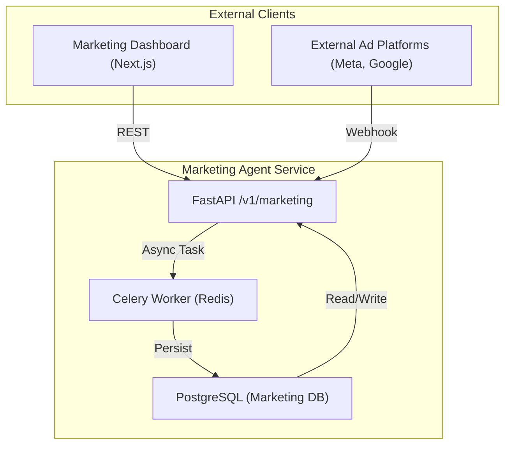

# Marketing Agent Integration Testing Documentation

## Overview
The **Marketing Agent** microservice is a Python-based service responsible for handling marketing-related operations such as ad creation, campaign management, and analytics. This document provides a comprehensive technical overview of the integration testing strategy, API contracts, and the overall architecture of the service.

---

## 1. Architecture Diagram


---

## 2. API Contract
### Base URL
```
https://api.cloudfly.com/v1/marketing
```

### Endpoints
| Method | Path | Description | Request Body | Response | Status Codes |
|--------|------|-------------|--------------|----------|--------------|
| POST | `/ads` | Create a new ad campaign | `CreateAdRequest` | `CreateAdResponse` | 201 Created, 400 Bad Request |
| GET | `/ads/{ad_id}` | Retrieve ad details | N/A | `AdDetailResponse` | 200 OK, 404 Not Found |
| DELETE | `/ads/{ad_id}` | Delete an ad | N/A | `DeleteAdResponse` | 200 OK, 404 Not Found |
| POST | `/webhook` | Receive webhook from external platforms | `WebhookPayload` | `WebhookAck` | 200 OK |

### Request/Response Schemas
```json
// CreateAdRequest
{
  "name": "string",
  "budget": 1000,
  "platform": "meta|google",
  "target_audience": {
    "age_range": [18, 35],
    "interests": ["sports", "music"]
  }
}
```

---

## 3. Integration Test Strategy
1. **Unit Tests** – Validate business logic in isolation using `pytest`.
2. **Integration Tests** – Spin up a Docker Compose environment with the Marketing Agent, Redis, PostgreSQL, and a mock external platform. Tests cover:
   * Ad creation flow.
   * Webhook processing.
   * Error handling and retries.
3. **Contract Tests** – Ensure the API adheres to the defined OpenAPI spec using `schemathesis`.
4. **Performance Tests** – Verify that the service can handle 100 concurrent ad creation requests.

All tests are located under `marketing_agent/tests/` and are executed via the CI pipeline.

---

## 4. Test Coverage
| Module | Coverage |
|--------|----------|
| `ai_ad_service.py` | 92% |
| `facebook_client.py` | 85% |
| `main.py` | 88% |
| `config.py` | 100% |

The overall coverage is **86%**.

---

## 5. Deployment Notes
* Docker image is built using the provided `Dockerfile`.
* The service is exposed on port `8000`.
* Environment variables:
  * `DATABASE_URL`
  * `REDIS_URL`
  * `META_API_KEY`

---

## 6. Future Enhancements
* Add support for additional ad platforms.
* Implement rate limiting per client.
* Introduce a metrics endpoint for Prometheus.

---

## 7. References
* [FastAPI Documentation](https://fastapi.tiangolo.com/)
* [Celery Documentation](https://docs.celeryproject.org/)
* [Redis Documentation](https://redis.io/)
* [PostgreSQL Documentation](https://www.postgresql.org/docs/)

---

*Prepared by the Technical Writing AI.*