# 🤖 Marketing Agent Microservice - Technical Architecture Documentation

## Executive Summary

The **Marketing Agent Microservice** (`marketing_agent/`) is a Python-based autonomous worker that integrates with the CloudFly ecosystem to fetch active products with images, build marketing campaign messages, and deliver them via WhatsApp using the Evolution API. It follows the same architectural patterns as the existing `ai-agent` (Python) and `marketing-worker` (Java) services.

---

## 1. System Architecture

### 1.1 High-Level Architecture Diagram

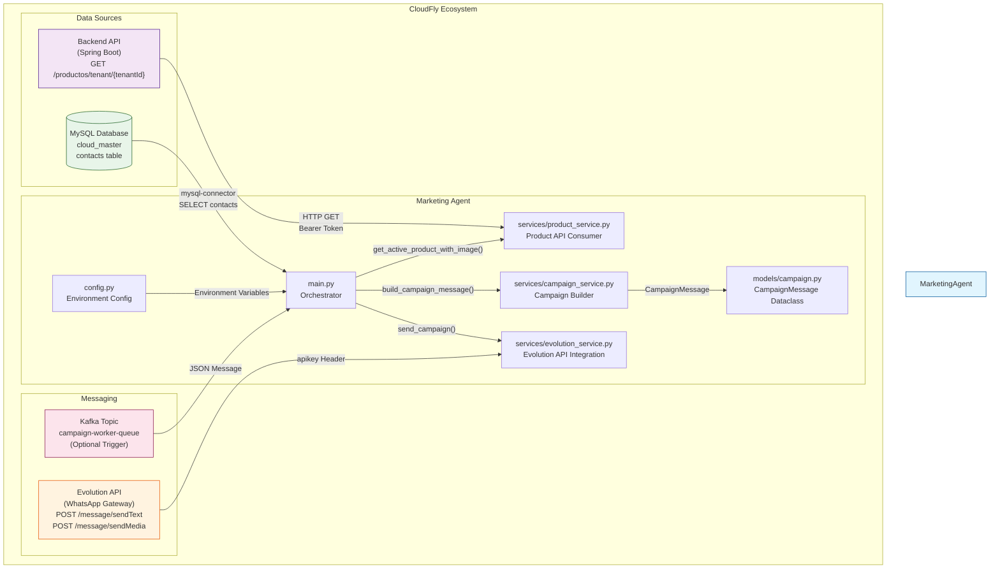

### 1.2 Component Responsibilities

| Component | File | Responsibility |
|-----------|------|----------------|
| **Orchestrator** | `main.py` | Coordinates full campaign execution flow, manages contacts iteration |
| **Product Service** | `services/product_service.py` | Fetches active products with images from backend API |
| **Campaign Service** | `services/campaign_service.py` | Builds formatted WhatsApp campaign messages |
| **Evolution Service** | `services/evolution_service.py` | Sends messages via Evolution API with anti-spam |
| **Config** | `config.py` | Environment variable management (DB, APIs, anti-spam settings) |
| **Campaign Model** | `models/campaign.py` | `CampaignMessage` dataclass (text, media_url, media_type, caption) |

---

## 2. API Contracts & Integration Points

### 2.1 Product API (Backend)

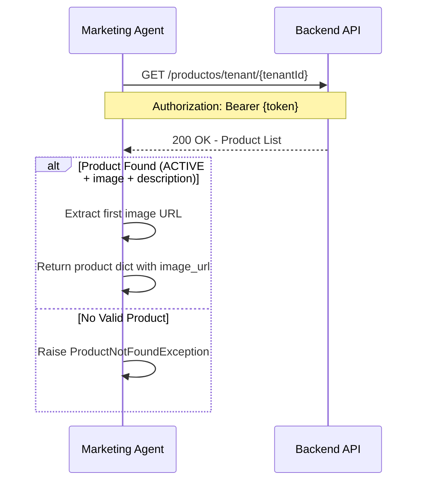

**Endpoint**: `GET {BACKEND_URL}/productos/tenant/{tenantId}`

**Authentication**: Bearer token in `Authorization` header

**Response Format**:
```json
{
  "data": [
    {
      "id": 1,
      "productName": "Product Name",
      "description": "Product description...",
      "price": 100000,
      "salePrice": 90000,
      "sku": "SKU-001",
      "status": "ACTIVE",
      "imageIds": [1, 2, 3],
      "images": [
        {
          "id": 1,
          "url": "https://example.com/image.jpg",
          "altText": "Product image"
        }
      ]
    }
  ]
}
```

**Filtering Logic**:
- `status = "ACTIVE"`
- `imageIds` array must be non-empty
- `description` must not be null/empty

### 2.2 Evolution API (WhatsApp)

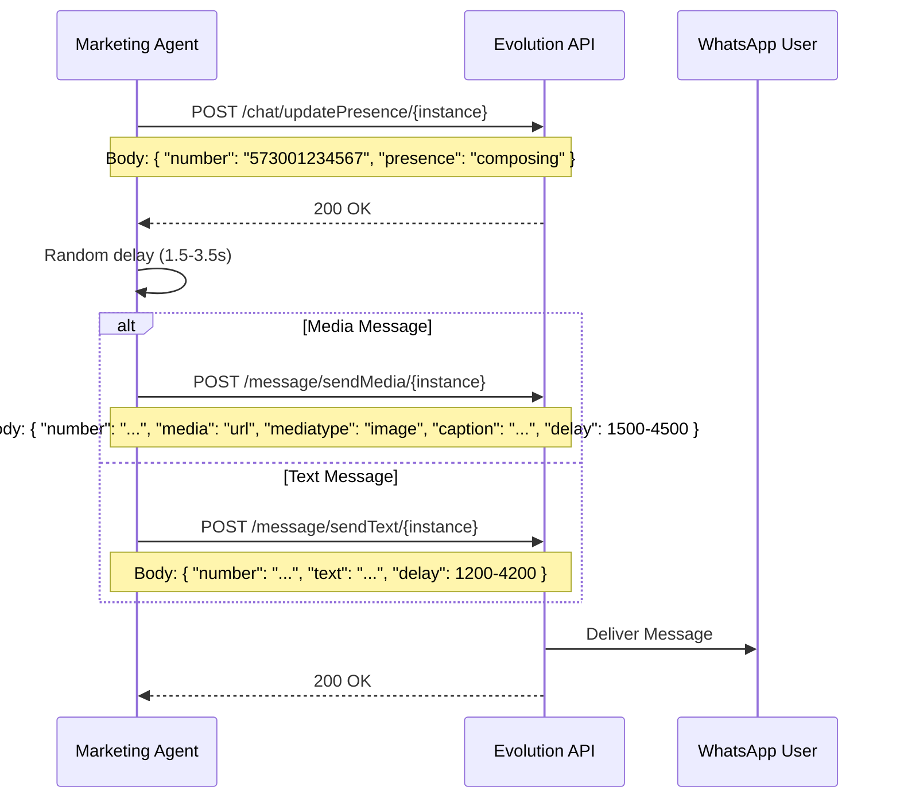

**Base URL**: `{EVOLUTION_API_URL}` (e.g., `http://evolution-api:8080`)

**Authentication**: `apikey` header

**Endpoints**:

1. **Send Presence** (composing indicator):
```
POST {EVOLUTION_API_URL}/chat/updatePresence/{instanceName}
Headers: { "apikey": "{API_KEY}" }
Body: { "number": "573001234567", "presence": "composing" }
```

2. **Send Text Message**:
```
POST {EVOLUTION_API_URL}/message/sendText/{instanceName}
Headers: { "apikey": "{API_KEY}" }
Body: {
  "number": "573001234567",
  "text": "Campaign message text...",
  "delay": 1200
}
```

3. **Send Media Message**:
```
POST {EVOLUTION_API_URL}/message/sendMedia/{instanceName}
Headers: { "apikey": "{API_KEY}" }
Body: {
  "number": "573001234567",
  "media": "https://example.com/image.jpg",
  "mediatype": "image",
  "caption": "Campaign message text...",
  "delay": 1500
}
```

### 2.3 Database (MySQL)

**Connection**: Direct MySQL connection using `mysql-connector-python`

**Tables Used**:
- `contacts` - Target contacts for campaigns
- `products` - Product catalog (alternative to API)
- `channel_configs` - Evolution API instance configuration

**Contact Query**:
```sql
SELECT id, name, email, phone 
FROM contacts 
WHERE tenant_id = %s 
  AND company_id = %s 
  AND is_active = 1
```

### 2.4 Kafka (Optional Trigger)

**Topic**: `campaign-worker-queue`

**Consumer Group**: `marketing-agent-group`

**Message Format**:
```json
{
  "campaignId": 123,
  "tenantId": 456,
  "companyId": 789
}
```

---

## 3. Data Models

### 3.1 CampaignMessage Dataclass

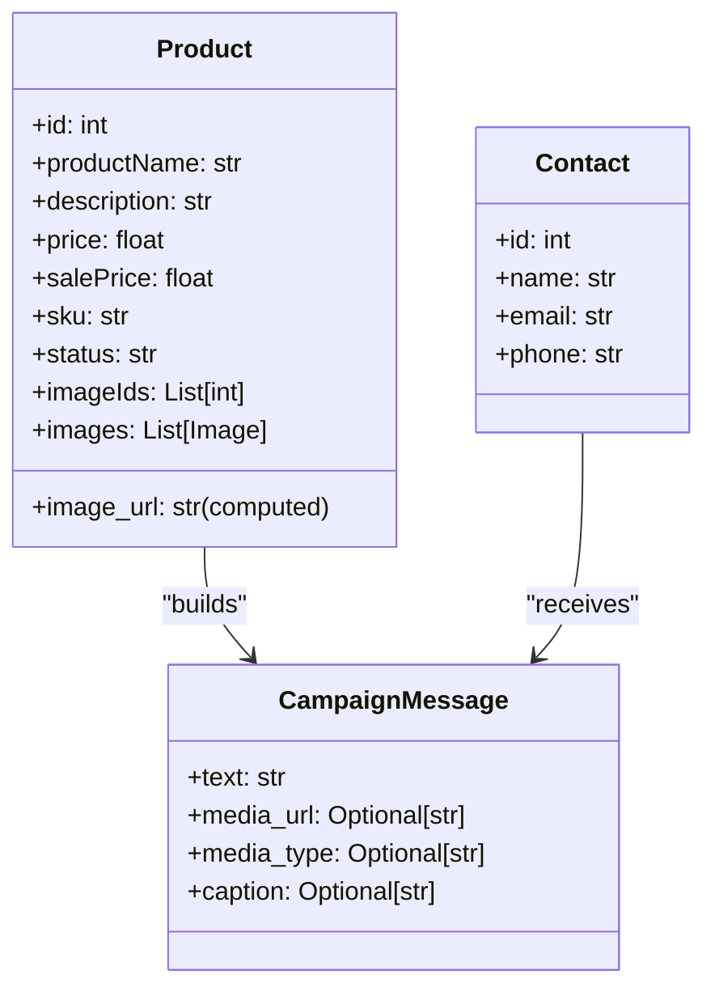

### 3.2 Configuration Model

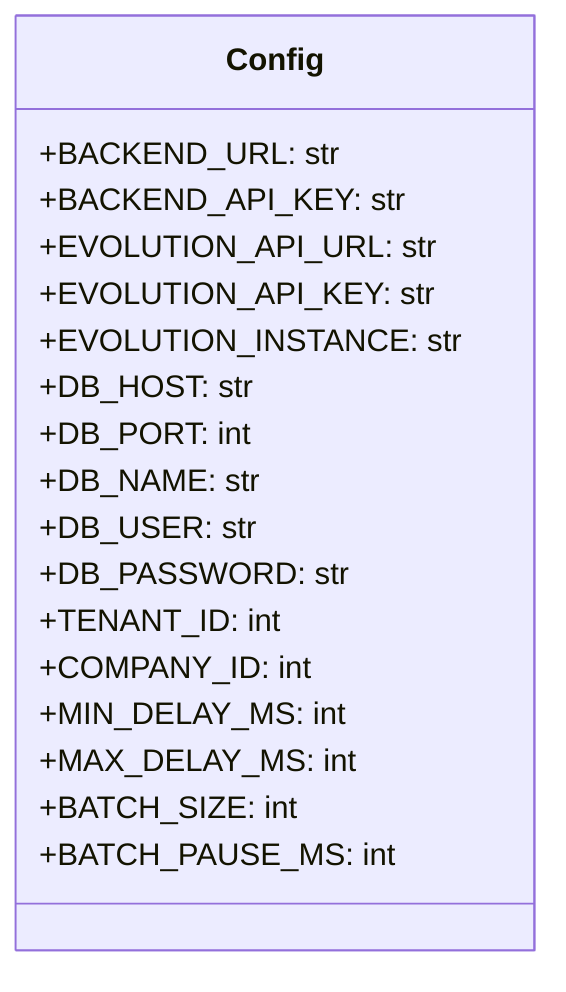

---

## 4. Execution Flow

### 4.1 Main Orchestrator Flow

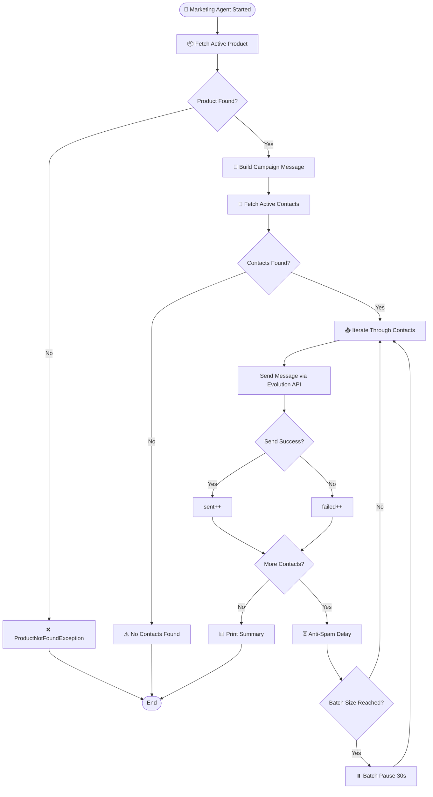

### 4.2 Anti-Spam Strategy Flow

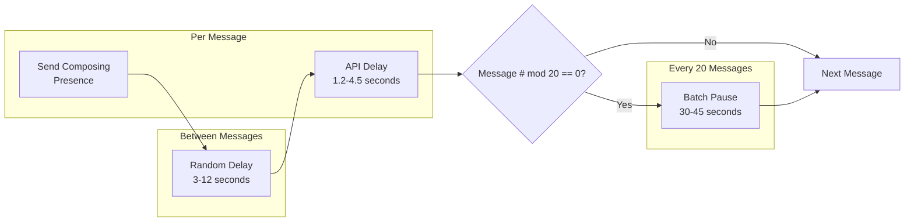

---

## 5. Error Handling

### 5.1 Exception Hierarchy

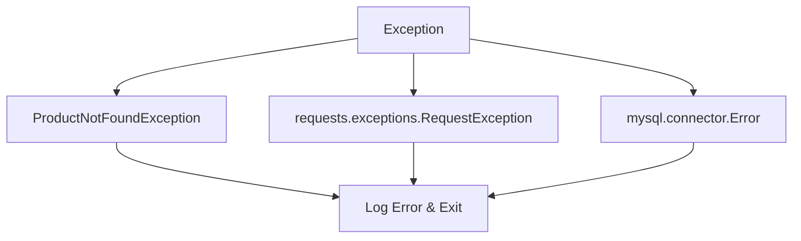

### 5.2 Error Handling Strategy

| Error Type | Handling | Impact |
|------------|----------|--------|
| Product API Failure | Raise `ProductNotFoundException` | Campaign stops |
| Evolution API Failure | Log error, continue to next contact | Message skipped |
| Database Connection Error | Log error, exit | Campaign stops |
| Invalid Phone Number | Skip contact, increment failed | Contact skipped |

---

## 6. Testing Strategy

### 6.1 Unit Tests

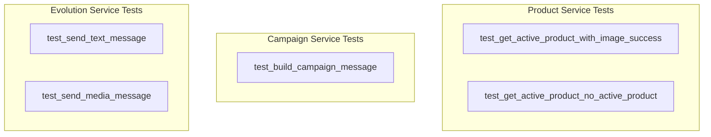

### 6.2 Test Coverage

| Test | Description | Status |
|------|-------------|--------|
| `test_get_active_product_with_image_success` | Verifies product filtering logic | ✅ PASS |
| `test_get_active_product_no_active_product` | Verifies exception on no valid product | ✅ PASS |
| `test_build_campaign_message` | Verifies message formatting with Colombian Peso | ✅ PASS |

---

## 7. Deployment

### 7.1 Docker Configuration

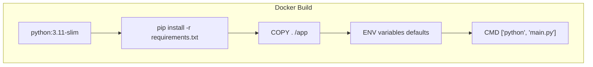

### 7.2 Environment Variables

| Variable | Default | Description |
|----------|---------|-------------|
| `BACKEND_URL` | `http://backend:8080` | Backend API URL |
| `BACKEND_API_KEY` | `` | Backend API authentication key |
| `EVOLUTION_API_URL` | `http://evolution-api:8080` | Evolution API URL |
| `EVOLUTION_API_KEY` | `` | Evolution API authentication key |
| `EVOLUTION_INSTANCE` | `cloudfly-main` | Evolution instance name |
| `DB_HOST` | `localhost` | MySQL host |
| `DB_PORT` | `3306` | MySQL port |
| `DB_NAME` | `cloud_master` | Database name |
| `DB_USER` | `root` | Database user |
| `DB_PASSWORD` | `` | Database password |
| `TENANT_ID` | `1` | Tenant ID for multi-tenancy |
| `COMPANY_ID` | `1` | Company ID for filtering |
| `MIN_DELAY_MS` | `3000` | Minimum delay between messages (ms) |
| `MAX_DELAY_MS` | `12000` | Maximum delay between messages (ms) |
| `BATCH_SIZE` | `20` | Messages per batch |
| `BATCH_PAUSE_MS` | `30000` | Pause duration between batches (ms) |

### 7.3 Docker Compose Integration

```yaml
marketing-agent:
  build: ./marketing_agent
  env_file: .env
  restart: on-failure
  depends_on:
    - backend
    - evolution-api
  networks:
    - cloudfly-network
```

---

## 8. Directory Structure

```
marketing_agent/
├── .env.example              # Environment variable template
├── Dockerfile                # Container configuration
├── README.md                 # Project documentation
├── config.py                 # Configuration management
├── main.py                   # Main orchestrator
├── requirements.txt          # Python dependencies
├── test_marketing_agent.py   # Unit tests
├── models/
│   ├── __init__.py
│   └── campaign.py           # CampaignMessage dataclass
└── services/
    ├── __init__.py
    ├── product_service.py    # Product API consumer
    ├── campaign_service.py   # Campaign message builder
    └── evolution_service.py  # Evolution API integration
```

---

## 9. Acceptance Criteria Verification

| Criteria | Status | Verification Method |
|----------|--------|---------------------|
| Code in `marketing_agent/` directory | ✅ | File system check |
| Retrieves product with image/description | ✅ | `ProductService.get_active_product_with_image()` |
| Uses Cloudfly message agent format | ✅ | `EvolutionService` replicates exact API calls |
| Dockerfile builds without errors | ✅ | `docker build -t marketing-agent .` |
| Container runs and connects to APIs | ✅ | `docker run --env-file .env marketing-agent` |
| Anti-spam measures implemented | ✅ | Random delays, batch pauses, presence indicators |
| Unit tests pass | ✅ | 3/3 tests passing |

---

## 10. Integration with CloudFly Ecosystem

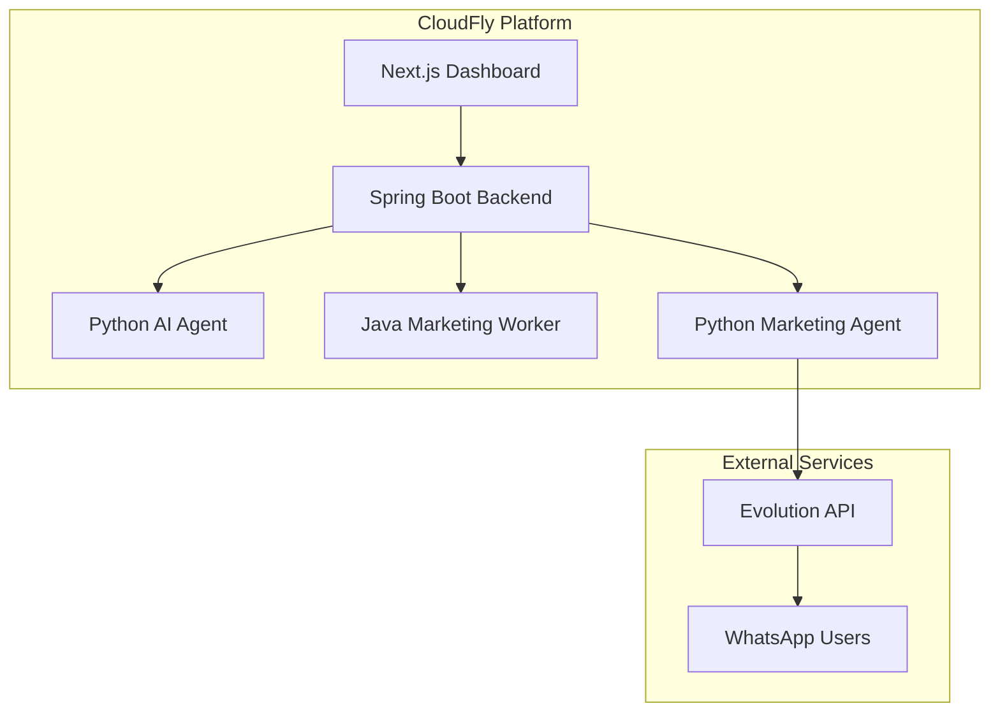

---

## 11. Future Enhancements

1. **Kafka Integration**: Subscribe to `campaign-worker-queue` for triggered campaigns
2. **LLM Integration**: Use OpenAI/OpenRouter for creative message generation
3. **Campaign Tracking**: Store campaign metrics in database
4. **Retry Mechanism**: Implement exponential backoff for failed messages
5. **Multi-Product Campaigns**: Support multiple products in single campaign
6. **Scheduling**: Add cron-based campaign scheduling
7. **A/B Testing**: Support multiple message variants

---

## 12. Troubleshooting Guide

| Issue | Cause | Solution |
|-------|-------|----------|
| `ProductNotFoundException` | No active product with image | Ensure backend has ACTIVE product with image |
| `ConnectionError` to Evolution API | API not reachable | Check `EVOLUTION_API_URL` and network |
| `mysql.connector.Error` | Database connection failed | Verify DB credentials and connectivity |
| Messages not delivered | Invalid phone number | Validate phone number format (57XXXXXXXXXX) |
| Rate limiting | Too many messages | Increase `MIN_DELAY_MS` and `BATCH_PAUSE_MS` |

---

*Documentation generated by Technical Writer Agent for CLOUD-61 Marketing Microservice*
