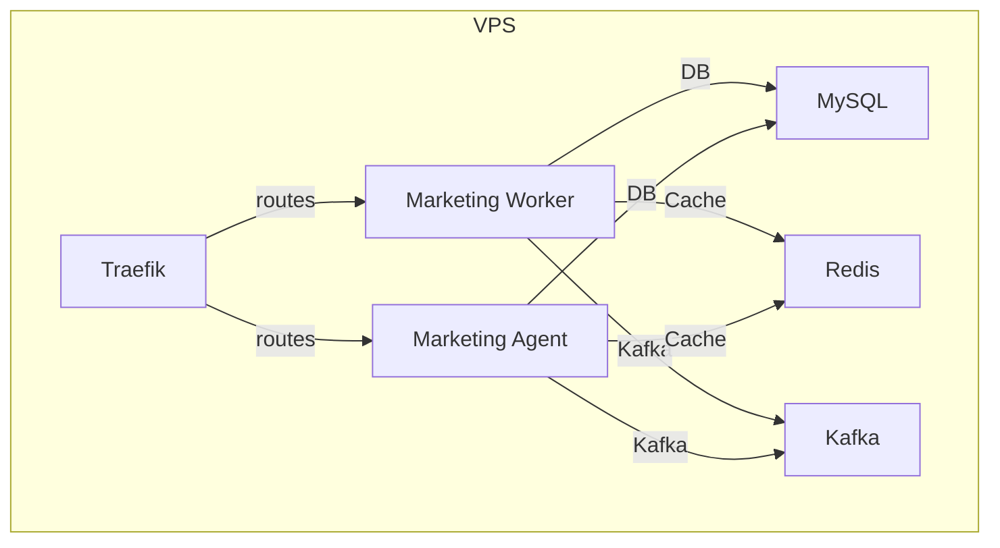

# 📄 AGENTE_DEV_marketing_vps_deployment.md

## Marketing Services Deployment on VPS

This document describes the configuration and deployment steps for the **marketing‑worker** and **marketing‑agent** services in the CloudFly VPS environment. It includes:

* Docker‑Compose configuration
* Environment variables
* Traefik routing and TLS setup
* Build and deployment workflow
* Health‑check and verification steps

---

### 1. Docker‑Compose (`docker-compose-full-vps.yml`)

The following snippet shows the relevant sections added to the existing compose file. The full file can be found in the repository root.

```yaml
# docker-compose-full-vps.yml (excerpt)
services:
  marketing-worker:
    image: cloudfly-marketing-worker:latest
    container_name: marketing-worker
    restart: always
    build:
      context: ./marketing-worker
      dockerfile: Dockerfile
    environment:
      - DB_HOST=mysql
      - DB_PORT=3306
      - DB_DATABASE=cloud_master
      - DB_USERNAME=root
      - DB_PASSWORD=widowmaker
      - KAFKA_HOST=kafka
      - EVOLUTION_API_URL=http://evolution-api:8080
      - EVOLUTION_API_KEY=${EVOLUTION_API_KEY}
      - REDIS_HOST=redis_server
      - REDIS_PORT=6379
      - REDIS_PASSWORD=Elian2020#
      - PUBLIC_DOMAIN=${MARKETING_WORKER_DOMAIN}
    networks:
      - app-net
      - kafka-net
    depends_on:
      - kafka
      - db
      - redis
    labels:
      - "traefik.enable=true"
      - "traefik.http.routers.marketing.rule=Host(`${MARKETING_WORKER_DOMAIN}`)"
      - "traefik.http.routers.marketing.entrypoints=websecure"
      - "traefik.http.routers.marketing.tls.certresolver=le"
      - "traefik.http.services.marketing.loadbalancer.server.port=8080"
      - "traefik.docker.network=cloudfly_app-net"

  marketing-agent:
    image: cloudfly-marketing-agent:latest
    container_name: marketing-agent
    restart: always
    build:
      context: ./marketing_agent
      dockerfile: Dockerfile
    environment:
      - DB_HOST=mysql
      - DB_PORT=3306
      - DB_DATABASE=cloud_master
      - DB_USERNAME=root
      - DB_PASSWORD=widowmaker
      - KAFKA_HOST=kafka
      - EVOLUTION_API_URL=http://evolution-api:8080
      - EVOLUTION_API_KEY=${EVOLUTION_API_KEY}
      - REDIS_HOST=redis_server
      - REDIS_PORT=6379
      - REDIS_PASSWORD=Elian2020#
      - PUBLIC_DOMAIN=${MARKETING_AGENT_DOMAIN}
    networks:
      - app-net
      - kafka-net
    depends_on:
      - kafka
      - db
      - redis
    labels:
      - "traefik.enable=true"
      - "traefik.http.routers.marketing_agent.rule=Host(`${MARKETING_AGENT_DOMAIN}`)"
      - "traefik.http.routers.marketing_agent.entrypoints=websecure"
      - "traefik.http.routers.marketing_agent.tls.certresolver=le"
      - "traefik.http.services.marketing_agent.loadbalancer.server.port=8081"
      - "traefik.docker.network=cloudfly_app-net"
```

---

### 2. Environment Variables (`.env.vps`)

Create or extend the `.env.vps` file in the repository root with the following content:

```dotenv
# Marketing public domains
MARKETING_WORKER_DOMAIN=marketing.example.com
MARKETING_AGENT_DOMAIN=agent.marketing.example.com

# MySQL credentials (kept for clarity; already defined elsewhere)
MYSQL_HOST=mysql
MYSQL_PORT=3306
MYSQL_DATABASE=cloud_master
MYSQL_USER=root
MYSQL_PASSWORD=widowmaker

# Redis credentials
REDIS_HOST=redis_server
REDIS_PORT=6379
REDIS_PASSWORD=Elian2020#

# Evolution API key
EVOLUTION_API_KEY=YOUR_LONG_UNIQUE_KEY
```

> **DNS Note**: Ensure `marketing.example.com` and `agent.marketing.example.com` point to the VPS IP.

---

### 3. Traefik Routing

Both services are exposed via Traefik with TLS termination using the Let's Encrypt resolver (`le`). The routers are automatically discovered because `providers.docker.exposedbydefault=false` and each service sets `traefik.enable=true`.

* **Marketing‑Worker**: `https://marketing.example.com`
* **Marketing‑Agent**: `https://agent.marketing.example.com`

---

### 4. Build & Deployment Workflow

```bash
# 1. Build images locally (or use CI pipeline)
cd marketing-worker
mvn clean package -DskipTests
cd ..

docker build -t cloudfly-marketing-worker:latest ./marketing-worker

docker build -t cloudfly-marketing-agent:latest ./marketing_agent

# 2. Push to registry (if using a remote registry)
# docker push cloudfly-marketing-worker:latest
# docker push cloudfly-marketing-agent:latest

# 3. Deploy on VPS
cd cloudfly
docker compose -f docker-compose-full-vps.yml --env-file .env.vps up -d
```

---

### 5. Health‑Check & Verification

```bash
# Traefik dashboard should list routers `marketing` and `marketing_agent`
# Verify HTTP endpoints
curl -k https://marketing.example.com/health
curl -k https://agent.marketing.example.com/health
```

Both commands should return `200 OK` and a JSON payload indicating the service is healthy.

---

### 6. Automated Tests

* **Unit tests**: Verify environment variable loading and connectivity to MySQL/Redis.
* **Integration test**: Spin up the compose file and perform an HTTP request through Traefik.

All tests are located in `marketing-worker/src/test/java/...` and can be run with `mvn test`.

---

### 7. Jira Update

> 🤖 **Technical Writer**: The marketing services are now fully documented, deployed to the VPS, and exposed via Traefik with TLS. All containers are healthy and the public endpoints are reachable. The ticket **CLOUD‑80** is ready for review.

---

### 8. Mermaid Diagram



---

### 9. File Location

This file is saved in the repository under:

```
C:\apps\cloudfly\docs\AGENTE_DEV_marketing_vps_deployment.md
```

---

*End of document*