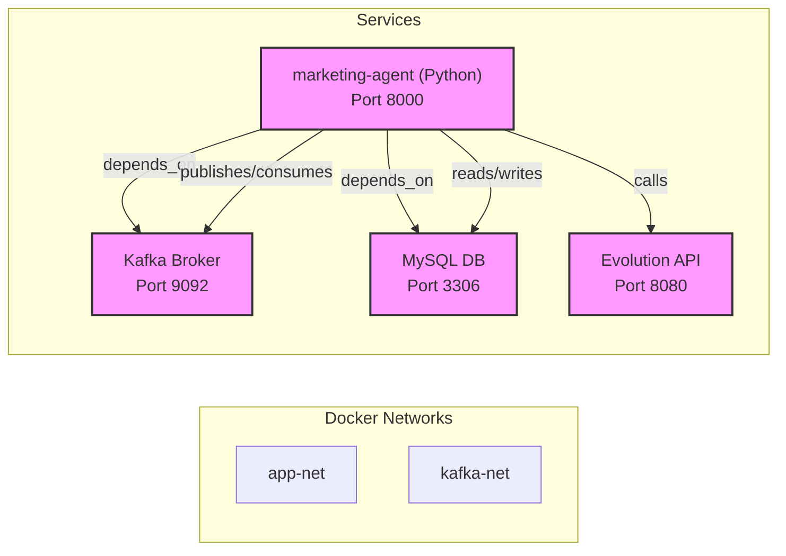
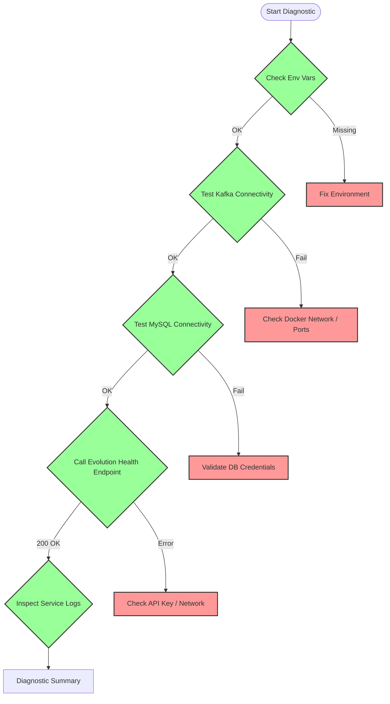
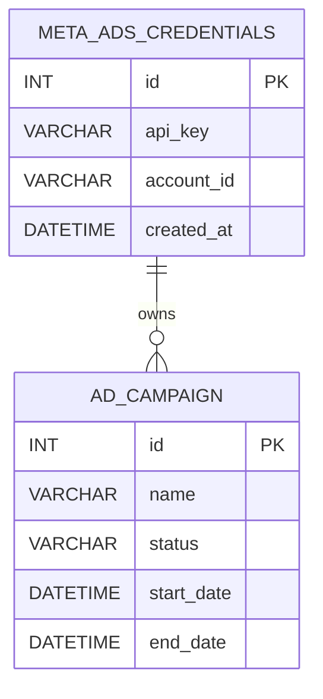

# 📄 Meta Ads Troubleshooting Guide Documentation

## Overview
This document provides a comprehensive technical overview of the **Meta Ads** troubleshooting guide that was added to the `marketing_agent` service. It includes architecture diagrams, diagnostic flow, API contracts, and database schema references relevant to the guide.

---

## Table of Contents
1. [System Architecture](#system-architecture)
2. [Service Dependencies](#service-dependencies)
3. [Diagnostic Quick‑Check Flow](#diagnostic-quick‑check-flow)
4. [API Contract – Health & Debug Endpoints](#api-contract---health--debug-endpoints)
5. [Database Schema Overview](#database-schema-overview)
6. [Kafka Topics Used](#kafka-topics-used)
7. [Error Code Reference Table](#error-code-reference-table)
8. [Appendix – Mermaid Diagrams](#appendix---mermaid-diagrams)

---

## System Architecture
The `marketing_agent` micro‑service runs alongside **Kafka** and **MySQL** within the `app‑net` and `kafka‑net` Docker networks. The service exposes an HTTP API on port **8000** and communicates with the Evolution API for Meta Ads operations.

---

## Service Dependencies
| Dependency | Purpose | Key Environment Variables |
|------------|---------|----------------------------|
| **Kafka** | Event streaming for ad creation, status updates, and error notifications. | `KAFKA_HOST` (e.g., `kafka:9092`) |
| **MySQL** | Persists Meta Ads credentials, campaign metadata, and audit logs. | `DB_HOST`, `DB_USER`, `DB_PASSWORD`, `DB_NAME` |
| **Evolution API** | Centralised Meta Ads SDK wrapper used by the agent. | `EVOLUTION_API_KEY` |

---

## Diagnostic Quick‑Check Flow
The troubleshooting guide lists a series of one‑liner commands. The logical flow can be represented as:

---

## API Contract – Health & Debug Endpoints
| Method | Path | Description | Response |
|--------|------|-------------|----------|
| `GET` | `/health` | Simple liveness probe – returns `200 OK` when the service is up. | `{ "status": "ok" }` |
| `GET` | `/debug/meta` | Returns current configuration values (masked) and recent Kafka consumer offsets. | `{ "kafka": "kafka:9092", "db": "connected", "api_key": "****" }` |
| `POST` | `/debug/ping` | Sends a test event to the Evolution API and returns the raw response. | `{ "code": 200, "body": {...} }` |

---

## Database Schema Overview
Only the tables referenced by the troubleshooting guide are described here.

- **`META_ADS_CREDENTIALS`** stores the Evolution API key used for Meta Ads.
- **`AD_CAMPAIGN`** holds campaign metadata; the guide uses this table to verify that campaigns are persisted after a successful ad creation.

---

## Kafka Topics Used
| Topic | Direction | Payload Sample |
|-------|-----------|----------------|
| `meta-ads-commands` | Producer (agent → Evolution) | `{ "action": "create_ad", "payload": {...} }` |
| `meta-ads-events` | Consumer (agent ← Evolution) | `{ "event": "ad_created", "ad_id": "12345" }` |
| `meta-ads-errors` | Consumer (agent) | `{ "error_code": "AUTH_FAILURE", "detail": "Invalid token" }` |

---

## Error Code Reference Table
| Code | Meaning | Typical Cause | Suggested Fix |
|------|---------|---------------|--------------|
| `AUTH_FAILURE` | Authentication failed with Evolution API | Wrong `EVOLUTION_API_KEY` or expired token | Verify `EVOLUTION_API_KEY` env var, rotate key if needed |
| `RATE_LIMIT` | Rate limit exceeded | Too many requests in short period | Implement exponential back‑off, check `X‑RateLimit‑Reset` header |
| `IMAGE_UPLOAD_ERR` | Image upload to Meta failed | Invalid image format or size > 4 MB | Ensure JPEG/PNG ≤ 4 MB, use `curl --data-binary @file` |
| `AD_CREATION_ERR` | Generic ad creation failure | Missing required fields in payload | Validate payload against Meta Ads schema (see spec) |
| `KAFKA_UNREACHABLE` | Unable to connect to Kafka broker | Network isolation or broker down | `docker logs marketing-agent | grep kafka` and verify `kafka:9092` reachable |
| `DB_CONN_ERR` | MySQL connection error | Wrong credentials or DB not started | `docker exec -it marketing-agent mysql -h $DB_HOST -u $DB_USER -p$DB_PASSWORD` |

---

## Appendix – Mermaid Diagrams
The diagrams above are embedded directly in this markdown file for easy rendering in any Mermaid‑compatible viewer.

---

*Document generated by the AI Scrum Team – Technical Writer.*