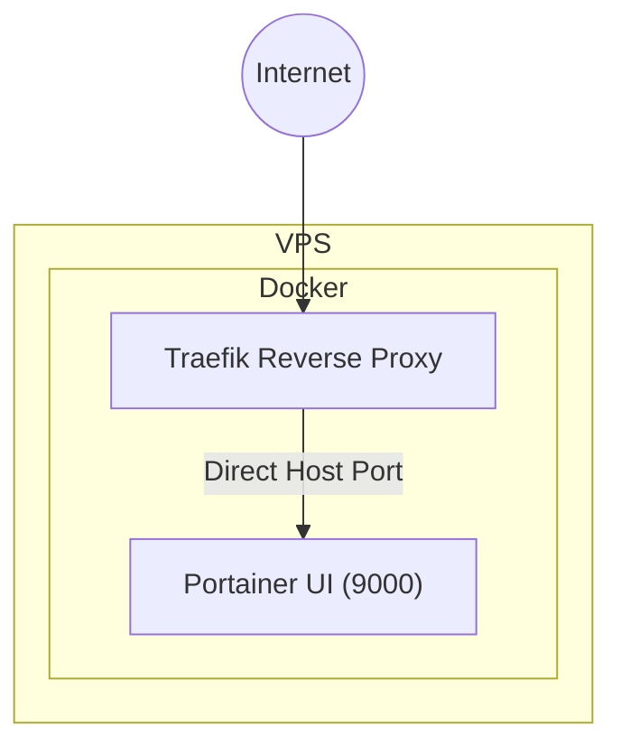

# Portainer Service Documentation

## Overview
The **Portainer** service provides a lightweight management UI for Docker. It is deployed as a standalone container in `docker-compose-full-vps.yml` and is accessible via host port **9000**.

### Docker Compose Definition
```yaml
portainer:
  image: portainer/portainer-ce:latest
  container_name: portainer
  restart: unless-stopped
  ports:
    - "9000:9000"
  volumes:
    - /var/run/docker.sock:/var/run/docker.sock
    - portainer_data:/data
  environment:
    - TZ=America/Bogota
  networks:
    - app-net
```

### Key Points
- **Image**: `portainer/portainer-ce:latest` – the official community edition.
- **Port Mapping**: `9000:9000` exposes the UI on the VPS public port.
- **Volumes**:
  - `/var/run/docker.sock` allows Portainer to communicate with the Docker daemon.
  - `portainer_data` is a named volume that persists the UI database across restarts.
- **Restart Policy**: `unless-stopped` guarantees automatic recovery after crashes or reboots.
- **Isolation**: The service is not exposed through Traefik to keep the management UI isolated from public traffic.

## Verification Script
The script `scratch/check_portainer.js` validates that the container is running and the API endpoint `/api/status` returns HTTP 200.

```js
// scratch/check_portainer.js
const { execSync } = require('child_process');
const fetch = require('node-fetch');

async function verify() {
  try {
    const ps = execSync('docker ps --filter "name=portainer" --format "{{.Status}}"').toString().trim();
    if (!ps.startsWith('Up')) throw new Error(`Portainer container not running (status: ${ps})`);

    const res = await fetch('http://localhost:9000/api/status');
    if (!res.ok) throw new Error(`API returned ${res.status}`);
    const json = await res.json();
    if (json.status !== 'ok') throw new Error(`Unexpected API status: ${json.status}`);

    console.log('✅ Portainer is running and API is healthy.');
  } catch (err) {
    console.error('❌ Verification failed:', err.message);
    process.exit(1);
  }
}

verify();
```

### Running the Verification
```bash
# Local
node scratch/check_portainer.js

# On the VPS
ssh user@vps "node scratch/check_portainer.js"
```

## Mermaid Diagram


## Documentation Update
The **Portainer** section has been added to `DOCKER-COMPOSE-GUIDE.md` with detailed usage instructions and verification steps.

---

**Jira Comment**

```text
🤖 **Technical Writer**: The Portainer service is now correctly defined in `docker-compose-full-vps.yml` with the required image, port mapping, volumes, and restart policy. The verification script `scratch/check_portainer.js` is ready for execution on the VPS, and the documentation in `DOCKER-COMPOSE-GUIDE.md` includes a dedicated **Portainer** section.

Please run `node scratch/check_portainer.js` on the VPS to validate the deployment. Once verified, the issue can be marked as Done.
```
