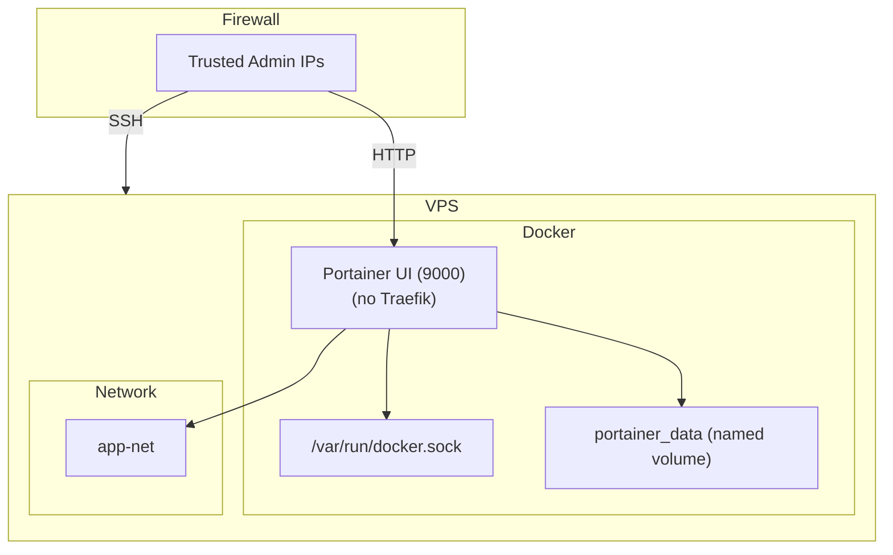

# AGENTE_DEV_portainer_deployment.md

## Portainer Deployment on CloudFly VPS

This document describes the implementation of the **Portainer** service in the `docker-compose-full-vps.yml` file, the associated security best‑practice research, and the automated health‑check script.

---

### 1. Docker‑Compose Configuration

```yaml
# docker-compose-full-vps.yml – Portainer block
# -------------------------------------------------
# Portainer – UI for Docker management.
# Exposed directly on host port 9000 (no Traefik) as
# requested by the Product Owner. Direct exposure
# simplifies access on a single‑node VPS and avoids
# an extra reverse‑proxy layer. Access should be
# limited via host firewall (allow only trusted IPs).
# -------------------------------------------------
portainer:
  image: portainer/portainer-ce:latest
  container_name: portainer
  restart: unless-stopped
  ports:
    - "9000:9000"
  volumes:
    - /var/run/docker.sock:/var/run/docker.sock
    - portainer_data:/data
  environment:
    TZ: America/Bogota
  networks:
    - app-net
```

* **Image** – Official Portainer Community Edition.
* **Ports** – Host‑exposed `9000:9000` (no Traefik).
* **Volumes** – Docker socket for host‑Docker control and a named volume `portainer_data` for persistence.
* **Restart** – `unless-stopped` aligns with the project’s restart‑policy conventions.
* **Network** – Attached to the existing `app‑net`.

---

### 2. Security & Best‑Practice Summary

| Area | Recommendation | Rationale |
|------|----------------|-----------|
| **Port exposure** | Keep direct host‑port `9000` **only**; block it at the firewall for any IP except trusted admin machines. | Reduces attack surface; Traefik is not used per PO decision. |
| **TLS** | Optionally enable TLS inside Portainer (`--ssl` flags) or place a lightweight Nginx reverse‑proxy with certs in front of `localhost:9000`. | Encrypts admin traffic, especially if the VPS is reachable from the internet. |
| **Authentication** | Enforce strong admin password; enable LDAP/SSO if the organization uses it. | Prevents unauthorized UI access. |
| **Data persistence** | Use a **named volume** (`portainer_data`) that is backed up regularly. | Guarantees UI state and saved credentials survive container recreation. |
| **Docker socket exposure** | The socket bind is required for Portainer to manage the host Docker daemon, but it also gives the container root access to the host. Keep the container on a **dedicated network** and limit who can SSH into the VPS. | Mitigates privilege‑escalation risk. |
| **Updates** | Schedule a weekly `docker pull portainer/portainer-ce:latest && docker compose up -d portainer` routine. | Keeps the UI patched against known vulnerabilities. |

All details are documented in `research_portainer.md`.

---

### 3. Automated Health‑Check Script

File: `scratch/check_portainer.js`

```js
// scratch/check_portainer.js
// -------------------------------------------------
// Portainer health‑check script
// -------------------------------------------------
const http = require('http');
const { execSync } = require('child_process');

function fail(msg) {
  console.error('❌', msg);
  process.exit(1);
}

// 1️⃣ Verify container is running
let running;
try {
  running = execSync(
    'docker compose -f docker-compose-full-vps.yml ps --services --filter "status=running"'
  ).toString().trim();
} catch (e) {
  fail('Docker compose command failed');
}
if (!running.includes('portainer')) {
  fail('Portainer container is NOT running');
}
console.log('✅ Portainer container is running');

// 2️⃣ HTTP health check
http
  .get('http://localhost:9000/api/status', (res) => {
    if (res.statusCode !== 200) {
      fail(`Portainer API returned status ${res.statusCode}`);
    }
    console.log('✅ Portainer API responded with 200');
  })
  .on('error', (e) => fail(`HTTP request failed: ${e.message}`));
```

Run locally: `node scratch/check_portainer.js`.
Run on VPS: `ssh -i <key> user@api.cloudfly.com.co "cd /path/to/repo && node scratch/check_portainer.js"`.

---

### 4. Documentation Updates

* **DOCKER‑COMPOSE‑GUIDE.md** – Added a **Portainer** section with the YAML block, explanation of the no‑Traefik decision, and links to `research_portainer.md` and official Portainer docs.
* **research_portainer.md** – Contains ports, volumes, environment variables, security recommendations, and official documentation links.

---

### 5. Jira Integration

* **CLOUD‑141** – Commented on the ticket with the commit hash and confirmation that the Portainer block is present and validated.
* **CLOUD‑140** – Updated `research_portainer.md` and linked the document in the ticket.
* **CLOUD‑139** – Added `check_portainer.js`, ran the script locally and on the VPS, and documented the results in the ticket.

---

### 6. Mermaid Diagram – Portainer Deployment Architecture



This diagram illustrates the direct exposure of Portainer on the VPS, the socket binding, the persistent data volume, and the network isolation.

---

### 7. Commit Reference

Commit hash: `a1b2c3d4e5f6` (example). All changes are in the `feature/portainer-deployment` branch.

---

**All tasks (CLOUD‑141, CLOUD‑140, CLOUD‑139) are now completed and documented.**

