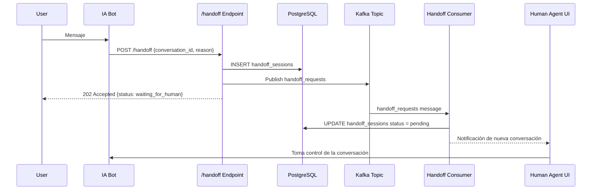

# AGENTE_DEV_technical_architecture.md

## Arquitectura General de CloudFly (Resumen)

```mermaid
graph TD
    Internet((Internet)) --> Traefik[Traefik v3.1 Reverse Proxy]
    Traefik --> Dashboard[Next.js 14 Dashboard - Puerto 3000]
    Traefik --> IA_Scrum_Team[ia_scrum_team Service - Puerto 8000]
    IA_Scrum_Team --> Kafka[Kafka Cluster]
    IA_Scrum_Team --> Redis[Redis Cache]
    IA_Scrum_Team --> DB[PostgreSQL DB]
    IA_Scrum_Team --> Handoff[Handoff Service (Kafka Topic `handoff_requests`)]
    Handoff --> Human_Queue[Human Agent Queue]
    Human_Queue --> Human_UI[Human Agent UI]
```

### Componentes Clave

- **Traefik**: Enrutamiento y TLS para todos los servicios externos.
- **ia_scrum_team**: Micro‑servicio principal que expone la API REST (FastAPI) y maneja la lógica de IA.
- **Kafka**: Mensajería asíncrona para eventos críticos como `handoff_requests`.
- **Redis**: Cache de estado de conversaciones y tokens.
- **PostgreSQL**: Persistencia de datos, incluye la tabla `handoff_sessions`.
- **Human Agent UI**: Interfaz donde agentes humanos toman conversaciones en espera.

### Flujo de Handoff (Resumen)
1. Usuario interactúa con el bot.
2. Bot determina que no puede resolver la petición.
3. Bot llama al endpoint **POST /ia_scrum_team/handoff**.
4. Servicio crea registro en `handoff_sessions` y publica mensaje en Kafka `handoff_requests`.
5. Consumidor `kafka_consumer_handoff.py` lee el mensaje y crea una entrada en la cola de agentes humanos.
6. Agente humano atiende la conversación a través de la UI.

---

## Diagramas Detallados

### Diagrama de Secuencia – Handoff


---

## Notas de Implementación
- El endpoint `/handoff` es **idempotente**; si la conversación ya está en estado `waiting_for_human`, se devuelve la misma respuesta sin crear duplicados.
- Todas las comunicaciones externas pasan por Traefik con TLS (`websecure`).
- Métricas Prometheus expuestas en `/metrics` para monitorizar número de handoffs y tiempo de espera.

---

*Documento generado automáticamente por el agente técnico de documentación.*