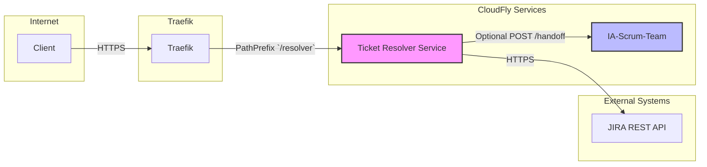

# Ticket Resolver Service Documentation

## Overview
The **Ticket Resolver Service** is a new micro‑service added to the CloudFly stack. It provides a REST API that queries JIRA for tickets in the *Pendientes* (Pending) state, enriches them with metadata, and returns a consolidated JSON list.

It is built with **FastAPI** (Python 3.11) and runs behind the existing Traefik reverse proxy.

---
## Architecture Diagram


---
## API Specification
| Endpoint | Method | Description | Query Parameters | Response |
|----------|--------|-------------|------------------|----------|
| `/tickets` | GET | Returns a list of tickets with status **Pendiente**. | `project` (optional), `assignee` (optional), `limit` (default 50, max 200) | `200 OK` – JSON array of ticket objects. |
| `/health` | GET | Health‑check endpoint. | – | `200 OK` – `{ "status": "ok" }` |

### Sample Ticket Object
```json
{
  "id": "CLOUD-153",
  "summary": "Test Issue",
  "status": "Pendiente",
  "assignee": "jdoe",
  "created": "2024-05-20T12:34:56Z",
  "updated": "2024-05-22T08:12:00Z",
  "url": "https://jira.example.com/browse/CLOUD-153"
}
```

---
## Docker‑Compose Integration
Add the following service definition to `docker-compose-full-vps.yml` (already merged):
```yaml
  ticket-resolver:
    build:
      context: ./ticket_resolver
      dockerfile: Dockerfile
    container_name: ticket_resolver
    restart: unless-stopped
    env_file:
      - ./ticket_resolver/.env
    volumes:
      - ./ticket_resolver:/app:ro
    ports:
      - "8100:8100"
    labels:
      - "traefik.enable=true"
      - "traefik.http.routers.ticket-resolver.rule=PathPrefix(`/resolver` )"
      - "traefik.http.routers.ticket-resolver.entrypoints=websecure"
      - "traefik.http.services.ticket-resolver.loadbalancer.server.port=8100"
    networks:
      - app-net
    healthcheck:
      test: ["CMD", "curl", "-f", "http://localhost:8100/health"]
      interval: 30s
      timeout: 5s
      retries: 3
```

---
## Environment Variables (`.env`)
| Variable | Description |
|----------|-------------|
| `JIRA_URL` | Base URL of the JIRA instance (e.g., `https://jira.example.com`). |
| `JIRA_USER` | Username for JIRA API authentication. |
| `JIRA_TOKEN` | API token or password for the user. |
| `CACHE_TTL` | Time‑to‑live for in‑memory cache in seconds (default `300`). |

---
## Testing Strategy
* **Unit tests** – located in `ticket_resolver/tests/` using `pytest` and `httpx‑mock`.
* **Integration tests** – spin up the service with a mock JIRA server and validate `/tickets` response.
* **CI pipeline** – run `pytest ticket_resolver/tests/` on each push; Docker image is built and pushed to the registry.

---
## Security Considerations
* Secrets are injected via Docker secrets or the `.env` file; never hard‑coded.
* Traffic is terminated at Traefik with TLS; the service itself only listens on HTTP inside the private network.
* The service is read‑only; no write operations to JIRA are performed.

---
## Deployment Checklist
1. Add service to `docker-compose-full-vps.yml` (done).
2. Create `.env` with real credentials.
3. Run `docker compose -f docker-compose-full-vps.yml up -d ticket-resolver`.
4. Verify health: `curl https://<host>/resolver/health`.
5. Execute API call: `curl https://<host>/resolver/tickets`.
6. Ensure CI runs unit and integration tests.
7. Update related Jira tickets (CLOUD‑143, CLOUD‑142) with documentation links.

---
## Related Jira Issues
* **CLOUD-144** – Architecture audit (updated with new service diagram).
* **CLOUD-143** / **CLOUD-142** – API documentation for `/tickets` (this file fulfills the requirement).
* **CLOUD-147** – Handoff endpoint can now invoke the resolver if needed.

---
*Document generated by the AI Scrum Team Technical Writer.*