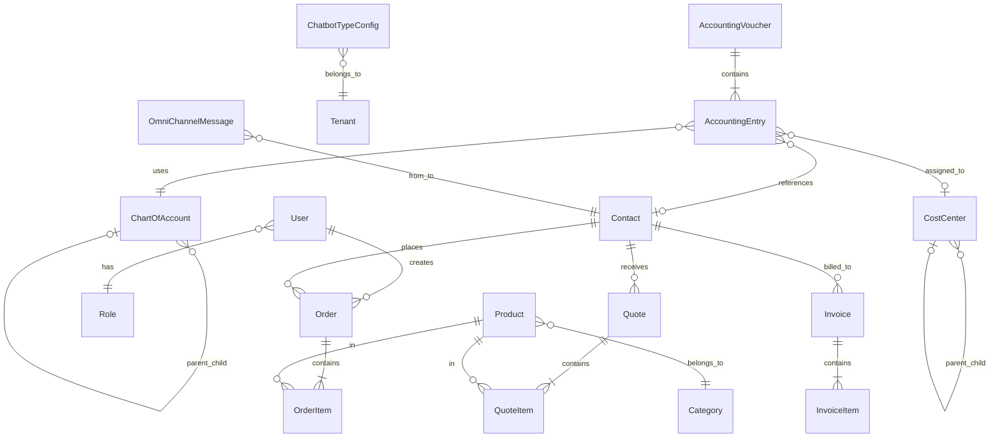

# ESPECIFICACIONES TÉCNICAS DE CLOUDFLY

## 📋 ÍNDICE

1. [Descripción General](#descripción-general)
2. [Arquitectura del Sistema](#arquitectura-del-sistema)
3. [Stack Tecnológico](#stack-tecnológico)
4. [Módulos Funcionales](#módulos-funcionales)
5. [Modelo de Datos](#modelo-de-datos)
6. [APIs y Endpoints](#apis-y-endpoints)
7. [Seguridad y Autenticación](#seguridad-y-autenticación)
8. [Integraciones](#integraciones)
9. [Infraestructura y Deployment](#infraestructura-y-deployment)

---

## 📝 DESCRIPCIÓN GENERAL

**CloudFly** es una plataforma ERP multi-tenant completa diseñada para la gestión empresarial integral. Combina funcionalidades de ventas, contabilidad, punto de venta (POS), gestión de inventario, CRM, y comunicación omnicanal con inteligencia artificial.

### Características Principales

- **Multi-tenant**: Soporte para múltiples empresas/clientes en una sola instancia
- **Gestión de Ventas**: Cotizaciones, pedidos, facturación
- **Contabilidad Completa**: Plan de cuentas, comprobantes, libros contables, balance
- **Punto de Venta (POS)**: Sistema POS completo con gestión de productos y categorías
- **CRM**: Gestión de contactos y clientes
- **Chatbot con IA**: Sistema de atención automatizada con WhatsApp
- **Comunicaciones**: Integración con múltiples canales (WhatsApp, Email, SMS)
- **Gestión documental**: Almacenamiento y gestión de documentos

---

## 🏗️ ARQUITECTURA DEL SISTEMA

### Arquitectura General

```
┌─────────────────────────────────────────────────────────────┐
│                       CLOUDFLY PLATFORM                      │
├─────────────────────────────────────────────────────────────┤
│                                                              │
│  ┌────────────┐    ┌────────────┐    ┌────────────┐        │
│  │  Frontend  │◄───│  Traefik   │───►│  Backend   │        │
│  │  Next.js   │    │  (Proxy)   │    │  Spring    │        │
│  └────────────┘    └────────────┘    └────────────┘        │
│         │                                     │              │
│         │                                     │              │
│  ┌──────▼───────────────────────────────────▼─────────┐    │
│  │              MySQL Database (Multi-tenant)          │    │
│  └─────────────────────────────────────────────────────┘    │
│                                                              │
│  ┌─────────────┐  ┌─────────────┐  ┌─────────────┐        │
│  │    Kafka    │  │   Redis     │  │  PostgreSQL │        │
│  │ (Messages)  │  │  (Cache)    │  │  (Chatbot)  │        │
│  └─────────────┘  └─────────────┘  └─────────────┘        │
│                                                              │
│  ┌─────────────┐  ┌─────────────┐  ┌─────────────┐        │
│  │     N8N     │  │  Evolution  │  │   Qdrant    │        │
│  │ (Workflows) │  │ (WhatsApp)  │  │  (Vectors)  │        │
│  └─────────────┘  └─────────────┘  └─────────────┘        │
│                                                              │
│  ┌─────────────┐  ┌─────────────┐                          │
│  │  Chatwoot   │  │   Socket    │                          │
│  │(Chat Center)│  │  Service    │                          │
│  └─────────────┘  └─────────────┘                          │
└─────────────────────────────────────────────────────────────┘
```

### Componentes Principales

1. **Frontend (Next.js 14)**
   - Framework React con App Router
   - Server-Side Rendering (SSR)
   - Material-UI para interfaz de usuario
   - Socket.IO client para comunicación en tiempo real

2. **Backend (Spring Boot 3.4)**
   - API RESTful
   - JPA/Hibernate para ORM
   - Spring Security + JWT
   - Kafka para mensajería asíncrona

3. **Base de Datos**
   - MySQL 8.0 (Principal - multi-tenant)
   - PostgreSQL (Chatbot y Chatwoot)
   - Redis (Cache y sesiones)
   - Qdrant (Vector database para IA)

4. **Servicios de Soporte**
   - Traefik (Reverse proxy + SSL)
   - Evolution API (WhatsApp)
   - N8N (Automatizaciones)
   - Chatwoot (Centro de atención)
   - Socket Service (Comunicación en tiempo real)

---

## 🛠️ STACK TECNOLÓGICO

### Backend
- **Lenguaje**: Java 17
- **Framework**: Spring Boot 3.4.0
- **ORM**: Hibernate/JPA
- **Base de datos**: MySQL 8.0
- **Seguridad**: Spring Security + JWT
- **Validación**: Jakarta Validation
- **Migraciones**: Flyway
- **Mensajería**: Apache Kafka
- **Build**: Maven
- **Documentación API**: Swagger/OpenAPI

### Frontend
- **Framework**: Next.js 14 (React 18+)
- **Lenguaje**: TypeScript
- **UI Library**: Material-UI (MUI)
- **Estado**: React Context + Hooks
- **Formularios**: React Hook Form
- **HTTP Client**: Axios
- **Socket**: Socket.IO Client
- **Charts**: ApexCharts/Recharts
- **Notificaciones**: React Hot Toast
- **Formato de fechas**: date-fns
- **Íconos**: Material Icons, Tabler Icons

### DevOps e Infraestructura
- **Containerización**: Docker + Docker Compose
- **Proxy Inverso**: Traefik v3.1
- **SSL**: Let's Encrypt (automático)
- **Monitoreo**: Portainer
- **Logs**: Kafka + Kafdrop

### Servicios Externos e Integraciones
- **WhatsApp**: Evolution API
- **Automatización**: N8N
- **IA/ML**: Qdrant (Vector DB)
- **Chat**: Chatwoot
- **Cache**: Redis
- **Base de datos vectorial**: Qdrant

---

## 📦 MÓDULOS FUNCIONALES

### 1. MÓDULO DE AUTENTICACIÓN Y USUARIOS

#### Funcionalidades
- Login con JWT
- Registro de usuarios
- Gestión de roles y permisos
- Multi-tenant (separación por empresa)
- Recuperación de contraseña

#### Roles del Sistema
- `SUPERADMIN`: Acceso total
- `ADMIN`: Administrador de tenant
- `CONTADOR`: Acceso contable
- `USER`: Usuario estándar
- `BIOMEDICAL`: Usuario biomédico

#### Endpoints
```
POST   /auth/login                    - Iniciar sesión
POST   /auth/register                 - Registro de usuario
POST   /auth/refresh-token            - Refrescar token
POST   /auth/forgot-password          - Recuperar contraseña
GET    /users                         - Listar usuarios
GET    /users/{id}                    - Obtener usuario
POST   /users                         - Crear usuario
PUT    /users/{id}                    - Actualizar usuario
DELETE /users/{id}                    - Eliminar usuario
```

---

### 2. MÓDULO DE VENTAS

#### 2.1 Cotizaciones (Quotes)

**Descripción**: Gestión completa del ciclo de cotizaciones a clientes.

**Funcionalidades**:
- Crear cotizaciones con múltiples ítems
- Convertir cotización a pedido
- Estados: DRAFT, SENT, ACCEPTED, REJECTED, EXPIRED
- Cálculos automáticos de subtotales, descuentos, IVA
- Generación de PDF
- Envío por email
- Seguimiento de versiones

**Modelo de Datos**:
```java
Quote {
    id: Long
    quoteNumber: String
    clientId: Long
    date: LocalDate
    validUntil: LocalDate
    status: QuoteStatus
    subtotal: BigDecimal
    discount: BigDecimal
    tax: BigDecimal
    total: BigDecimal
    notes: String
    tenantId: Integer
    items: List<QuoteItem>
}

QuoteItem {
    id: Long
    quoteId: Long
    productId: Long
    quantity: Integer
    unitPrice: BigDecimal
    discount: BigDecimal
    subtotal: BigDecimal
}
```

**Endpoints**:
```
GET    /quotes                        - Listar cotizaciones
GET    /quotes/{id}                   - Obtener cotización
POST   /quotes                        - Crear cotización
PUT    /quotes/{id}                   - Actualizar cotización
DELETE /quotes/{id}                   - Eliminar cotización
POST   /quotes/{id}/send              - Enviar cotización
POST   /quotes/{id}/accept            - Aceptar cotización
POST   /quotes/{id}/reject            - Rechazar cotización
POST   /quotes/{id}/convert-to-order  - Convertir a pedido
GET    /quotes/{id}/pdf               - Generar PDF
```

#### 2.2 Pedidos (Orders)

**Descripción**: Gestión de pedidos de clientes.

**Funcionalidades**:
- Crear pedidos (manual o desde cotización)
- Estados: PENDING, CONFIRMED, IN_PROGRESS, COMPLETED, CANCELLED
- Gestión de stock automática
- Facturación desde pedido
- Tracking de estado

**Modelo de Datos**:
```java
Order {
    id: Long
    orderNumber: String
    customerId: Long
    orderDate: LocalDateTime
    status: OrderStatus
    subtotal: BigDecimal
    discount: BigDecimal
    tax: BigDecimal
    total: BigDecimal
    tenantId: Integer
    items: List<OrderItem>
}

OrderItem {
    id: Long
    orderId: Long
    productId: Long
    quantity: Integer
    unitPrice: BigDecimal
    subtotal: BigDecimal
}
```

**Endpoints**:
```
GET    /orders                        - Listar pedidos
GET    /orders/{id}                   - Obtener pedido
POST   /orders                        - Crear pedido
PUT    /orders/{id}                   - Actualizar pedido
DELETE /orders/{id}                   - Cancelar pedido
POST   /orders/{id}/confirm           - Confirmar pedido
POST   /orders/{id}/complete          - Completar pedido
POST   /orders/{id}/invoice           - Generar factura
```

#### 2.3 Facturas (Invoices)

**Descripción**: Facturación electrónica y gestión de facturas.

**Funcionalidades**:
- Crear facturas (manual o desde pedido)
- Numeración automática
- Estados: DRAFT, ISSUED, PAID, CANCELLED
- Cálculo de impuestos
- Generación de PDF
- Envío por email

**Endpoints**:
```
GET    /invoices                      - Listar facturas
GET    /invoices/{id}                 - Obtener factura
POST   /invoices                      - Crear factura
PUT    /invoices/{id}                 - Actualizar factura
DELETE /invoices/{id}                 - Anular factura
POST   /invoices/{id}/send            - Enviar factura
POST   /invoices/{id}/mark-paid       - Marcar como pagada
GET    /invoices/{id}/pdf             - Generar PDF
```

---

### 3. MÓDULO DE CONTABILIDAD

#### 3.1 Plan de Cuentas (Chart of Accounts)

**Descripción**: Catálogo de cuentas contables con estructura jerárquica.

**Funcionalidades**:
- Estructura jerárquica (niveles)
- Códigos de cuenta personalizables
- Tipos de cuenta: ACTIVO, PASIVO, PATRIMONIO, INGRESO, GASTO
- Naturaleza: DÉBITO, CRÉDITO
- Cuentas de movimiento y totalizadoras
- Validación de unicidad de códigos

**Modelo de Datos**:
```java
ChartOfAccount {
    id: Long
    code: String (único)
    name: String
    accountType: AccountType (ACTIVO, PASIVO, etc.)
    nature: Nature (DEBIT, CREDIT)
    level: Integer (1-5)
    parentCode: String
    isActive: Boolean
    requiresThirdParty: Boolean
    requiresCostCenter: Boolean
    isSystem: Boolean
}
```

**Endpoints**:
```
GET    /chart-of-accounts             - Listar cuentas
GET    /chart-of-accounts/{id}        - Obtener cuenta
POST   /chart-of-accounts             - Crear cuenta
PUT    /chart-of-accounts/{id}        - Actualizar cuenta
DELETE /chart-of-accounts/{id}        - Eliminar cuenta
GET    /chart-of-accounts/hierarchy   - Obtener árbol jerárquico
GET    /chart-of-accounts/type/{type} - Filtrar por tipo
```

#### 3.2 Centros de Costo (Cost Centers)

**Descripción**: Gestión de centros de costo con jerarquía.

**Funcionalidades**:
- Estructura jerárquica (padre-hijo)
- Códigos únicos
- Estado activo/inactivo
- Asignación a movimientos contables

**Modelo de Datos**:
```java
CostCenter {
    id: Long
    code: String (único)
    name: String
    description: String
    parentId: Long
    isActive: Boolean
}
```

**Endpoints**:
```
GET    /cost-centers                  - Listar centros
GET    /cost-centers/{id}             - Obtener centro
POST   /cost-centers                  - Crear centro
PUT    /cost-centers/{id}             - Actualizar centro
DELETE /cost-centers/{id}             - Desactivar centro
GET    /cost-centers/root             - Centros raíz
GET    /cost-centers/children/{id}    - Centros hijos
```

#### 3.3 Comprobantes Contables (Accounting Vouchers)

**Descripción**: Gestión de comprobantes contables (asientos contables).

**Funcionalidades**:
- Tipos: INGRESO, EGRESO, NOTA_CONTABLE, APERTURA, CIERRE
- Estados: DRAFT (borrador), POSTED (contabilizado), VOID (anulado)
- Numeración automática por tipo
- Validación débitos = créditos
- Múltiples líneas de movimiento
- Integración con terceros y centros de costo
- Solo borradores son editables/eliminables

**Modelo de Datos**:
```java
AccountingVoucher {
    id: Long
    voucherType: VoucherType
    voucherNumber: String (auto-generado)
    date: LocalDate
    description: String
    reference: String
    status: VoucherStatus
    totalDebit: BigDecimal
    totalCredit: BigDecimal
    fiscalYear: Integer
    fiscalPeriod: Integer
    tenantId: Integer
    entries: List<AccountingEntry>
}

AccountingEntry {
    id: Long
    voucherId: Long
    lineNumber: Integer
    accountCode: String (FK a ChartOfAccount)
    thirdPartyId: Long (FK a Contact)
    costCenterId: Long (FK a CostCenter)
    description: String
    debitAmount: BigDecimal
    creditAmount: BigDecimal
    baseValue: BigDecimal
    taxValue: BigDecimal
}
```

**Endpoints**:
```
GET    /accounting/vouchers           - Listar comprobantes
GET    /accounting/vouchers/{id}      - Obtener comprobante
POST   /accounting/vouchers           - Crear comprobante
PUT    /accounting/vouchers/{id}      - Actualizar borrador
DELETE /accounting/vouchers/{id}      - Eliminar borrador
POST   /accounting/vouchers/{id}/post - Contabilizar
POST   /accounting/vouchers/{id}/void - Anular
```

#### 3.4 Reportes Contables

**Descripción**: Generación de reportes financieros.

**Funcionalidades**:

- **Libro Diario**: Todos los movimientos cronológicos
- **Libro Mayor**: Movimientos por cuenta
- **Balance de Prueba**: Saldos de todas las cuentas
- **Estado de Resultados**: Ingresos vs gastos
- **Balance General**: Activos, pasivos y patrimonio

**Endpoints**:
```
GET    /accounting/reports/libro-diario   - Libro diario
       ?tenantId&fromDate&toDate&accountCode?

GET    /accounting/reports/libro-mayor    - Libro mayor
       ?tenantId&accountCode&fromDate&toDate

GET    /accounting/reports/balance-prueba - Balance de prueba
       ?tenantId&asOfDate

GET    /accounting/reports/estado-resultados - Estado de resultados
       ?tenantId&fromDate&toDate

GET    /accounting/reports/balance-general - Balance general
       ?tenantId&asOfDate
```

---

### 4. MÓDULO DE PUNTO DE VENTA (POS)

#### 4.1 Productos

**Descripción**: Catálogo de productos y servicios.

**Funcionalidades**:
- Gestión de productos con múltiples variantes
- Categorización
- Precios de venta
- Gestión de stock
- Códigos de barras
- Imágenes
- Impuestos

**Modelo de Datos**:
```java
Product {
    id: Long
    sku: String (único)
    name: String
    description: String
    categoryId: Long
    price: BigDecimal
    cost: BigDecimal
    stock: Integer
    minStock: Integer
    barcode: String
    imageUrl: String
    taxRate: BigDecimal
    isActive: Boolean
    tenantId: Integer
}
```

**Endpoints**:
```
GET    /products                      - Listar productos
GET    /products/{id}                 - Obtener producto
POST   /products                      - Crear producto
PUT    /products/{id}                 - Actualizar producto
DELETE /products/{id}                 - Eliminar producto
GET    /products/category/{id}        - Por categoría
GET    /products/low-stock            - Stock bajo
```

#### 4.2 Categorías

**Descripción**: Organización de productos por categorías.

**Modelo de Datos**:
```java
Category {
    id: Long
    name: String
    description: String
    parentId: Long
    isActive: Boolean
    tenantId: Integer
}
```

**Endpoints**:
```
GET    /categories                    - Listar categorías
GET    /categories/{id}               - Obtener categoría
POST   /categories                    - Crear categoría
PUT    /categories/{id}               - Actualizar categoría
DELETE /categories/{id}               - Eliminar categoría
```

---

### 5. MÓDULO DE CRM (CONTACTOS)

#### Descripción
Gestión de contactos: clientes, proveedores, empleados.

#### Funcionalidades
- Tipos de contacto: CUSTOMER, SUPPLIER, EMPLOYEE, OTHER
- Información fiscal (RUC, DNI)
- Pipeline Kanban (LEAD, POTENTIAL, CLIENT)
- Integración contable (cuentas por cobrar/pagar)
- Avatar/foto de perfil
- Historial de interacciones

**Modelo de Datos**:
```java
Contact {
    id: Long
    name: String
    email: String
    phone: String
    address: String
    taxId: String (DNI, RUC)
    type: ContactType
    stage: String (LEAD, POTENTIAL, CLIENT)
    avatarUrl: String
    tenantId: Integer
    
    // Campos contables
    accountsReceivableAccount: String
    accountsPayableAccount: String
    advanceAccount: String
}
```

**Endpoints**:
```
GET    /contacts                      - Listar contactos
GET    /contacts/{id}                 - Obtener contacto
POST   /contacts                      - Crear contacto
PUT    /contacts/{id}                 - Actualizar contacto
DELETE /contacts/{id}                 - Eliminar contacto
GET    /contacts/type/{type}          - Filtrar por tipo
GET    /contacts/stage/{stage}        - Filtrar por etapa
```

---

### 6. MÓDULO DE CHATBOT E IA

#### 6.1 Configuración de Chatbot

**Descripción**: Sistema de chatbot multi-tenant con IA integrada.

**Funcionalidades**:
- Tipos de chatbot: SALES (ventas), SCHEDULING (agendamiento), SUPPORT (soporte), CUSTOM
- Configuración por tenant
- Integración con WhatsApp vía Evolution API
- RAG (Retrieval Augmented Generation) con Qdrant
- Flujos de N8N para automatización
- Webhooks personalizables

**Modelo de Datos**:
```java
ChatbotTypeConfig {
    id: Long
    tenantId: Integer
    chatbotType: ChatbotType
    instanceName: String
    isActive: Boolean
    qdrantCollectionName: String
    n8nWebhookUrl: String
    config: JSON
}
```

**Endpoints**:
```
GET    /chatbot-types                 - Listar configuraciones
GET    /chatbot-types/{id}            - Obtener configuración
POST   /chatbot-types                 - Crear configuración
PUT    /chatbot-types/{id}            - Actualizar configuración
DELETE /chatbot-types/{id}            - Eliminar configuración
POST   /chatbot-types/{id}/activate   - Activar chatbot
POST   /chatbot-types/{id}/deactivate - Desactivar chatbot
```

#### 6.2 Gestión de Instancias de WhatsApp

**Funcionalidades**:
- Crear instancia de WhatsApp
- Generar QR para conexión
- Desconectar/reconectar
- Restart de instancia
- Estado de conexión

**Endpoints**:
```
GET    /chatbot                       - Listar instancias
GET    /chatbot/{instanceName}        - Obtener instancia
POST   /chatbot                       - Crear instancia
DELETE /chatbot/{instanceName}        - Eliminar instancia
POST   /chatbot/{instanceName}/logout - Desconectar
POST   /chatbot/{instanceName}/restart- Reiniciar
GET    /chatbot/{instanceName}/qr     - Obtener QR
```

#### 6.3 Mensajería Omnicanal

**Descripción**: Sistema de mensajes multi-canal.

**Funcionalidades**:
- Canales: WhatsApp, Email, SMS, Facebook, Instagram, Telegram
- Estados: PENDING, SENT, DELIVERED, READ, FAILED
- Direcciones: INBOUND, OUTBOUND
- Tipos de mensaje: TEXT, IMAGE, AUDIO, VIDEO, DOCUMENT, etc.
- Almacenamiento de media

**Modelo de Datos**:
```java
OmniChannelMessage {
    id: Long
    platform: Platform (WHATSAPP, EMAIL, etc.)
    provider: Provider (EVOLUTION, META, TWILIO, etc.)
    direction: Direction (INBOUND, OUTBOUND)
    messageType: MessageType (TEXT, IMAGE, etc.)
    content: String
    mediaUrl: String
    fromNumber: String
    toNumber: String
    status: MessageStatus
    contactId: Long
    tenantId: Integer
    metadata: JSON
}
```

**Endpoints**:
```
GET    /chat/messages                 - Listar mensajes
POST   /chat/messages/send            - Enviar mensaje
GET    /chat/conversations/{contactId}- Conversación
POST   /chat/upload-media             - Subir archivo
```

---

### 7. MÓDULO DE DOCUMENTOS

**Descripción**: Gestión documental simple.

**Funcionalidades**:
- Subida de archivos
- Categorización
- Metadatos
- Búsqueda
- Descarga

**Endpoints**:
```
GET    /documents                     - Listar documentos
GET    /documents/{id}                - Obtener documento
POST   /documents/upload              - Subir documento
DELETE /documents/{id}                - Eliminar documento
GET    /documents/{id}/download       - Descargar
```

---

### 8. MÓDULO DE NOTIFICACIONES

**Descripción**: Sistema de notificaciones en tiempo real.

**Funcionalidades**:
- Notificaciones push
- Email notifications
- WebSocket para tiempo real
- Estados: PENDING, SENT, READ
- Tipos: INFO, WARNING, ERROR, SUCCESS

**Endpoints**:
```
GET    /notifications                 - Listar notificaciones
POST   /notifications                 - Crear notificación
PUT    /notifications/{id}/read       - Marcar como leída
DELETE /notifications/{id}            - Eliminar notificación
```

---

### 9. MÓDULO DE DASHBOARD

**Descripción**: Métricas y KPIs del sistema.

**Funcionalidades**:
- Ventas del día/mes/año
- Productos más vendidos
- Clientes activos
- Estado de stock
- Indicadores contables
- Gráficos y estadísticas

**Endpoints**:
```
GET    /dashboard/sales-summary       - Resumen de ventas
GET    /dashboard/top-products        - Productos top
GET    /dashboard/recent-orders       - Pedidos recientes
GET    /dashboard/accounting-summary  - Resumen contable
GET    /dashboard/kpis                - KPIs generales
```

---

## 🔐 SEGURIDAD Y AUTENTICACIÓN

### Autenticación JWT

**Flujo**:
1. Usuario envía credenciales a `/auth/login`
2. Backend valida y genera JWT
3. Frontend almacena token (localStorage/cookie)
4. Todas las peticiones incluyen: `Authorization: Bearer <token>`
5. Backend valida token en cada request

**Estructura del Token**:
```json
{
  "iss": "EGBM",
  "sub": "username",
  "authorities": "DELETE,READ,ROLE_ADMIN,UPDATE,WRITE",
  "iat": 1234567890,
  "exp": 1234569690,
  "jti": "uuid",
  "nbf": 1234567890
}
```

### Autorización Basada en Roles

**Matriz de Permisos**:

| Endpoint | SUPERADMIN | ADMIN | CONTADOR | USER |
|----------|------------|-------|----------|------|
| GET /products | ✅ | ✅ | ✅ | ✅ |
| POST /products | ✅ | ✅ | ❌ | ❌ |
| GET /accounting/* | ✅ | ✅ | ✅ | ❌ |
| POST /accounting/vouchers | ✅ | ✅ | ✅ | ❌ |
| DELETE /users | ✅ | ✅ | ❌ | ❌ |
| POST /chatbot | ✅ | ✅ | ❌ | ❌ |

### Multi-tenancy

**Estrategia**: Discriminador por `tenantId` en nivel de aplicación.

**Implementación**:
- Todas las tablas principales tienen campo `tenant_id`
- Filtrado automático en queries por tenant
- Usuario solo ve/modifica datos de su tenant
- SUPERADMIN puede ver todos los tenants

---

## 🔌 INTEGRACIONES

### 1. Evolution API (WhatsApp)

**Propósito**: Gestión de instancias de WhatsApp Business API.

**Funcionalidades**:
- Crear/eliminar instancias
- Generar QR de conexión
- Enviar/recibir mensajes
- Webhooks de eventos

**Configuración**:
```env
EVOLUTION_API_URL=https://eapi.cloudfly.com.co
EVOLUTION_API_KEY=seu_api_key
```

### 2. N8N (Automatización)

**Propósito**: Workflows de automatización.

**Casos de uso**:
- Procesamiento de mensajes de chatbot
- Integración con IA/RAG
- Envío de emails automáticos
- Sincronización de datos

**Configuración**:
```env
N8N_HOST=autobot.cloudfly.com.co
N8N_PROTOCOL=https
WEBHOOK_URL=https://autobot.cloudfly.com.co/
```

### 3. Qdrant (Vector Database)

**Propósito**: Almacenamiento de embeddings para RAG.

**Funcionalidades**:
- Búsqueda semántica
- Almacenamiento de vectores
- Recuperación de información contextual

**Configuración**:
```env
QDRANT_HOST=qdrant
QDRANT_PORT=6333
QDRANT_API_KEY=Elian2020#
```

### 4. Chatwoot (Centro de Atención)

**Propósito**: Plataforma de atención al cliente.

**Funcionalidades**:
- Inbox multicanal
- Asignación de agentes
- Etiquetas y notas
- Reportes de atención

**Configuración**:
```env
CHATWOOT_URL=https://chatcenter.cloudfly.com.co
SECRET_KEY_BASE=<secret>
```

### 5. Kafka (Mensajería)

**Propósito**: Sistema de mensajería asíncrona.

**Topics**:
- `notifications`: Notificaciones generales
- `chat-messages`: Mensajes de chat
- `orders`: Eventos de pedidos
- `accounting`: Eventos contables

---

## 🚀 INFRAESTRUCTURA Y DEPLOYMENT

### Arquitectura de Contenedores

**Servicios Docker**:

1. **MySQL** (db)
   - Puerto: 3306
   - Database: cloud_master
   - Volumen: persistent_master

2. **Backend API** (backend-api)
   - Spring Boot en puerto 8080
   - Conecta a MySQL, Kafka
   - Red: app-net, kafka-net

3. **Frontend** (frontend-react)
   - Next.js en puerto 3000
   - Red: app-net

4. **Kafka + Zookeeper**
   - Kafka: Puerto 9092 (interno), 9093 (externo)
   - Zookeeper: Puerto 2181
   - Red: kafka-net

5. **Redis** (redis)
   - Puerto: 6379
   - Cache y sesiones

6. **PostgreSQL** (postgresql)
   - Puerto: 5432
   - Usado por chatbot y Chatwoot

7. **Qdrant** (qdrant)
   - Puerto: 8075 (API), 8076 (gRPC)
   - Vector database

8. **N8N** (n8n)
   - Puerto: 5678
   - Workflows

9. **Evolution API** (evolution-api)
   - Puerto: 8082
   - WhatsApp API

10. **Chatwoot** (chatwoot + chatwoot-worker)
    - Puerto: 3000
    - Centro de atención

11. **Traefik** (traefik)
    - Puertos: 80 (HTTP), 443 (HTTPS)
    - Reverse proxy con SSL automático

12. **Utilidades**:
    - phpMyAdmin: Puerto 8000
    - Kafdrop: Puerto 9100
    - Redis Insight: Puerto 8001
    - Portainer: Puerto 9000

### Dominios y Routing

**Traefik Routing**:

| Servicio | Dominio | Puerto Interno |
|----------|---------|----------------|
| Frontend | dashboard.cloudfly.com.co | 3000 |
| Backend | api.cloudfly.com.co | 8080 |
| N8N | autobot.cloudfly.com.co | 5678 |
| Evolution API | eapi.cloudfly.com.co | 8080 |
| Chatwoot | chatcenter.cloudfly.com.co | 3000 |
| Chat Socket | chat.cloudfly.com.co | 3001 |

### SSL/TLS

**Let's Encrypt**:
- Renovación automática
- Challenge HTTP en puerto 80
- Certificados almacenados en `/sellerbot/traefik/acme.json`

### Redes Docker

```yaml
networks:
  app-net:      # Red principal de aplicación
  kafka-net:    # Red de Kafka
  traefik:      # Red de Traefik
```

### Volúmenes Persistentes

```yaml
volumes:
  persistent_master:      # MySQL data
  postgres_data:          # PostgreSQL data
  qdrant_data:           # Qdrant vectors
  n8n_data:              # N8N workflows
  evolution_instances:    # Evolution WhatsApp instances
  chatwoot_storage:      # Chatwoot uploads
  portainer_data:        # Portainer config
```

### Deployment

**Iniciar todos los servicios**:
```bash
docker-compose up -d
```

**Ver logs**:
```bash
docker-compose logs -f backend-api
docker-compose logs -f frontend-react
```

**Reiniciar servicio**:
```bash
docker-compose restart backend-api
```

**Actualizar servicios**:
```bash
docker-compose pull
docker-compose up -d
```

---

## 📊 MODELO DE DATOS GENERAL

### Entidades Principales



### Schema Principal (MySQL)

**Tablas Principales**:
```
users
roles
customers (deprecated, ver contacts)
contacts
products
categories
quotes
quote_items
orders
order_items
invoices
invoice_items
chart_of_accounts
cost_centers
accounting_vouchers
accounting_entries
fiscal_periods
chatbot_instances
chatbot_type_configs
omni_channel_messages
documents
notifications
subscriptions
plans
```

---

## 🎯 CASOS DE USO PRINCIPALES

### Caso 1: Flujo de Venta Completo

```
1. Cliente solicita cotización
   → POST /quotes
   
2. Vendedor crea cotización con ítems
   → Sistema calcula totales
   
3. Envía cotización a cliente
   → POST /quotes/{id}/send
   
4. Cliente acepta cotización
   → POST /quotes/{id}/accept
   
5. Sistema convierte a pedido
   → POST /quotes/{id}/convert-to-order
   
6. Pedido es confirmado
   → POST /orders/{id}/confirm
   → Sistema reduce stock
   
7. Pedido es completado
   → POST /orders/{id}/complete
   
8. Se genera factura
   → POST /orders/{id}/invoice
   
9. Factura es enviada
   → POST /invoices/{id}/send
   
10. Factura es pagada
    → POST /invoices/{id}/mark-paid
    → Sistema genera asiento contable automático
```

### Caso 2: Registro Contable Manual

```
1. Contador crea comprobante
   → POST /accounting/vouchers
   {
     "type": "INGRESO",
     "date": "2025-12-16",
     "description": "Venta contado",
     "entries": [
       {
         "accountCode": "1105",  // Caja
         "debit": 119000,
         "credit": 0
       },
       {
         "accountCode": "4135",  // Ingresos
         "debit": 0,
         "credit": 100000
       },
       {
         "accountCode": "2408",  // IVA
         "debit": 0,
         "credit": 19000
       }
     ]
   }
   
2. Sistema valida balance (débitos = créditos)
   → Genera número consecutivo: ING-0001
   → Guarda como DRAFT
   
3. Contador revisa y contabiliza
   → POST /accounting/vouchers/1/post
   → Estado cambia a POSTED
   → No es editable
```

### Caso 3: Chatbot de Ventas

```
1. Cliente envía mensaje por WhatsApp
   → Evolution API recibe mensaje
   → Webhook a N8N
   
2. N8N procesa mensaje
   → Consulta a Qdrant (RAG)
   → Genera respuesta con IA
   → Envía a backend: POST /chat/messages/send
   
3. Backend guarda en omni_channel_messages
   → Publica evento en Kafka
   → Socket service notifica en tiempo real
   
4. Frontend muestra conversación actualizada
   → Usuario ve mensaje en inbox
```

---

## 📝 NOTAS IMPORTANTES PARA IA

### Convenciones de Código

**Backend**:
- Controladores usan `@RestController`
- DTOs para request/response
- Servicios con `@Transactional`
- Validación con `@Valid`
- Lombok para reducir boilerplate

**Frontend**:
- Componentes funcionales con hooks
- TypeScript strict mode
- Material-UI para UI
- Axios interceptors para auth
- React Hook Form para formularios

### Patrones de Diseño

1. **Repository Pattern**: Acceso a datos
2. **DTO Pattern**: Transferencia de datos
3. **Service Layer**: Lógica de negocio
4. **Multi-tenancy**: Discriminador en aplicación
5. **Event-Driven**: Kafka para eventos

### Consideraciones de Performance

- Paginación en listados largos
- Caché con Redis para datos frecuentes
- Índices en campos de búsqueda
- Lazy loading de relaciones
- Optimistic UI updates

### Limitaciones Conocidas

- TTS (Text-to-Speech) comentado en docker-compose
- Algunas integraciones requieren configuración manual
- Certificados SSL requieren dominios válidos

---

## 📚 RECURSOS ADICIONALES

### Documentación Interna

- `docs/PLAN_COMPROBANTES_CONTABLES.md`
- `docs/COMPROBANTES_TERMINADO_100.md`
- `docs/SISTEMA_POS_COMPLETO.md`
- `docs/CHAT_SYSTEM_COMPLETE.md`
- `docs/GUIA_USO_CENTROS_COSTO.md`

### Scripts de Utilidad

- `validate_complete_system.ps1`: Validación completa
- `test_complete_flow.ps1`: Prueba de flujo completo
- `run_demo.ps1`: Demo del sistema

---

**Versión del Documento**: 1.0  
**Última Actualización**: 2025-12-16  
**Sistema**: CloudFly ERP Platform  
**Autor**: Equipo de Desarrollo CloudFly
