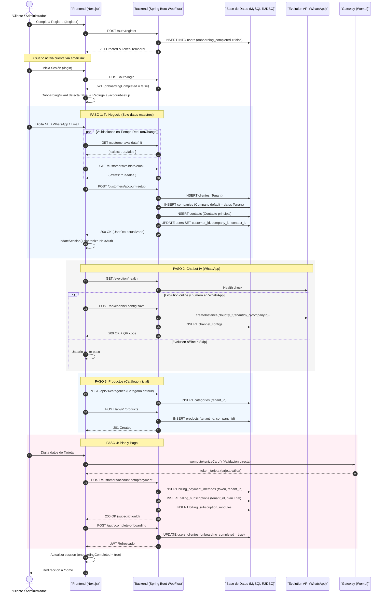

# Specification-Driven Development (SDD)
## Multi-Tenant Onboarding & Account Setup Flow

Contrato formal de arquitectura para el wizard de onboarding de CloudFly. Cada paso tiene una **responsabilidad única** y no debe ejecutar lógica de otro paso.

---

## 1. Architectural Sequence Diagram



---

## 2. Responsabilidad por Paso (Backend)

### 2.1. Paso 1: `POST /customers/account-setup`
**Responsabilidad única:** Crear datos maestros del negocio.

| Acción | Tabla | Campos clave |
|:---|:---|:---|
| INSERT/UPDATE | `clientes` | name, nit, email, phone, address, business_type |
| INSERT | `companies` | tenant_id, name, nit, phone, email (copia de Tenant) |
| INSERT | `contacts` | tenant_id, company_id, name, email, phone |
| UPDATE | `users` | customer_id, company_id, contact_id, updated_at |

**NO hace:** WhatsApp, categorías, productos, suscripciones.

### 2.2. Paso 2: WhatsApp Setup
**Responsabilidad única:** Configurar instancia de Evolution API.

| Acción | Tabla | Campos clave |
|:---|:---|:---|
| INSERT | `channel_configs` | tenant_id, company_id, instance_name, channel_type |

Se invoca desde el Frontend. Si el usuario omite, no se crea nada.

### 2.3. Paso 3: Catálogo Inicial
**Responsabilidad única:** Crear categoría default y primer producto.

| Acción | Tabla | Campos clave |
|:---|:---|:---|
| INSERT | `categories` | tenant_id, name ("General") |
| INSERT | `products` | tenant_id, company_id, category_id, name, price |

### 2.4. Paso 4: `POST /customers/account-setup/payment`
**Responsabilidad única:** Guardar método de pago, crear suscripción Trial, y finalizar onboarding.

| Acción | Tabla | Campos clave |
|:---|:---|:---|
| INSERT | `billing_payment_methods` | tenant_id, token, brand, last4 |
| INSERT | `billing_subscriptions` | tenant_id, plan_id, status=TRIAL, billing_cycle |
| INSERT | `billing_subscription_modules` | subscription_id, module_id (copiados del Plan) |
| UPDATE | `users`, `clientes` | onboarding_completed = true |

**Flujo:** Wompi valida tarjeta → Backend guarda método de pago → Backend busca el **Plan Gratuito y Activo** (`is_free = true` e `is_active = true`) y crea la suscripción de tipo **TRIAL** → Backend marca onboarding como completado → Devuelve JWT refrescado.

El `user_id` del ADMIN queda asociado en la entidad `Customer` (clientes) para recibir las notificaciones de facturación.


### 2.5. Finalización: `POST /auth/complete-onboarding`
1. Actualiza `onboarding_completed = true` en `users` y `clientes`.
2. Genera nuevo JWT con claims actualizados.
3. Frontend redirige a `/home`.

---

## 3. API Payload Contracts

### 3.1. Validar NIT (Paso 1)
* **GET /customers/validate/nit?nit=900453768**
* **Response:** `{ "exists": true, "message": "El NIT ya está registrado" }`

### 3.2. Guardar Negocio (Paso 1)
* **POST /customers/account-setup**
* **Request:**
```json
{
  "userId": 105,
  "form": {
    "name": "Pulguero virtual",
    "nit": "16287318",
    "email": "egbmaster2007@gmail.com",
    "phone": "573245640657",
    "businessType": "software_saas"
  }
}
```

### 3.3. Configurar WhatsApp (Paso 2)
* **POST /api/channel-config/save**
```json
{
  "tenantId": 76,
  "companyId": 76,
  "channelType": "WHATSAPP",
  "instanceName": "cloudfly_t76_c76",
  "isActive": true
}
```

### 3.4. Crear Producto (Paso 3)
* **POST /api/v1/products**
```json
{
  "name": "Consultoría IA Premium",
  "description": "Gestión proactiva de redes y leads.",
  "price": 150000,
  "stock": 999,
  "active": true
}
```

### 3.5. Pago y Suscripción (Paso 4)
* **POST /customers/account-setup/payment**
```json
{
  "tenantId": 76,
  "userId": 105,
  "wompiToken": "tok_test_abc123",
  "brand": "VISA",
  "last4": "4242",
  "expMonth": 12,
  "expYear": 2028,
  "billingCycle": "MONTHLY"
}
```

### 3.6. Finalizar Onboarding (Paso 4 - Final)
* **POST /auth/complete-onboarding**
* **Request:** `{ "userId": 105 }`
* **Response:**
```json
{
  "status": true,
  "message": "Onboarding completed successfully",
  "jwt": "eyJhbGciOiJIUzI1NiIsIn...",
  "user": { "id": 105, "onboardingCompleted": true }
}
```

---

## 4. Frontend UX & Sanitization Rules

| Campo | Regla | Yup Validation |
|:---|:---|:---|
| **Paso 1: NIT** | `e.target.value.replace(/[^0-9]/g, '')` | `.matches(/^[0-9]+$/).test('checkNit')` |
| **Paso 1: WhatsApp** | `replace(/[^0-9]/g, '')` | `.min(10).test('checkWhatsApp')` |
| **Paso 3: Precio** | `replace(/[^0-9]/g, '')` | `.required().min(1)` |
| **Paso 3: Nombre** | Trim espacios | `.required()` |

### 4.1. Bypass Contextual (Paso 1)
```typescript
.test('checkNit', 'Este NIT ya está registrado', async (value, testContext) => {
    const initialData = testContext.options.context?.initialData;
    if (initialData && initialData.nit === value) return true // Bypass
    const res = await axios.get(`/customers/validate/nit?nit=${value}`)
    return !res.data.exists
})
```

---

## 5. Hidratación y Recuperación de Progreso

Si el usuario abandona el wizard a la mitad y regresa con `onboardingCompleted: false`:

1. **Carga desde DB:**
   * Paso 1: `GET /customers/{customerId}` → pre-llena formulario con `initialData`
   * Paso 2: `GET /api/channel-config/config` → verifica si existe instancia WA
   * Paso 3: `GET /api/v1/products` → verifica si hay productos creados

2. **Smart Skip:** Si `customerId` existe → salta al Paso 2. Si ya hay productos → salta al Paso 4.

3. **Fallback Vacío:** Sin `customerId`, todos los formularios arrancan con strings vacíos `''` via `defaultValues`.

---

## 6. E2E Test Protocol (e2e_admin_marketing_onboarding.js)

1. Registro y activación vía link IMAP.
2. Redirección forzada a `/account-setup`.
3. Validaciones negativas (caracteres en NIT, duplicados).
4. Recorrido del wizard (4 pasos en orden).
5. Verificación final: Logout → Re-Login → Aterrizaje en `/home`.
