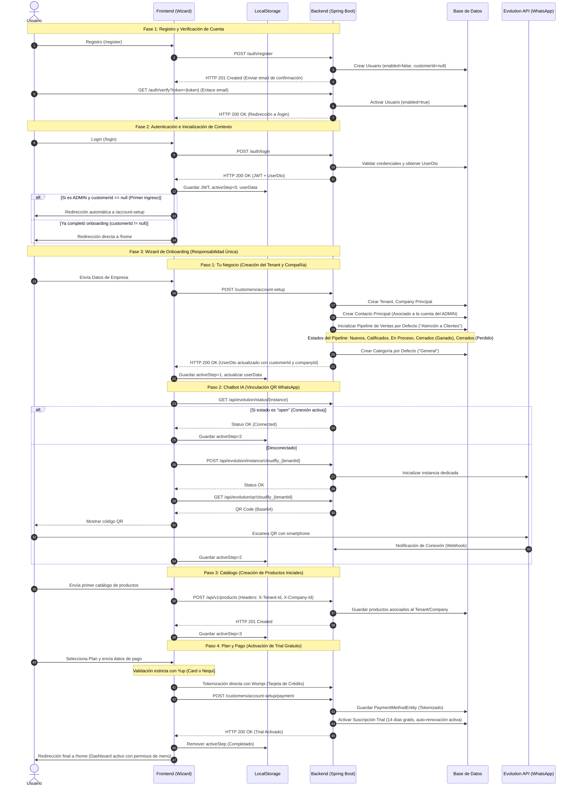

# System Design Document (SDD): Multi-Tenant Onboarding & Account Setup Flow

## 1. Visión General del Sistema
El flujo de Registro, Verificación y Onboarding (Wizard Account Setup) de CloudFly es la puerta de entrada de nuevos clientes corporativos (Tenants). Ha sido diseñado bajo un estricto principio de **responsabilidad única por paso** y aislamiento de datos multi-tenant para garantizar que cada fase inicialice únicamente la infraestructura y los datos que le corresponden, sin solapamientos.

## 2. Diagrama Maestro de Secuencia (Onboarding & Setup)

El siguiente diagrama define el contrato formal de comunicación entre el usuario, la interfaz de Next.js, el backend reactivo de Spring Boot, la base de datos y los servicios periféricos (Evolution API, Kafka).

---

## 3. Desglose Técnico por Paso (Wizard Contract)

### Paso 1: Tu Negocio (Empresa y Pipeline de Ventas)
* **Objetivo:** Registrar la entidad legal (Tenant) y su sede principal (Company).
* **Operaciones en Base de Datos:**
  - Registra el emisor en `tenants`.
  - Registra la primera sucursal en `companies`.
  - Crea el contacto inicial en `contacts`.
  - **Pipeline por Defecto:** Llama a `PipelineService.createDefaultPipeline` para generar el embudo de ventas prediseñado:
    * **Nuevos** (Posición 0, estado inicial).
    * **Calificados** (Posición 1).
    * **En Proceso** (Posición 2).
    * **Cerrados (Ganado)** (Posición 3, estado final exitoso).
    * **Cerrados (Perdido)** (Posición 4, estado final fallido).
  - **Categoría por Defecto:** Crea la categoría base `"General"` para catalogar productos.

### Paso 2: Vinculación del Chatbot
* **Objetivo:** Provisionar el canal de comunicación en tiempo real.
* **Operaciones:**
  - Llama a `EvolutionService` para instanciar un contenedor/servicio dedicado con formato de nombre `cloudfly_{tenantId}`.
  - Presenta el QR Code temporal al cliente.
  - Registra el canal en la base de datos una vez que se detecta el estado `open` a través de webhooks.

### Paso 3: Productos Iniciales
* **Objetivo:** Forzar al cliente a poblar su catálogo para que el chatbot de IA sea funcional inmediatamente después de iniciar sesión.
* **Aislamiento Multi-Tenant:**
  - Cada inserción viaja con las cabeceras `X-Tenant-Id` y `X-Company-Id`.
  - El backend valida que el usuario autenticado pertenezca a dicho `tenantId` antes de escribir en la tabla `products`.

### Paso 4: Activación de Suscripción (Billing)
* **Objetivo:** Registrar el método de cobro recurrente automático (Wompi) y activar los permisos completos de los módulos contratados.
* **Validación Yup:**
  - Formulario protegido del lado del cliente para verificar estructuras de tarjeta de crédito (longitud de 13 a 19 dígitos numéricos en `cardNumber`, expiración `MM/YY` y `CVC` de 3 a 4 dígitos) o teléfonos Nequi válidos de 10 dígitos.
* **Activación:**
  - Inserta el registro en `subscriptions` con estado `TRIAL`.
  - Copia los módulos activos del plan a `subscription_modules` para desbloquear el Sidebar del Dashboard de forma dinámica.

---

## 4. Resiliencia de Sesión (Control F5)
Para evitar que una recarga accidental de página (`F5`) reinicie el progreso del usuario:
1. El frontend almacena `account_setup_step` en el `localStorage` en cada transición exitosa.
2. Al cargar el componente `/account-setup`, se valida el estado local:
   - Si `userData.customerId` es nulo, se restaura la vista en el paso indicado en `account_setup_step`.
   - Si se detecta que el backend ya guardó el negocio pero el estado local se perdió, se hace una consulta rápida al backend para sincronizar y restaurar el paso correcto.
