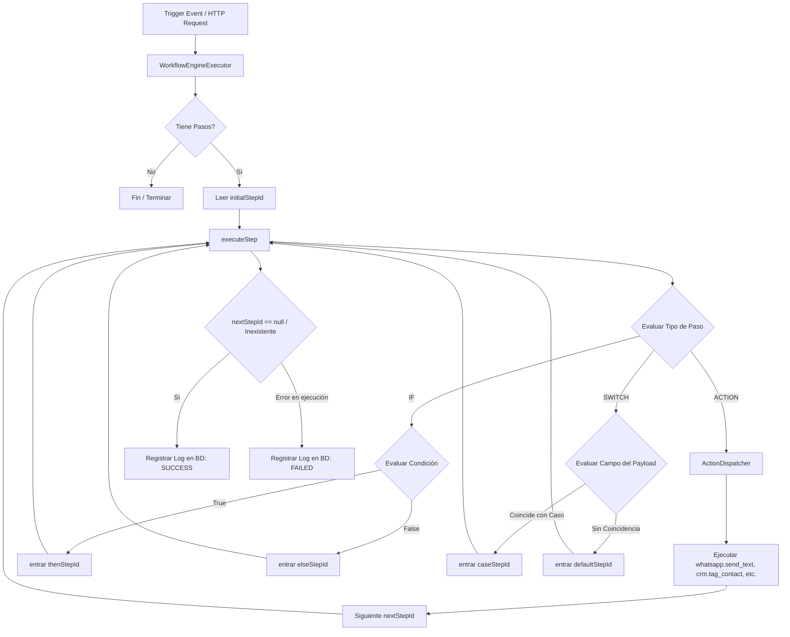

# 📋 Documento de System Design / Spec-Driven Development (SDD): Motor de Workflows Reactivos Multi-Tenant

Este documento define la especificación técnica, arquitectura, esquema de datos y contratos de la API para el **Motor de Automatización de Workflows** en CloudFly. Este motor está diseñado para ser un motor reactivo, no bloqueante y multi-tenant, permitiendo ejecutar acciones lógicas basadas en eventos de negocio o programaciones recurrentes.

---

## 1. 🎯 Visión General del Sistema

El módulo de Workflows de CloudFly provee a cada Tenant la capacidad de configurar reglas de automatización personalizadas (ej. *"Si se confirma una cita, enviar un WhatsApp y poner la etiqueta VIP"*). 

### Capacidades Core del Motor:
1. **Multi-Tenant Estricto:** Aislamiento absoluto por `tenant_id` y `company_id`.
2. **Reactividad React (Project Reactor):** Operaciones no bloqueantes e hilo asíncrono para garantizar alto rendimiento con baja huella de memoria.
3. **Decisiones Dinámicas:** Evaluación en tiempo real de ramificaciones lógicas condicionales (`IF`, `SWITCH`).
4. **Despacho Omnicanal:** Integración con la capa de notificaciones (WhatsApp, CRM, etc.) mediante acciones modulares.
5. **Tolerancia a Fallos y Auditoría:** Cada paso de ejecución se registra con su duración y estado (`SUCCESS` / `FAILED`), encapsulando excepciones para evitar interrumpir flujos transaccionales adyacentes.

---

## 2. 🏗️ Arquitectura y Ciclo de Vida de Ejecución

El motor de workflows interactúa entre el controlador REST, el servicio de persistencia y el motor de ejecución lógica recursiva.



---

## 3. 📝 Especificación de Base de Datos (MySQL R2DBC)

El esquema relacional consta de dos tablas principales para definir las automatizaciones y auditar su rendimiento e historial de ejecuciones.

### 3.1. Tabla `workflows` (Definición de Automatización)
Almacena el esqueleto lógico y los metadatos de activación.

```sql
CREATE TABLE IF NOT EXISTS workflows (
    id BIGINT PRIMARY KEY AUTO_INCREMENT,
    tenant_id BIGINT NOT NULL,
    company_id BIGINT NOT NULL,
    name VARCHAR(255) NOT NULL,
    description TEXT,
    trigger_event VARCHAR(100),                -- Evento que dispara el flujo (ej: "appointment.confirmed")
    cron_expression VARCHAR(100),              -- Para automatizaciones programadas
    initial_step_id VARCHAR(100) NOT NULL,     -- Nodo de entrada de la ejecución
    workflow_steps LONGTEXT NOT NULL,          -- Estructura JSON completa de los pasos
    is_active BOOLEAN DEFAULT TRUE,
    created_at TIMESTAMP DEFAULT CURRENT_TIMESTAMP,
    updated_at TIMESTAMP DEFAULT CURRENT_TIMESTAMP ON UPDATE CURRENT_TIMESTAMP,
    INDEX idx_workflow_tenant_company (tenant_id, company_id),
    INDEX idx_workflow_trigger (trigger_event)
);
```

### 3.2. Tabla `workflows_execution_logs` (Historial y Auditoría)
Registra cada ejecución del motor en tiempo real.

```sql
CREATE TABLE IF NOT EXISTS workflows_execution_logs (
    id BIGINT PRIMARY KEY AUTO_INCREMENT,
    workflow_id BIGINT NOT NULL,
    tenant_id BIGINT NOT NULL,
    company_id BIGINT NOT NULL,
    status VARCHAR(50) NOT NULL,               -- SUCCESS, FAILED
    trigger_payload LONGTEXT NOT NULL,         -- JSON del payload original que gatilló el evento
    error_message TEXT,                        -- Traza/Mensaje de error si status = FAILED
    execution_time_ms INT NOT NULL,            -- Tiempo consumido en milisegundos
    created_at TIMESTAMP DEFAULT CURRENT_TIMESTAMP,
    FOREIGN KEY (workflow_id) REFERENCES workflows(id) ON DELETE CASCADE,
    INDEX idx_log_workflow (workflow_id),
    INDEX idx_log_tenant_company (tenant_id, company_id)
);
```

---

## 4. 🎛️ Contratos del JSON de Pasos (`workflow_steps`)

La propiedad `workflow_steps` contiene un mapeo de nodos lógicos indexados por su identificador único. A continuación, se detallan las especificaciones para los tres tipos de pasos soportados:

### 4.1. Paso de Acción (`ACTION`)
Ejecuta lógica externa mediante el `WorkflowActionDispatcher`. Soporta renderización de parámetros basados en llaves dinámicas del payload de entrada.

```json
{
  "step_1": {
    "type": "ACTION",
    "actionCode": "whatsapp.send_text",
    "actionParameters": {
      "phone": "{{data.customer.phone}}",
      "text_message": "Hola {{data.customer.name}}, tu cita ha sido confirmada."
    },
    "nextStepId": "step_2"
  }
}
```

### 4.2. Paso Condicional Bifurcado (`IF`)
Evalúa un criterio de comparación simple sobre un campo del payload y bifurca la secuencia.

```json
{
  "step_2": {
    "type": "IF",
    "condition": {
      "field": "data.order.total",
      "operator": "GREATER_THAN",
      "value": 100.0
    },
    "thenStepId": "step_tag_vip",
    "elseStepId": "step_tag_regular"
  }
}
```

### 4.3. Paso de Selección Múltiple (`SWITCH`)
Evalúa el valor exacto de un campo del payload y busca una coincidencia de flujo entre múltiples casos, contando con un fallback por defecto.

```json
{
  "step_3": {
    "type": "SWITCH",
    "field": "data.appointment.status",
    "cases": {
      "CONFIRMED": "step_confirmed_action",
      "CANCELLED": "step_cancelled_action"
    },
    "defaultStepId": "step_default_action"
  }
}
```

---

## 5. ⚙️ Lógica de Evaluación de Condiciones y Operadores

El motor soporta la evaluación de las siguientes operaciones lógicas sobre cualquier campo anidado en el payload (utilizando notación de punto `a.b.c` para resolver rutas):

| Operador | Comportamiento | Compatibilidad de Tipos |
| :--- | :--- | :--- |
| **`EQUALS`** | Evalúa igualdad estricta. Si son números, compara su valor float/double. Si son texto, realiza comparación ignorando mayúsculas y espacios. | String, Number, Boolean |
| **`NOT_EQUALS`** | Evalúa diferencia estricta. Soporta fallbacks automáticos si el campo está ausente (retorna `true`). | String, Number |
| **`GREATER_THAN`** | Compara si el valor real del payload es numéricamente superior al configurado. | Number |
| **`LESS_THAN`** | Compara si el valor real del payload es numéricamente inferior al configurado. | Number |
| **`CONTAINS`** | Evalúa si el string objetivo contiene el texto configurado en minúsculas. | String |

---

## 6. 🌐 Endpoints de la API REST (`WorkflowController`)

Toda interacción de datos requiere el header `Authorization: Bearer <JWT>` y respeta el aislamiento multi-tenant contextualizando las consultas según los claims del token.

| Método | Endpoint | Roles Permitidos | Propósito |
| :--- | :--- | :--- | :--- |
| **`GET`** | `/api/v1/workflows` | `ADMIN`, `MANAGER`, `SUPERADMIN`, `USER` | Obtiene lista paginada y filtrable por `name`, `triggerEvent` e `isActive`. |
| **`GET`** | `/api/v1/workflows/{id}` | `ADMIN`, `MANAGER`, `SUPERADMIN`, `USER` | Obtiene el detalle completo y steps JSON de un workflow específico. |
| **`POST`** | `/api/v1/workflows` | `ADMIN`, `MANAGER`, `SUPERADMIN` | Registra una nueva automatización en la compañía activa. |
| **`PUT`** | `/api/v1/workflows/{id}` | `ADMIN`, `MANAGER`, `SUPERADMIN` | Actualiza los datos o estructura de pasos de una automatización existente. |
| **`DELETE`**| `/api/v1/workflows/{id}` | `ADMIN`, `MANAGER`, `SUPERADMIN` | Elimina lógicamente/físicamente el flujo de trabajo especificado. |
| **`PATCH`** | `/api/v1/workflows/{id}/toggle-status`| `ADMIN`, `MANAGER`, `SUPERADMIN` | Activa o desactiva rápidamente la ejecución del workflow. |
| **`GET`** | `/api/v1/workflows/{id}/logs` | `ADMIN`, `MANAGER`, `SUPERADMIN`, `USER` | Recupera el historial de ejecuciones con sus métricas y payloads. |

---

## 7. 🧪 Protocolo de Pruebas Unitarias de Resiliencia

El motor se valida bajo una rigurosa suite de pruebas no bloqueantes con `reactor.test.StepVerifier` para validar:
1. **Ejecución Recursiva Directa:** Comprobar que una secuencia de múltiples acciones se ejecute secuencialmente respetando los `nextStepId`.
2. **Evaluación de IF con Bifurcación:** Mockear el despachador de acciones para validar que solo se llame a la acción VIP o Regular según el total del payload.
3. **Resiliencia de Registro de Logs:** Asegurar que si una llamada a API remota de WhatsApp falla, el log guarde la traza en la base de datos con estado `FAILED` y duración de ejecución calculada, pero continúe con la tubería de negocio sin propagar excepciones catastróficas que interrumpan la confirmación transaccional.
