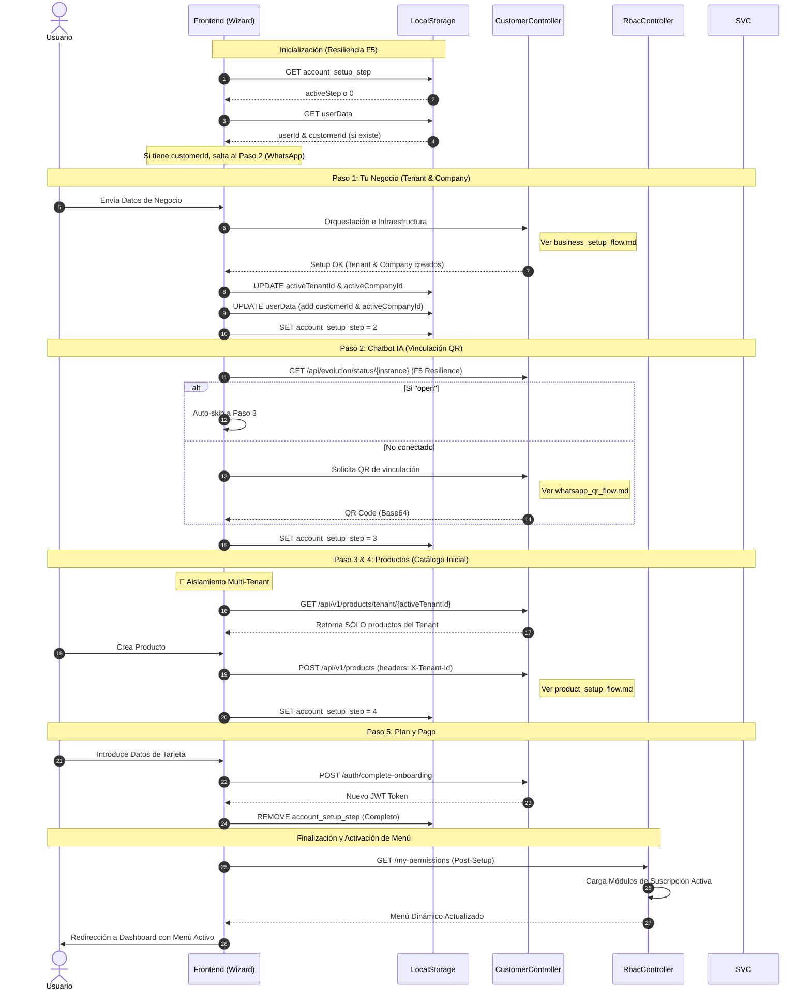

# Diagrama Maestro: Account Setup Orchestrator ⚓🛳️

Este diagrama actúa como el orquestador central, referenciando los sub-diagramas detallados para cada paso del wizard de onboarding.

### Mapa de Referencias Técnicas:
- **Datos de Negocio:** [business_setup_flow.md](file:///C:/Users/Edwin/.gemini/antigravity/brain/7c4f4fd6-4517-4cd6-9cb9-ce5112c7abe1/business_setup_flow.md)
- **Activación WhatsApp:** [whatsapp_qr_flow.md](file:///C:/Users/Edwin/.gemini/antigravity/brain/7c4f4fd6-4517-4cd6-9cb9-ce5112c7abe1/whatsapp_qr_flow.md)
- **Categorías:** [category_setup_flow.md](file:///C:/Users/Edwin/.gemini/antigravity/brain/7c4f4fd6-4517-4cd6-9cb9-ce5112c7abe1/category_setup_flow.md)
- **Productos:** [product_setup_flow.md](file:///C:/Users/Edwin/.gemini/antigravity/brain/7c4f4fd6-4517-4cd6-9cb9-ce5112c7abe1/product_setup_flow.md)
