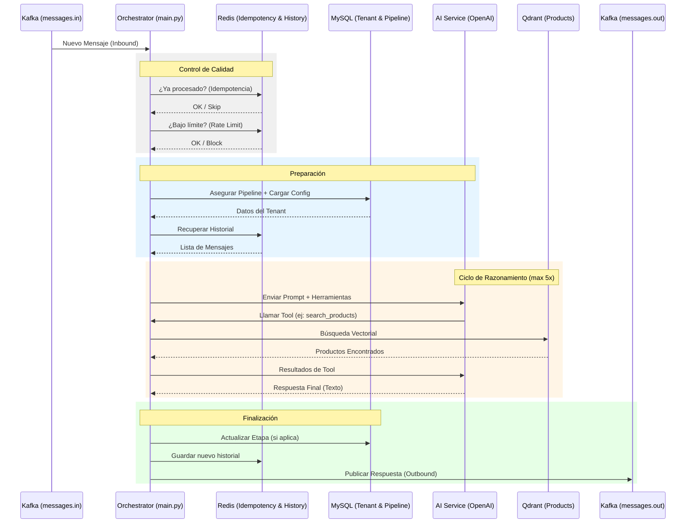

# Arquitectura del Microservicio AI Agent (CloudFly)

Este documento describe la arquitectura refactorizada del Agente de IA, transformado en un microservicio asíncrono, escalable y tolerante a fallos siguiendo los principios de **Clean Architecture**.

## 🏗️ Estructura de Capas

El servicio se organiza en tres capas principales para separar la lógica de negocio de la infraestructura:

1.  **`application/` (Orquestación)**: Contiene el `main.py` que coordina el flujo de datos. No conoce los detalles de implementación de la base de datos o Kafka, solo usa los clientes definidos.
2.  **`domain/` (Lógica de Negocio)**: Define el comportamiento del agente (`ai_service.py`), los modelos de datos (`models.py`) y las reglas de decisión de la IA.
3.  **`infrastructure/` (I/O & Clientes)**: Implementaciones técnicas para MySQL, Redis, Kafka y Qdrant. Todo el I/O es asíncrono.

---

## 🚀 Flujo de Procesamiento (9 Pasos)

Cada mensaje que llega por WhatsApp sigue este ciclo de vida atómico:

1.  **Ingesta**: El `Kafka Consumer` recibe el evento del tópico `messages.in`.
2.  **Idempotencia**: Se genera un hash del `message_id` y se verifica en **Redis**. Si ya fue procesado, se descarta para evitar duplicidad.
3.  **Rate Limiting**: Se incrementa un contador diario en Redis por `tenant_id`. Si excede el límite configurado, el mensaje se pausa.
4.  **Auto-Pipeline**: Si el contacto no tiene un pipeline asignado, se le asigna el pipeline por defecto del tenant mediante una consulta SQL atómica (`INSERT ... ON DUPLICATE KEY`).
5.  **Carga de Contexto**: Se recupera el historial de chat de **Redis** (memoria de corto plazo) y la configuración del agente desde **MySQL**.
6.  **Inyección de Prompt**: Se construye el `System Prompt` inyectando dinámicamente:
    *   Información de la empresa (NIT, Dirección, Teléfono).
    *   Estado actual del Pipeline (Etapa actual y opciones disponibles).
7.  **Ciclo de Herramientas (Tool Loop)**: El agente puede realizar múltiples llamadas secuenciales (hasta 5) a herramientas como:
    *   `search_products_semantically`: Búsqueda vectorial en **Qdrant**.
    *   `check_products_stock`: Consulta de inventario en tiempo real.
    *   `update_pipeline_stage`: Intento de mover al cliente en el embudo.
8.  **Persistencia**: Se guardan los nuevos turnos en Redis y se ejecutan las actualizaciones de base de datos pendientes.
9.  **Entrega**: El `Kafka Producer` publica la respuesta en `messages.out` para que el `chat-socket-service` la envíe a WhatsApp.

---

## 📊 Diagrama de Secuencia

---

## 🛠️ Tecnologías Utilizadas

*   **Lenguaje**: Python 3.11+
*   **Asincronía**: `asyncio`
*   **Base de Datos**: `aiomysql` (MySQL)
*   **Caché/Memoria**: `redis.asyncio` (Redis)
*   **Messaging**: `aiokafka` (Consumidor) & `confluent-kafka` (Productor)
*   **Vector DB**: `qdrant-client` (RAG)
*   **IA**: `AsyncOpenAI` (GPT-4o / GPT-3.5-Turbo)
*   **Observabilidad**: `python-json-logger` (Structured Logging)
