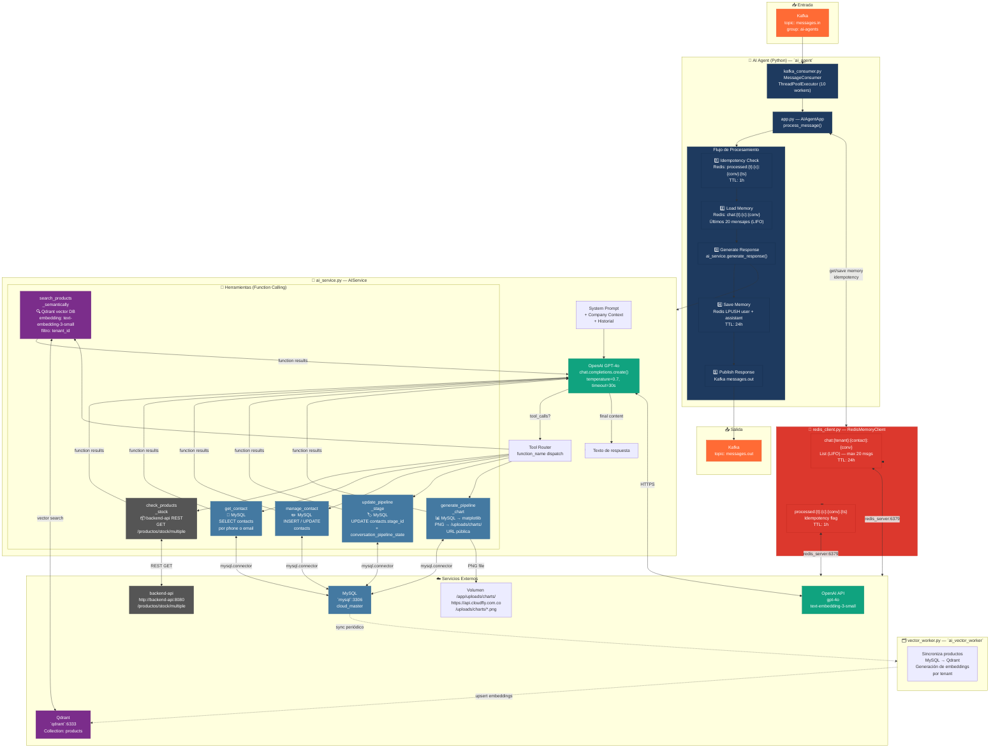
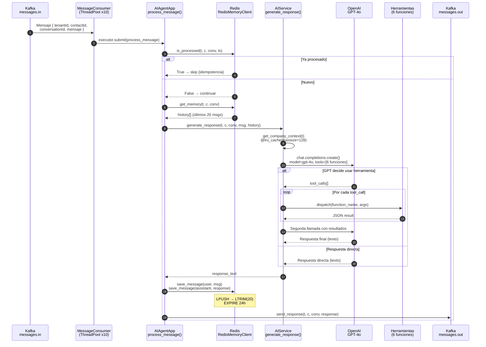

# 🤖 Arquitectura del AI Agent — Cloudfly

> Documentado con base en el código fuente de `/ai-agent/` verificado en producción.

---

## Diagrama de Arquitectura



---

## Flujo Interno Detallado



---

## Resumen de Componentes

| Archivo | Clase | Responsabilidad |
|---|---|---|
| `app.py` | `AIAgentApp` | Orquestador principal. Conecta consumer → proceso → producer |
| `kafka_consumer.py` | `MessageConsumer` | Lee `messages.in`, despacha a ThreadPoolExecutor (10 workers) |
| `kafka_producer.py` | `MessageProducer` | Publica respuesta en `messages.out` |
| `ai_service.py` | `AIService` | Prompt + OpenAI + 6 herramientas de Function Calling |
| `redis_client.py` | `RedisMemoryClient` | Memoria de conversación (lista LIFO) + idempotencia |
| `vector_worker.py` | *(standalone)* | Sincroniza productos MySQL → Qdrant (worker separado `ai_vector_worker`) |

---

## Herramientas — Detalle

| Herramienta | Backend | Input | Output |
|---|---|---|---|
| `search_products_semantically` | Qdrant + OpenAI embeddings | `query: str` | Lista de productos (payload vector) |
| `check_products_stock` | backend-api REST | `product_ids: int[]` | `[{id, stock, manageStock, inventoryStatus}]` |
| `get_contact` | MySQL `contacts` | `identifier: str` (phone/email) | Objeto contacto completo |
| `manage_contact` | MySQL `contacts` | `action: create/update`, campos opcionales | `{success, id/message}` |
| `update_pipeline_stage` | MySQL `contacts` + `conversation_pipeline_state` | `contact_id, stage_id` | `{success, message}` |
| `generate_pipeline_chart` | MySQL `pipeline_stages` → matplotlib | *(ninguno)* | `{success, chart_url}` PNG público |

---

## Memoria Redis — Estructura de Claves

```
chat:{tenant_id}:{contact_id}:{conversation_id}
  → List (LIFO) de JSON {role, content}
  → Max 20 elementos (LTRIM)
  → TTL: 24 horas

processed:{tenant_id}:{contact_id}:{conversation_id}:{timestamp}
  → String "1"
  → TTL: 1 hora (idempotencia)
```

---

## Configuración de Producción

| Variable | Valor Default | Descripción |
|---|---|---|
| `OPENAI_MODEL` | `gpt-4o` | Modelo LLM |
| `MAX_MEMORY_MESSAGES` | `20` | Mensajes en historial Redis |
| `KAFKA_BOOTSTRAP_SERVERS` | `kafka:9092` | Broker Kafka |
| `QDRANT_HOST` | `qdrant` | Vector DB host |
| `QDRANT_PORT` | `6333` | Vector DB port |
| `JAVA_API_URL` | `http://backend-api:8080` | REST API Java |
| `DB_NAME` | `cloud_master` | Base de datos MySQL |
