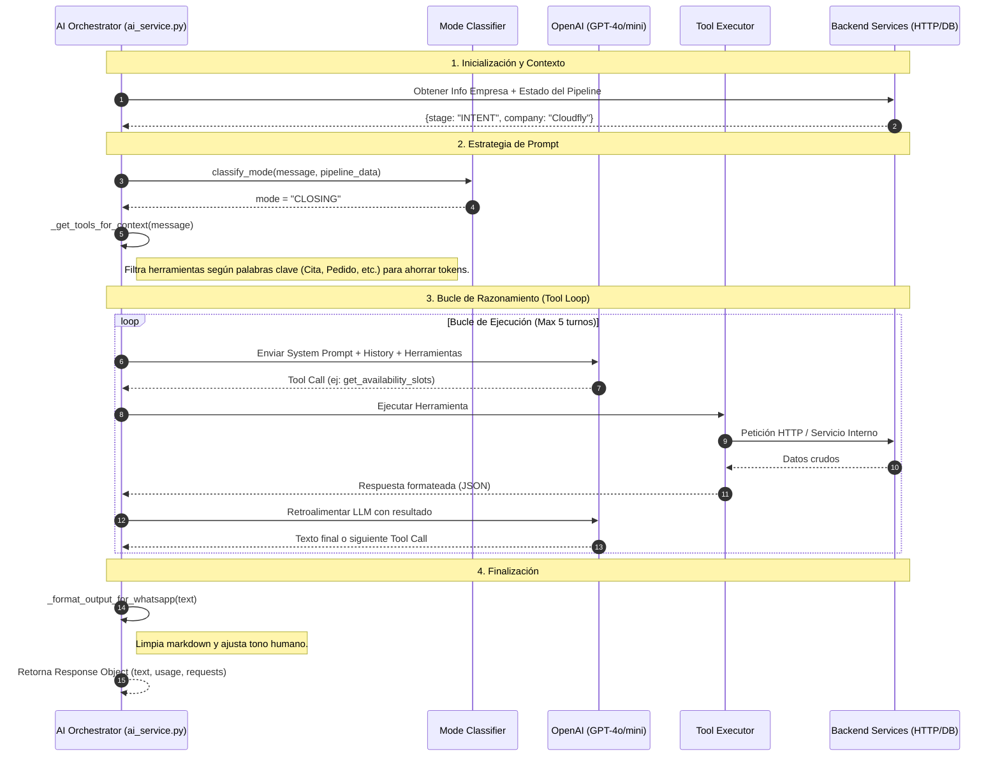

# 🧠 Lógica Interna del AI Agent

Este documento describe el flujo de procesamiento del agente de IA desde que recibe un mensaje del usuario hasta que genera una respuesta final, incluyendo la orquestación de herramientas y la optimización de tokens.

## Diagrama de Secuencia

## Componentes Críticos

### 1. Mode Classifier
Determina el `System Prompt` a utilizar.
- **EXPLORE**: Para saludos y dudas generales (Temp: 0.7).
- **INTENT**: Cuando hay interés en un producto (Temp: 0.5).
- **CLOSING**: Proceso de agendamiento o pago (Temp: 0.3 para mayor precisión).

### 2. Dynamic Tool Filtering
Para mantener el consumo de tokens bajo control, el agente no envía la definición de todas las herramientas si no son necesarias. Si el usuario no menciona palabras relacionadas con "agenda" o "cita", las herramientas del módulo de agendamiento se omiten del contexto inicial.

### 3. Tool Execution Loop
El agente soporta encadenamiento de tareas. Por ejemplo:
1. `get_availability_slots`: Ver qué hay libre.
2. `manage_contact`: Actualizar datos del cliente.
3. `book_appointment`: Realizar la reserva final.

### 4. WhatsApp Optimization
Convierte la salida técnica del LLM en mensajes aptos para chat:
- Elimina encabezados Markdown (`###`).
- Limpia artefactos de pensamiento interno.
- Ajusta la puntuación para un tono más cercano.

---
*Documentación generada automáticamente para CloudFly AI Architecture.*
