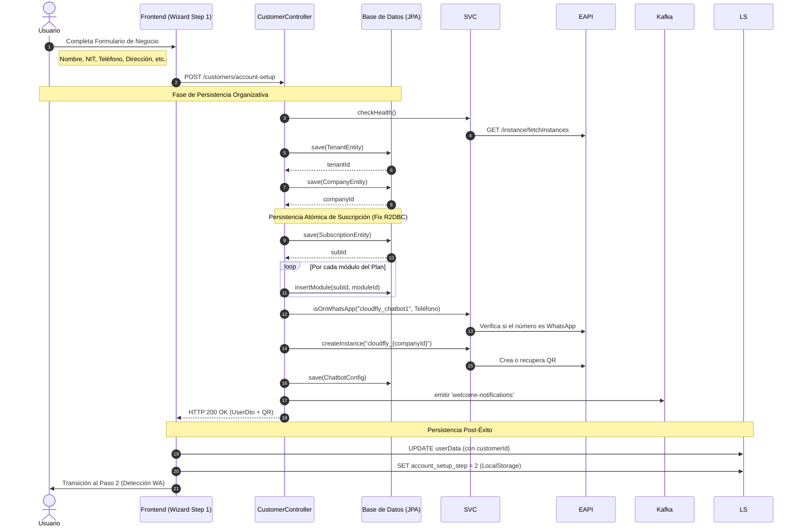

# Diagrama de Secuencia: Datos de Negocio (Tenant & Company) ⚓🛳️

Este diagrama detalla el primer paso del wizard, enfocado en la creación de la infraestructura organizativa del cliente.

```mermaid
sequenceDiagram
    autonumber
    actor Usuario
    participant FE as Frontend (Wizard Step 1)
    participant CTL as CustomerController
    participant DB as Base de Datos (JPA)

    Usuario->>FE: Completa Formulario de Negocio
    Note right of Usuario: Nombre, NIT, Teléfono, Dirección, etc.
    FE->>CTL: POST /customers/account-setup
    
    Note over Usuario, DB: Fase de Persistencia Organizativa
    CTL->>SVC: checkHealth()
    SVC->>EAPI: GET /instance/fetchInstances
    
    CTL->>DB: save(TenantEntity)
    DB-->>CTL: tenantId
    
    CTL->>DB: save(CompanyEntity)
    DB-->>CTL: companyId
    
    Note over CTL, DB: Persistencia Atómica de Suscripción (Fix R2DBC)
    CTL->>DB: save(SubscriptionEntity)
    DB-->>CTL: subId
    loop Por cada módulo del Plan
        CTL->>DB: insertModule(subId, moduleId)
    end
    
    CTL->>SVC: isOnWhatsApp("cloudfly_chatbot1", Teléfono)
    SVC->>EAPI: Verifica si el número es WhatsApp
    
    CTL->>SVC: createInstance("cloudfly_{companyId}")
    SVC->>EAPI: Crea o recupera QR
    
    CTL->>DB: save(ChatbotConfig)
    
    CTL->>Kafka: emitir 'welcome-notifications'
    
    CTL-->>FE: HTTP 200 OK (UserDto + QR)
    
    Note over FE, LS: Persistencia Post-Éxito
    FE->>LS: UPDATE userData (con customerId)
    FE->>LS: SET account_setup_step = 2 (LocalStorage)
    FE->>Usuario: Transición al Paso 2 (Detección WA)
```
