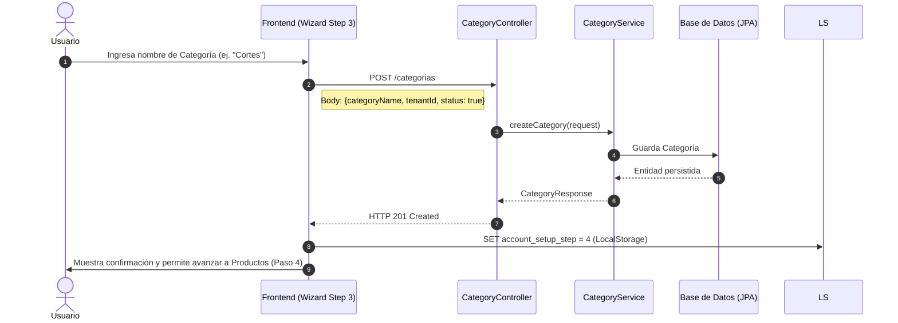

# Diagrama de Secuencia: Configuración de Categorías ⚓🛳️

Este diagrama detalla el proceso de creación de categorías durante el wizard de setup.

```mermaid
sequenceDiagram
    autonumber
    actor Usuario
    participant FE as Frontend (Wizard Step 3)
    participant CTL as CategoryController
    participant SVC as CategoryService
    participant DB as Base de Datos (JPA)

    Usuario->>FE: Ingresa nombre de Categoría (ej. "Cortes")
    FE->>CTL: POST /categorias
    Note right of FE: Body: {categoryName, tenantId, status: true}
    
    CTL->>SVC: createCategory(request)
    SVC->>DB: Guarda Categoría
    DB-->>SVC: Entidad persistida
    
    SVC-->>CTL: CategoryResponse
    CTL-->>FE: HTTP 201 Created
    
    FE->>LS: SET account_setup_step = 4 (LocalStorage)
    FE->>Usuario: Muestra confirmación y permite avanzar a Productos (Paso 4)
```
