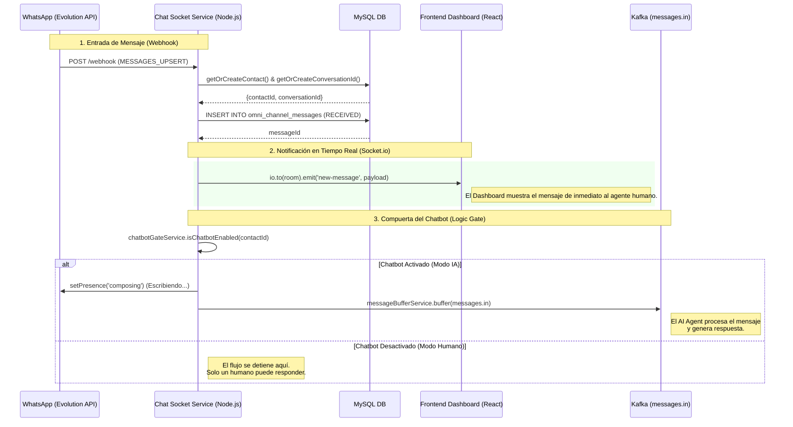

# 🔌 Flujo de Chat Socket Service

Este documento describe cómo el `chat-socket-service` actúa como el orquestador central entre WhatsApp, el Dashboard administrativo y el Agente de IA.

## Diagrama de Secuencia

## Responsabilidades del Servicio

1.  **Puente de Webhooks**: Convierte los webhooks crudos de Evolution API (WhatsApp) o Facebook Messenger en registros estandarizados de base de datos.
2.  **Gestión de Sesiones**: Crea y mantiene el `conversation_id`, agrupando mensajes en sesiones de 30 minutos de inactividad.
3.  **Sincronización del Dashboard**: Utiliza `Socket.io` para que los administradores vean los chats de WhatsApp sin necesidad de recargar la página.
4.  **Control de Flujo (Chatbot Gate)**: Decide si un mensaje debe ser procesado por la IA o si debe quedarse únicamente para atención humana.
5.  **Indicadores de Presencia**: Activa estados de "Escribiendo..." en WhatsApp para que la interacción con la IA se sienta más natural.

---
*Documentación técnica del sistema de comunicación omnicanal CloudFly.*
