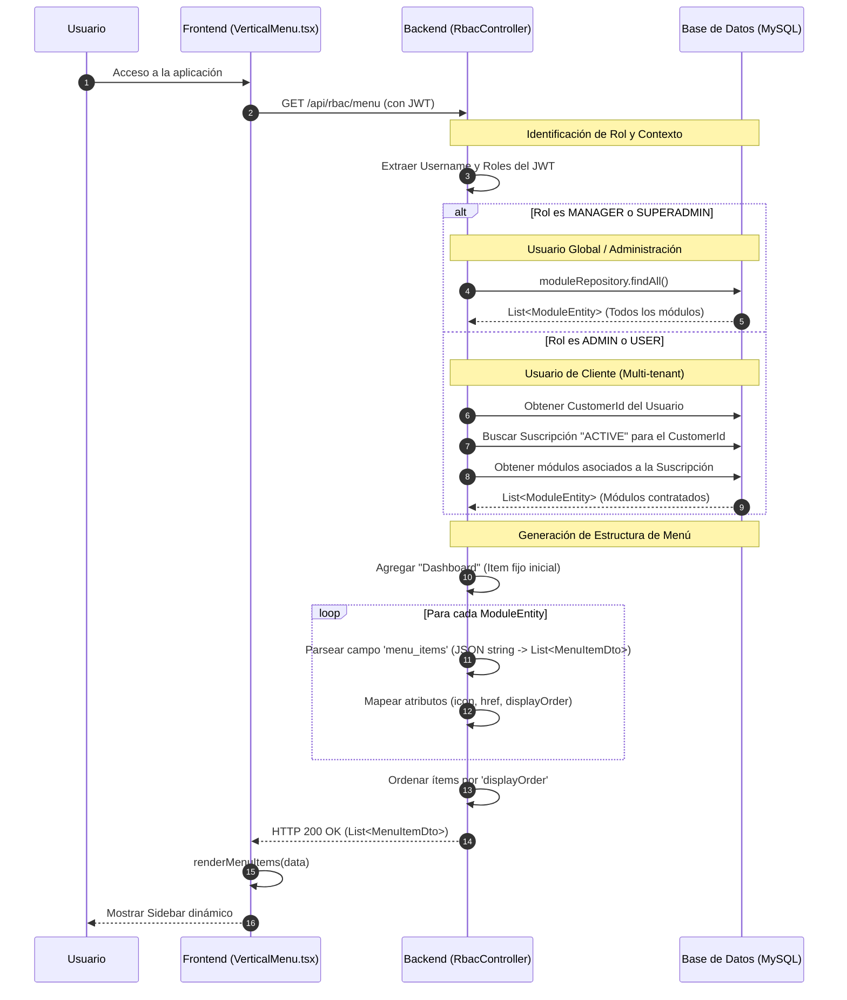

# Diagrama de Carga de Menú Dinámico (DB Driven)

Este diagrama detalla cómo el sistema genera el menú lateral basándose en el rol del usuario y los módulos contratados en su suscripción.

## Diagrama de Secuencia

## Lógica de Decisión

1.  **MANAGER / SUPERADMIN**: Tienen acceso de "plataforma". No requieren una suscripción de cliente porque su función es gestionar a los clientes, planes y módulos globales. Ven todos los registros de la tabla `modules`.
2.  **ADMIN / USER**: Tienen acceso de "negocio". Su menú está estrictamente limitado a los módulos vinculados a la suscripción activa de su `Tenant`.
3.  **Campo `menu_items`**: Cada módulo en la DB almacena sus sub-ítems en formato JSON. Esto permite que el backend sea el único origen de verdad para la navegación, facilitando actualizaciones sin tocar el frontend.

---
*Este documento complementa el [onboarding_sequence_diagram.md](file:///c:/apps/cloudfly/docs/onboarding_sequence_diagram.md).*
