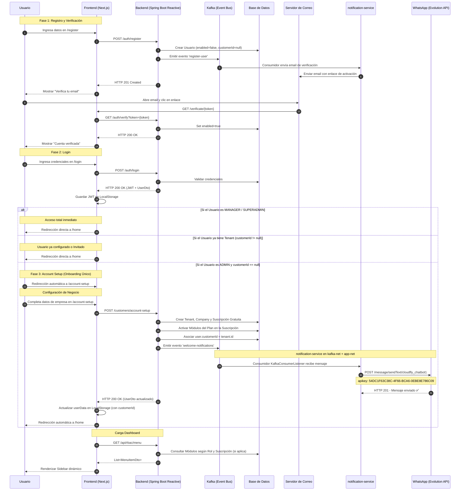

# Flujo de Registro, Verificación y Onboarding

Este diagrama detalla la secuencia de eventos desde que un usuario se registra hasta que su cuenta y compañía por defecto son configuradas automáticamente. Se ha refinado para asegurar que el onboarding solo ocurre si el usuario no tiene un Tenant asignado.

> **Última actualización**: 2026-03-12 — Incluye flujo verificado de notificación WhatsApp vía Evolution API

## Diagrama de Secuencia

## Detalles del Proceso

1.  **Registro**: El usuario se crea en estado inactivo hasta confirmar su correo. El `customerId` es nulo inicialmente.
2.  **Onboarding Único**: El frontend verifica el campo `customerId` del usuario autenticado. Si es nulo y el rol es `ADMIN`, redirige al wizard. Si ya tiene valor, significa que la empresa ya existe (o el usuario fue invitado a una) y se le permite ir directo al Dashboard.
3.  **Account Setup**: En este paso se crea:
    *   El **Customer** (Tenant principal).
    *   La **Company** principal.
    *   La **Suscripción** al Plan inicial.
    *   Se actualiza el usuario con el ID del Tenant recién creado.
4.  **Menú Dinámico**: El backend usa el `customerId` para filtrar los módulos en la tabla `modules`.
5.  **WhatsApp de Bienvenida**: Al completar el Account Setup, el backend publica en el tópico `welcome-notifications`. El `notification-service` consume el evento y llama a `POST /message/sendText/cloudfly_chatbot1` en la Evolution API con el mensaje de bienvenida al número registrado.

## Notas Técnicas (Producción)

| Componente | Valor |
|---|---|
| Evolution API instance | `cloudfly_chatbot1` |
| Evolution API key | `54DC1F63C38C-4F66-BCA6-0EBE8E786C09` |
| Kafka topic notificación bienvenida | `welcome-notifications` |
| Kafka topic registro | `register-user` |
| Redes Docker `notification-service` | `kafka-net` + `app-net` (requerido para alcanzar `evolution_api`) |

> ⚠️ **Importante**: El `notification-service` **debe estar en ambas redes** (`kafka-net` para consumir Kafka y `app-net` para alcanzar el contenedor `evolution_api`). Sin `app-net`, el servicio falla silenciosamente al intentar enviar la notificación.
