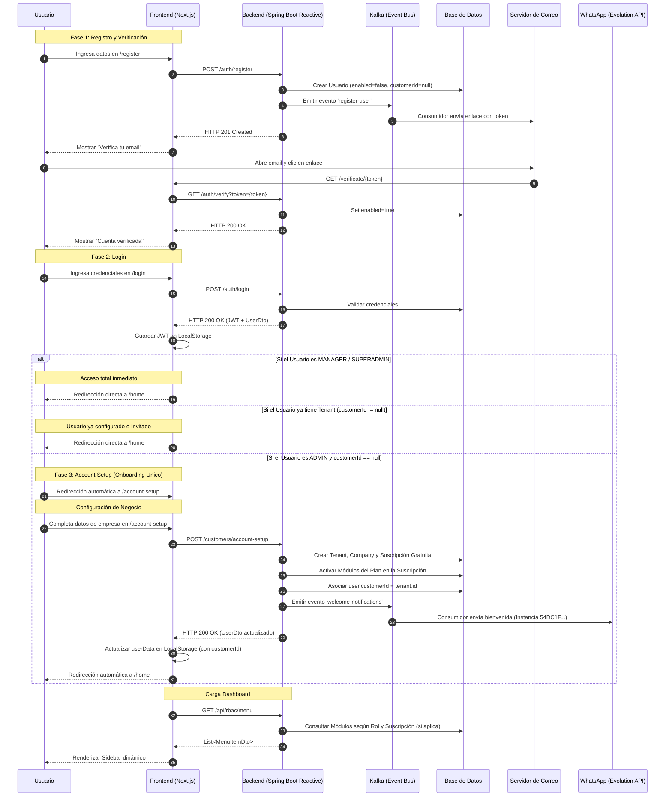

# Flujo de Registro, Verificación y Onboarding

Este diagrama detalla la secuencia de eventos desde que un usuario se registra hasta que su cuenta y compañía por defecto son configuradas automáticamente. Se ha refinado para asegurar que el onboarding solo ocurre si el usuario no tiene un Tenant asignado.

## Diagrama de Secuencia

## Detalles del Proceso

1.  **Registro**: El usuario se crea en estado inactivo hasta confirmar su correo. El `customerId` es nulo inicialmente.
2.  **Onboarding Único**: El frontend verifica el campo `customerId` del usuario autenticado. Si es nulo y el rol es `ADMIN`, redirige al wizard. Si ya tiene valor, significa que la empresa ya existe (o el usuario fue invitado a una) y se le permite ir directo al Dashboard.
3.  **Account Setup**: En este paso se crea:
    *   El **Customer** (Tenant principal).
    *   La **Company** principal.
    *   La **Suscripción** al Plan inicial.
    *   Se actualiza el usuario con el ID del Tenant recién creado.
4.  **Menú Dinámico**: El backend usa el `customerId` para filtrar los módulos en la tabla `modules`.
