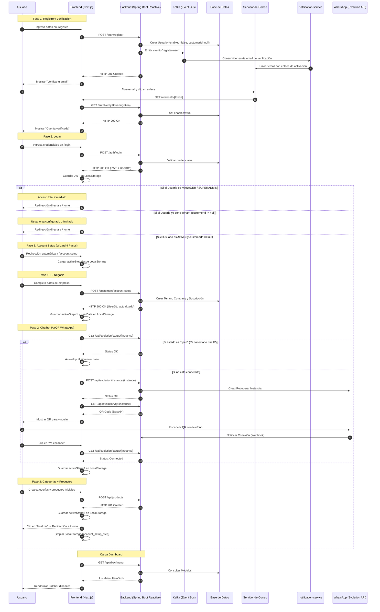

# Flujo de Registro, Verificación y Onboarding

Este diagrama detalla la secuencia de eventos desde que un usuario se registra hasta que su cuenta y compañía por defecto son configuradas automáticamente. Se ha refinado para asegurar que el onboarding incluya la activación real de la instancia de WhatsApp y el catálogo inicial.

> **Última actualización**: 2026-03-12 — Incluye flujo verificado de 4 pasos con activación de instancia dedicada.

## Diagrama de Secuencia

## Detalles del Proceso

1.  **Registro**: El usuario se crea en estado inactivo hasta confirmar su correo. El `customerId` es nulo inicialmente.
2.  **Onboarding Estándar**: El wizard de 4 pasos asegura que el cliente tenga configurado su negocio, su canal de WhatsApp y al menos un producto antes de entrar al dashboard.
3.  **Activación de WhatsApp**: Al completar el Paso 1 (Negocio), el backend crea automáticamente una instancia dedicada en Evolution API (`cloudfly_{tenantId}`). La notificación de bienvenida se envía a través de esta nueva instancia si es posible.
4.  **Vinculación**: En el Paso 2, el usuario ve el QR de su propia instancia para finalizar la vinculación real.
5.  **Menú Dinámico**: El backend usa el `customerId` para filtrar los módulos.

## Notas Técnicas (Producción)

| Componente | Valor |
|---|---|
| Evolution API Instance Format | `cloudfly_{tenantId}` |
| Fallback Instance | `cloudfly_chatbot1` |
| Evolution API key | `54DC1F63C38C-4F66-BCA6-0EBE8E786C09` |
| Kafka topic notificación bienvenida | `welcome-notifications` |
| Redes Docker `notification-service` | `kafka-net` + `app-net` |

> ⚠️ **Importante**: El proceso de "Omitir" ha sido deshabilitado en favor de una configuración completa y activa desde el primer día.
