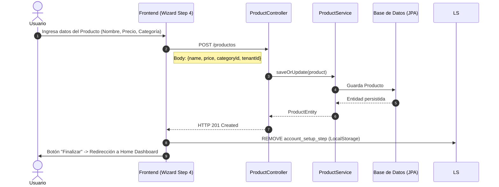

# Diagrama de Secuencia: Configuración de Productos ⚓🛳️

Este diagrama detalla el proceso de creación de productos finales en el wizard de onboarding.

```mermaid
sequenceDiagram
    autonumber
    actor Usuario
    participant FE as Frontend (Wizard Step 4)
    participant CTL as ProductController
    participant SVC as ProductService
    participant DB as Base de Datos (JPA)

    Usuario->>FE: Ingresa datos del Producto (Nombre, Precio, Categoría)
    FE->>CTL: POST /productos
    Note right of FE: Body: {name, price, categoryId, tenantId}
    
    CTL->>SVC: saveOrUpdate(product)
    SVC->>DB: Guarda Producto
    DB-->>SVC: Entidad persistida
    
    SVC-->>CTL: ProductEntity
    CTL-->>FE: HTTP 201 Created
    
    FE->>LS: REMOVE account_setup_step (LocalStorage)
    FE->>Usuario: Botón "Finalizar" -> Redirección a Home Dashboard
```
