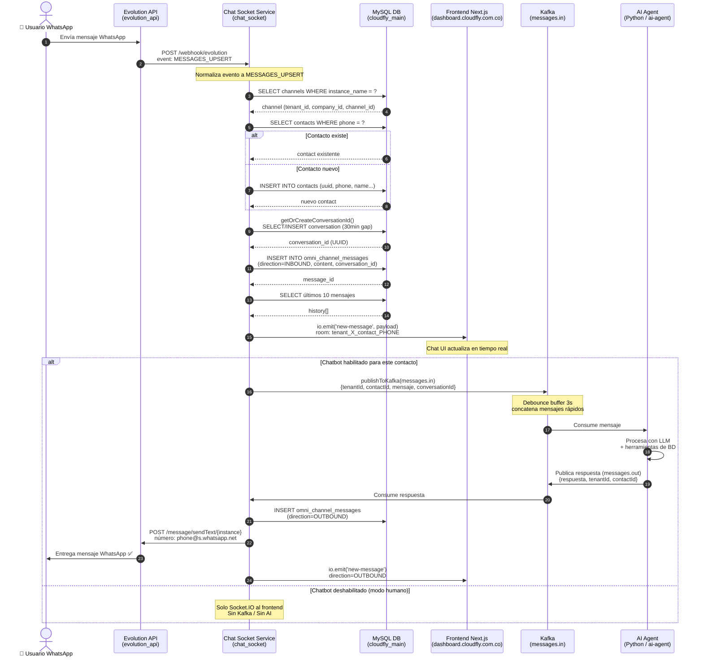
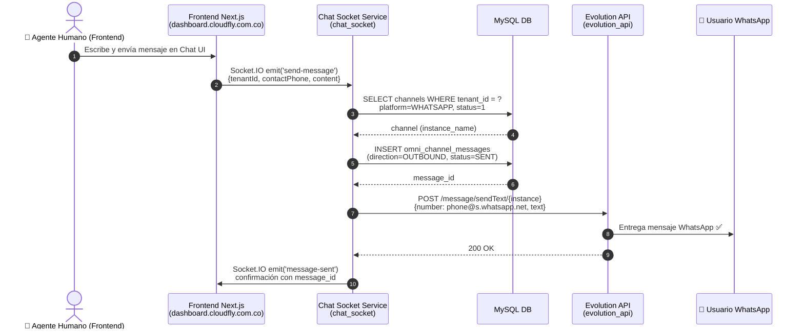

# 📱 Diagrama de Flujo: Mensajes WhatsApp en Cloudfly

## Arquitectura General

```
WhatsApp ↔ Evolution API ↔ chat-socket-service ↔ Frontend (Socket.IO)
                                    ↓ (si chatbot ON)
                              Kafka (messages.in)
                                    ↓
                              AI Agent (Python)
                                    ↓
                              Kafka (messages.out)
                                    ↓
                          chat-socket-service → Evolution API → WhatsApp
```

---

## Diagrama de Secuencia — Mensaje ENTRANTE (Inbound)



---

## Diagrama de Secuencia — Mensaje SALIENTE (Outbound desde Frontend)



---

## Servicios y Dominios

| Servicio | Contenedor | Dominio Público | Puerto Interno |
|----------|------------|------------------|----------------|
| Evolution API | `evolution_api` | `eapi.cloudfly.com.co` | 8080 |
| Chat Socket Service | `chat_socket` | `chat.cloudfly.com.co` | 3001 |
| Frontend Next.js | `frontend_app` | `dashboard.cloudfly.com.co` | 3000 |
| Backend Java API | `backend-api` | `api.cloudfly.com.co` | 8080 |
| AI Agent | `ai-agent` | *(interno)* | — |
| Kafka | `kafka` | *(interno)* | 9092 |
| MySQL | `db` | *(interno)* | 3306 |

---

## Instancias WhatsApp Activas

| Instancia | Estado | Número | Tenant |
|-----------|--------|--------|--------|
| `cloudfly_t1_c1` | ✅ open | 573246285134 (Pixelweb) | tenant_1 |

---

## Tópicos Kafka

| Tópico | Dirección | Publicado por | Consumido por |
|--------|-----------|---------------|---------------|
| `messages.in` | ➡️ | chat-socket-service | ai-agent |
| `messages.out` | ⬅️ | ai-agent | chat-socket-service |

---

## Comandos útiles para diagnóstico en VPS

```bash
# Logs del chat-socket-service (webhook + socket.io + kafka)
docker logs chat_socket -f --tail=100

# Logs del AI Agent (Kafka consumer + LLM)
docker logs ai-agent -f --tail=100

# Logs de Evolution API
docker logs evolution_api -f --tail=50

# Enviar mensaje de prueba a Evolution API
curl -X POST https://eapi.cloudfly.com.co/message/sendText/cloudfly_t1_c1 \
  -H "Content-Type: application/json" \
  -H "apikey: CAMBIA_ESTA_LLAVE_LARGA_Y_UNICA" \
  -d '{"number": "57XXXXXXXXXX@s.whatsapp.net", "text": "🧪 Prueba desde VPS"}'

# Verificar webhook configurado en instancia
curl -X GET https://eapi.cloudfly.com.co/webhook/find/cloudfly_t1_c1 \
  -H "apikey: CAMBIA_ESTA_LLAVE_LARGA_Y_UNICA"

# Simular webhook entrante (prueba del chat-socket-service)
curl -X POST https://chat.cloudfly.com.co/webhook/evolution \
  -H "Content-Type: application/json" \
  -d '{
    "event": "messages.upsert",
    "instance": "cloudfly_t1_c1",
    "data": {
      "key": { "id": "TEST001", "remoteJid": "573000000000@s.whatsapp.net", "fromMe": false },
      "pushName": "Test Usuario",
      "message": { "conversation": "Hola, mensaje de prueba" }
    }
  }'
```
