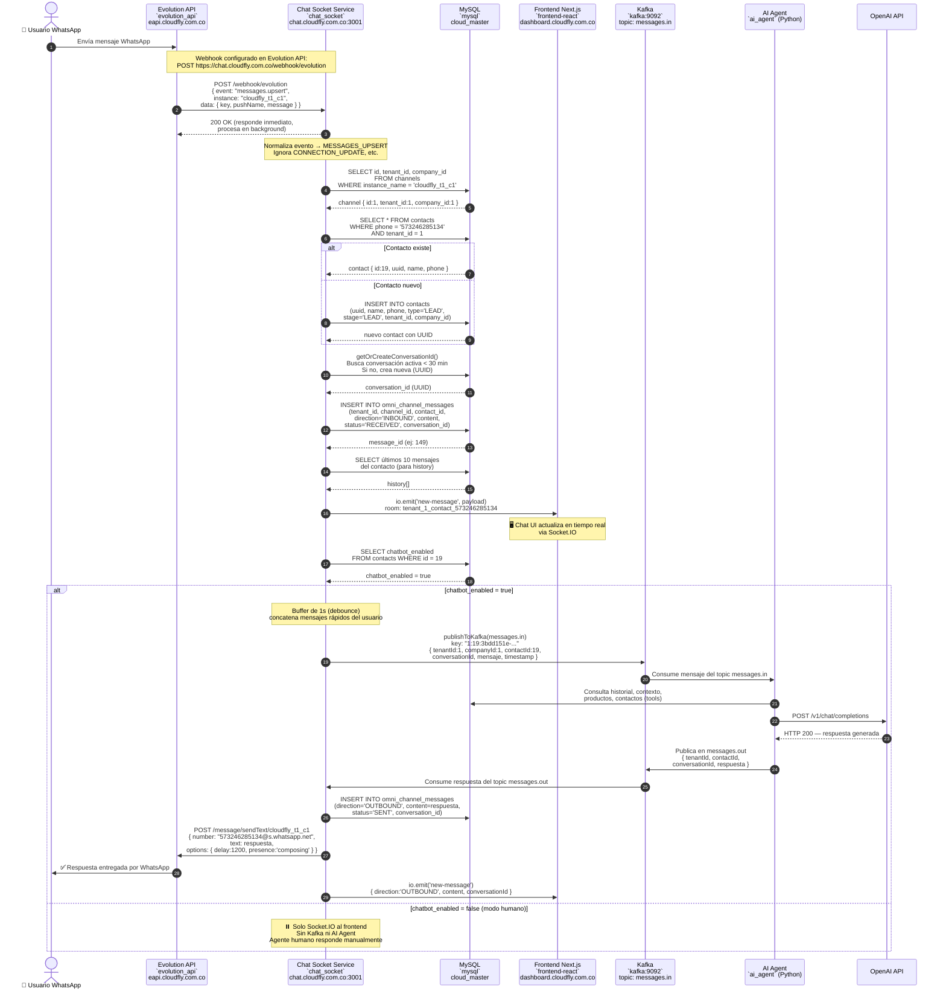
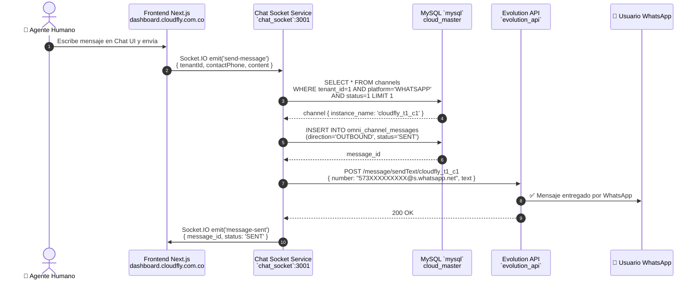

# 📱 Flujo de Mensajes WhatsApp — Cloudfly

> Diagrama verificado en producción el 2026-04-14 via pruebas E2E en VPS.

---

## Arquitectura General

```
WhatsApp ↔ Evolution API ──webhook──► chat-socket-service ──Socket.IO──► Frontend (Next.js)
                                              │
                                    (chatbot_enabled=true)
                                              │
                                       Kafka messages.in
                                              │
                                         AI Agent (Python)
                                              │ OpenAI API
                                       Kafka messages.out
                                              │
                                    chat-socket-service
                                         ├─ Evolution API ──► WhatsApp
                                         └─ Socket.IO ──────► Frontend
```

---

## Diagrama de Secuencia — Mensaje ENTRANTE (Inbound)



---

## Diagrama de Secuencia — Mensaje SALIENTE (Outbound humano)



---

## Infraestructura — Contenedores y Redes

| Contenedor | Imagen | Dominio Público | Red(es) Docker |
|---|---|---|---|
| `evolution_api` | evoapicloud/evolution-api | `eapi.cloudfly.com.co` | `cloudfly_app-net` |
| `chat_socket` | cloudfly-chat-socket-service | `chat.cloudfly.com.co` | `cloudfly_app-net` + `cloudfly_kafka-net` |
| `frontend-react` | cloudfly-frontend | `dashboard.cloudfly.com.co` | `cloudfly_app-net` |
| `backend-api` | cloudfly-backend-api | `api.cloudfly.com.co` | `cloudfly_app-net` + `cloudfly_kafka-net` |
| `ai_agent` | cloudfly-ai-agent | *(interno)* | `cloudfly_app-net` + `cloudfly_kafka-net` |
| `kafka` | confluentinc/cp-kafka:7.4.0 | *(interno)* | `cloudfly_kafka-net` |
| `mysql` | mysql:8.0 | *(interno)* | `cloudfly_app-net` + `cloudfly_kafka-net` |
| `redis_server` | redis:latest | *(interno)* | `cloudfly_app-net` |
| `qdrant` | qdrant/qdrant | *(interno)*:6333 | `cloudfly_app-net` |
| `traefik` | traefik:v2.11 | *(proxy inverso)* | `cloudfly_app-net` |

---

## Tópicos Kafka

| Tópico | Dirección | Publicado por | Consumido por |
|---|---|---|---|
| `messages.in` | ➡️ Entrada al AI | `chat_socket` (kafkajs) | `ai_agent` (confluent-kafka Python) |
| `messages.out` | ⬅️ Salida del AI | `ai_agent` | `chat_socket` |

---

## Instancias WhatsApp Activas

| Instancia Evolution | Estado | Número | Tenant/Company |
|---|---|---|---|
| `cloudfly_t1_c1` | ✅ open | 573246285134 (Pixelweb) | tenant_id=1, company_id=1 |

> ⚠️ La tabla `channels` en `cloud_master` debe tener `instance_name = 'cloudfly_t1_c1'`
> para que el webhook sea procesado correctamente.

---

## Base de Datos — Tablas Involucradas (cloud_master)

```sql
-- Canal WhatsApp del tenant
channels (id, tenant_id, company_id, instance_name, platform, status)

-- Contactos
contacts (id, uuid, name, phone, type, stage, chatbot_enabled,
          tenant_id, company_id, created_at)

-- Mensajes del canal omnicanal
omni_channel_messages (id, tenant_id, channel_id, contact_id,
                        direction, content, status,
                        conversation_id, external_msg_id, created_at)
```

---

## Orden de Arranque (docker-compose-full.yml)

```
zookeeper → kafka → [mysql, redis] → chat_socket
                                   → ai_agent
                                   → ai_vector_worker
                                   → backend-api
```

> `chat_socket` tiene `depends_on: [kafka, redis, db]` para evitar fallos
> de conexión a Kafka en cold start.

---

## Comandos de Diagnóstico en VPS

```bash
# --- Logs en tiempo real ---
docker logs chat_socket -f --tail=50       # Webhook + Socket.IO + Kafka producer
docker logs ai_agent -f --tail=50          # Kafka consumer + LLM + respuesta
docker logs evolution_api -f --tail=30     # Conexión WhatsApp

# --- Prueba de mensaje entrante (simula Evolution API) ---
cat > /tmp/test_webhook.py << 'EOF'
import urllib.request, json
payload = json.dumps({
    'event': 'messages.upsert',
    'instance': 'cloudfly_t1_c1',
    'data': {
        'key': {'id': 'TEST_001', 'remoteJid': '573XXXXXXXXX@s.whatsapp.net', 'fromMe': False},
        'pushName': 'Test Usuario',
        'message': {'conversation': 'Hola, mensaje de prueba'}
    }
}).encode()
req = urllib.request.Request(
    'http://172.18.0.2:3001/webhook/evolution',
    data=payload,
    headers={'Content-Type': 'application/json'},
    method='POST'
)
r = urllib.request.urlopen(req, timeout=5)
print('STATUS:', r.status, r.read())
EOF
python3 /tmp/test_webhook.py

# --- Verificar canal en DB ---
docker exec mysql mysql -uroot -pwidowmaker cloud_master \
  -e "SELECT id, tenant_id, instance_name, status FROM channels;"

# --- Verificar mensajes recientes ---
docker exec mysql mysql -uroot -pwidowmaker cloud_master \
  -e "SELECT id, direction, content, created_at FROM omni_channel_messages ORDER BY id DESC LIMIT 10;"
```

---

## Issues Encontrados y Resueltos (2026-04-14)

| Issue | Causa | Solución |
|---|---|---|
| `No channel found for instance: cloudfly_t1_c1` | `channels.instance_name` tenía valor `cloudfly_manager` | UPDATE a `cloudfly_t1_c1` en `cloud_master` |
| `[KAFKA] ECONNREFUSED` al arrancar | `chat_socket` iniciaba antes que Kafka | `depends_on: [kafka, redis, db]` en `docker-compose-full.yml` |
| `chat_socket` en red incorrecta | Solo estaba en `app-net` en `docker-compose.apps.yml` | Corregido en `docker-compose-full.yml` que ya tenía ambas redes |
