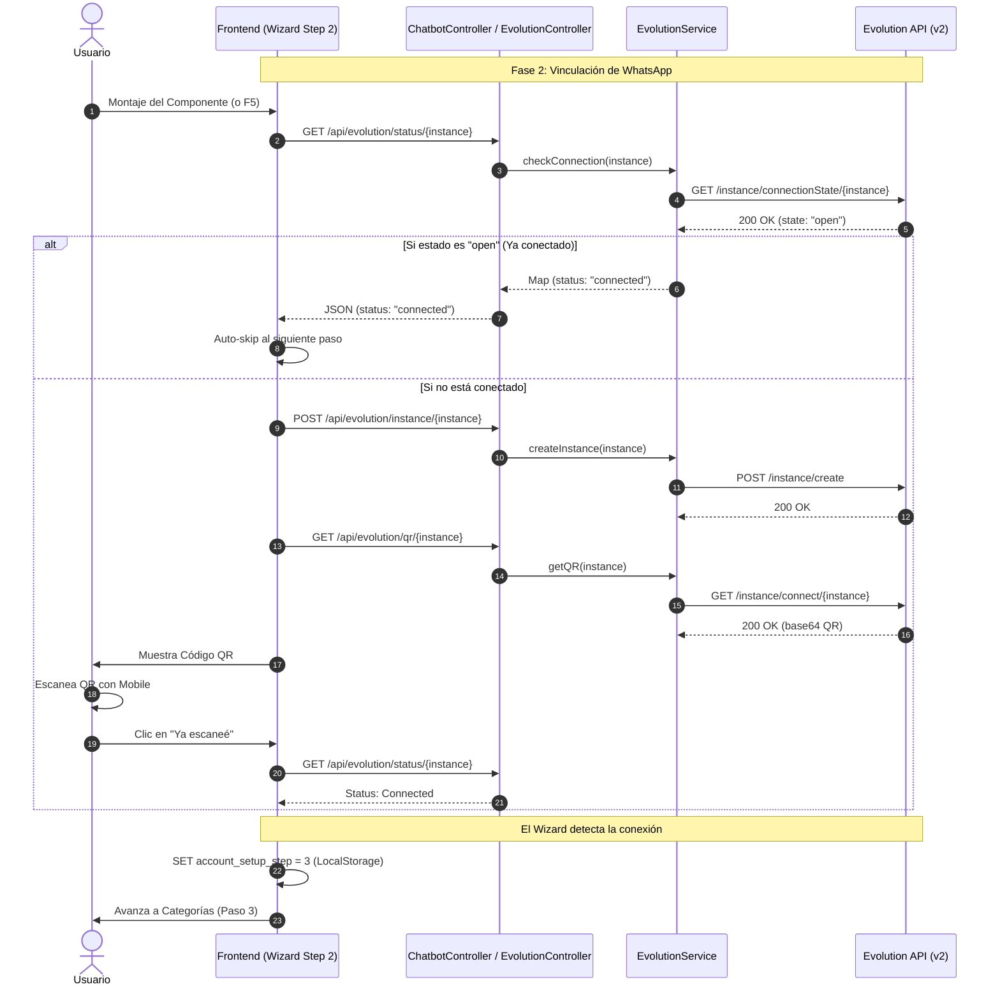

# Flujo de Generación de QR WhatsApp ⚓🛳️

Este diagrama detalla la integración técnica con la **Evolution API v2**, incluyendo las validaciones de salud, verificación de número y gestión inteligente de instancias.

### Notas Técnicas Implementadas:
1. **Instancia Maestra:** Se utiliza una instancia global (`cloudfly_chatbot1`) para verificar si el número del cliente tiene WhatsApp antes de desperdiciar recursos creando una instancia nueva.
2. **Resiliencia de Conexión:** Si la instancia ya existe (ej. re-intento de onboarding), el sistema recupera el QR existente mediante `/instance/connect` en lugar de fallar por "already exists".
3. **Persistencia Dual:** La configuración se asocia tanto al `tenant_id` como al `company_id` en la tabla `chatbot_configs`, garantizando integridad de datos multi-tenant.
4. **Targeting E2E:** Selector `.whatsapp-qr-code` disponible para validación automatizada.
